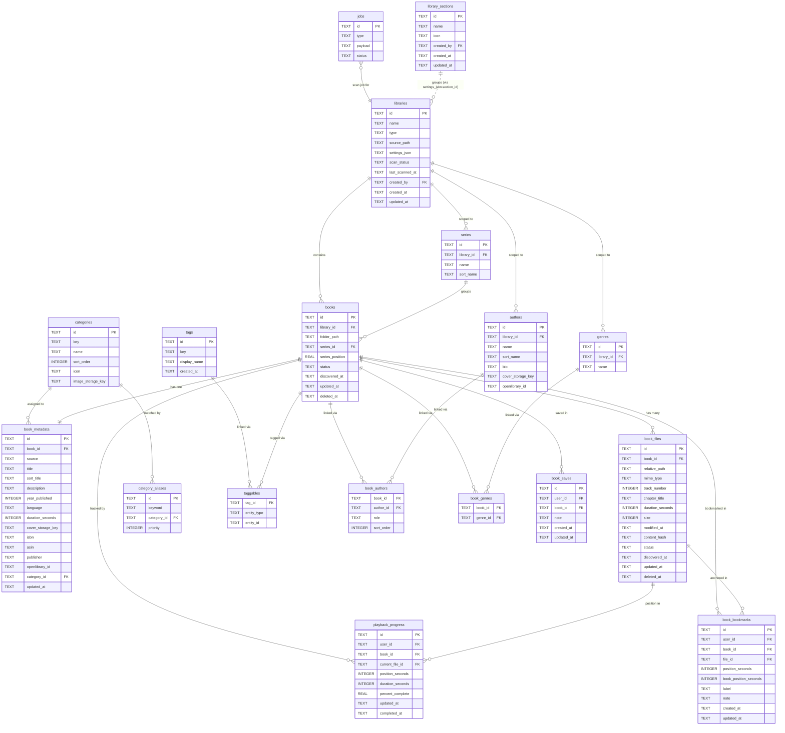

# Digital Library — Audiobook Database Diagram

Entity-relationship diagram for the audiobook library type. Shared system tables (`shares`, `jobs`) are shown in outline — the sharing model schema is in [`sharing.md`](sharing.md).

---

## Diagram

---

## Table Reference

### `libraries`

The top-level record for an audiobook library. `type = 'audiobook'` selects the scanner and display logic. `settings_json` holds audiobook-specific settings (folder_structure, default_language, supported_extensions, etc.). `scan_status` drives the UI scanning indicator.

### `books`

One record per book folder. The unique key is `(library_id, folder_path)` — folder path is relative to the library `source_path`. `deleted_at` is set on rescan when a folder is no longer found; cleared if it reappears.

### `book_metadata`

One-to-one with `books`. Holds all descriptive metadata. `source` tracks origin:
- `'scan'` — written by the scanner, can be overwritten on rescan
- `'manual'` — set by user edit, never overwritten by the scanner

`cover_storage_key` is a relative path into the thumbnail cache, e.g. `ab/cd/<book-id>-cover.webp`.
`category_id` stores the book's single primary navigation category. If no mapping matches, the scanner assigns the seeded `general_other` category.

### `book_files`

One record per audio file. `relative_path` is relative to `source_path`. `track_number` determines playback order within the book — set from the audio tag if present, otherwise parsed from the filename prefix, otherwise the sort index. `status = 'missing'` when a file is not found during rescan.

### `authors`

Library-scoped. Both authors and narrators are stored here; `book_authors.role` distinguishes them. `sort_name` is used for alphabetical listing (e.g. "Pratchett, Terry"). The separate `narrators` table is reserved for a future phase when narrators get richer metadata.

### `series`

Library-scoped. `books.series_position` supports decimals (2.5 for novellas between books). `sort_name` strips leading articles for sorting.

### `genres` / `book_genres` (deprecated)

The original library-scoped freeform genre tables. **Superseded** by the two-layer model below — the scanner no longer writes to them. Retained only to avoid a destructive migration; safe to drop later.

### Genre model — categories + tags

Incoming genre strings (from audio tags and sidecars) are split into two layers:

- **`categories`** — a fixed, app-defined, global navigation taxonomy: Fiction, Classics & Literary, Adventure & Action, Mystery & Thriller, Sci-Fi & Fantasy, Horror & Supernatural, Romance, Humor & Satire, Biographies & Memoirs, History, Self-Help & Business, Science & Culture, Kids & Teens, plus the `general_other` fallback. Seeded on startup from `categories-seed.ts`. A book has **one** primary category (`book_metadata.category_id`).
- **`category_aliases`** — `keyword → category_id` with a `priority`. The scanner normalizes each raw genre and assigns the highest-priority keyword match; no match → General / Other. Default aliases are English-only for new installs, and admins can add/edit aliases per category.
- **`tags`** — global, freeform, normalized-by `key`. Every raw genre becomes a tag (the descriptive/filter layer). Nothing is discarded.
- **`taggables`** — polymorphic link (`tag_id`, `entity_type`, `entity_id`) so tags are reusable across future library types and Notes, not just books. No FK on `entity_id`; library/book deletion cleans up its rows explicitly.

Example: a scanned tag `historical mystery` matches the `mystery` keyword for Mystery & Thriller and could also match a lower-priority history keyword. The higher-priority match wins, so the book lands in Mystery & Thriller.

`book_metadata.category_id` (and the book's tags) are protected by the `source = 'manual'` rule — a manual category/tag edit survives rescans.

### `book_authors`

Join table linking books to authors/narrators. `role` is `'author'` or `'narrator'`. `sort_order` controls display order when a book has multiple authors.

### `book_genres`

Deprecated join table linking books to the old `genres` table. The scanner now writes `category_id` and `taggables` instead.

### `playback_progress`

One record per `(user_id, book_id)` pair, upserted on each position save. `current_file_id` is the file currently in progress. `percent_complete` is stored (not computed on read) for efficient sorting. Marked complete at 0.98 to allow for end credits.

### `book_bookmarks`

Per-user position bookmarks within a book — many rows per `(user_id, book_id)`. `file_id` + `position_seconds` locate the moment within a specific track (used to seek); `book_position_seconds` is the absolute offset within the whole book, denormalized on write for display and ordering. `label` defaults to the chapter title; `note` is optional free text. `file_id` is `ON DELETE SET NULL` so a bookmark survives if its file is purged. Private to the owning user.

### `book_saves`

Per-user "saved" flag for a whole book — the My List view. Unique on `(user_id, book_id)`, so a book is either saved or not. `note` holds an optional book-level note (a personal thought or mini-review), distinct from per-moment bookmark notes. Private to the owning user.

### `library_sections`

Grouping shell for **Special Sections** — a master entry in the audiobook sidebar that holds one or more audiobook libraries. Owns only identity (`name`, `icon`). Membership is not a foreign key: a library joins a section by storing `section_id` in its `settings_json`, and per-library metadata overrides live in `settings_json.overrides`. Member counts are derived with `json_extract`. Deleting a section detaches its members (clears their `section_id`); no books or files are removed. See [`special-section.md`](special-section.md).

### `jobs`

Background job queue. Scan jobs are type `SCAN_AUDIOBOOK_LIBRARY`; Phase 2 uses the queue for async scan execution, retries, and completed scan audit details.

---

## Notes

**Narrators** are currently stored in the `authors` table with `book_authors.role = 'narrator'`. The standalone `narrators` table exists in the schema but is not yet populated. Phase 3 separates them when narrator-specific metadata (bio, photo) is needed.

**`openlibrary_id`** on `book_metadata` and `authors` is retained as a reserved field for any future enrichment source that uses OpenLibrary identifiers. It is not populated by the current scanner.

**Soft delete** — `books.deleted_at` and `book_files.deleted_at` are set rather than deleting rows. Rows are permanently purged after 30 days by a future maintenance job.
