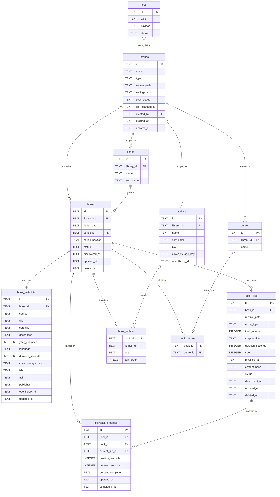

# Digital Library — Audiobook Database Diagram

Entity-relationship diagram for the audiobook library type. Shared system tables (`shares`, `jobs`) are shown in outline — the sharing model schema is in [`sharing.md`](sharing.md).

---

## Diagram

---

## Table Reference

### `libraries`

The top-level record for an audiobook library. `type = 'audiobook'` selects the scanner and display logic. `settings_json` holds audiobook-specific settings (folder_structure, default_language, supported_extensions, etc.). `scan_status` drives the UI scanning indicator.

### `books`

One record per book folder. The unique key is `(library_id, folder_path)` — folder path is relative to the library `source_path`. `deleted_at` is set on rescan when a folder is no longer found; cleared if it reappears.

### `book_metadata`

One-to-one with `books`. Holds all descriptive metadata. `source` tracks origin:
- `'scan'` — written by the scanner, can be overwritten on rescan
- `'manual'` — set by user edit, never overwritten by the scanner

`cover_storage_key` is a relative path into the thumbnail cache, e.g. `ab/cd/<book-id>-cover.webp`.

### `book_files`

One record per audio file. `relative_path` is relative to `source_path`. `track_number` determines playback order within the book — set from the audio tag if present, otherwise parsed from the filename prefix, otherwise the sort index. `status = 'missing'` when a file is not found during rescan.

### `authors`

Library-scoped. Both authors and narrators are stored here; `book_authors.role` distinguishes them. `sort_name` is used for alphabetical listing (e.g. "Pratchett, Terry"). The separate `narrators` table is reserved for a future phase when narrators get richer metadata.

### `series`

Library-scoped. `books.series_position` supports decimals (2.5 for novellas between books). `sort_name` strips leading articles for sorting.

### `genres`

Library-scoped controlled vocabulary. Set from embedded tags or manual edit. Distinct from user-defined `tags` (which are global and freeform).

### `book_authors`

Join table linking books to authors/narrators. `role` is `'author'` or `'narrator'`. `sort_order` controls display order when a book has multiple authors.

### `book_genres`

Join table linking books to genres.

### `playback_progress`

One record per `(user_id, book_id)` pair, upserted on each position save. `current_file_id` is the file currently in progress. `percent_complete` is stored (not computed on read) for efficient sorting. Marked complete at 0.98 to allow for end credits.

### `jobs`

Background job queue. Scan jobs are type `SCAN_AUDIOBOOK_LIBRARY`; Phase 2 uses the queue for async scan execution, retries, and completed scan audit details.

---

## Notes

**Narrators** are currently stored in the `authors` table with `book_authors.role = 'narrator'`. The standalone `narrators` table exists in the schema but is not yet populated. Phase 3 separates them when narrator-specific metadata (bio, photo) is needed.

**`openlibrary_id`** on `book_metadata` and `authors` is retained as a reserved field for any future enrichment source that uses OpenLibrary identifiers. It is not populated by the current scanner.

**Soft delete** — `books.deleted_at` and `book_files.deleted_at` are set rather than deleting rows. Rows are permanently purged after 30 days by a future maintenance job.
