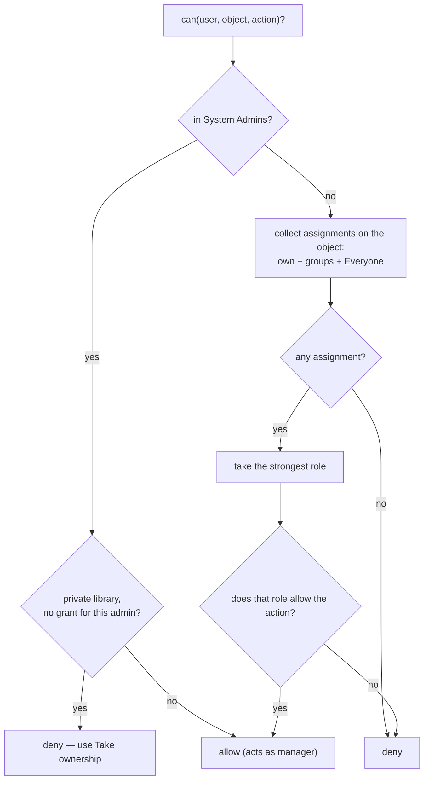
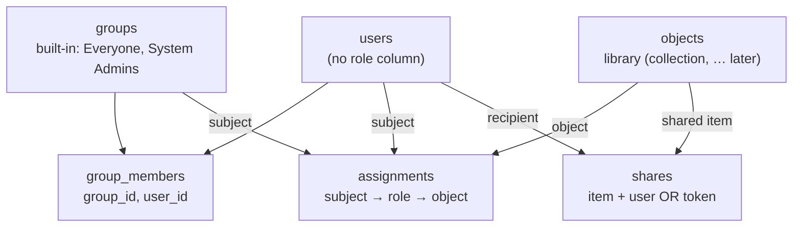

# Permissions & Access — Proposal (Draft)

> **Status:** Draft for discussion. Not implemented yet. The goal is to agree on the
> model before touching code. The database can be reset, so no migration is needed.

## Why change anything

Right now "who can do what to a library" is answered in **too many places**: owner
columns on the library, a `library_members` grants table, a `visibility` flag, a
`public_role` flag, plus group roles — and there is a separate, mostly-unused
permission system for shares. Same question, five answers.

This proposal replaces all of that with **one simple idea used everywhere**:

> An **assignment** says *"this subject has this role on this object."*
> One table, one check function, the same rules for every kind of object.

---

## The four pieces

1. **Users** — the accounts. No global role column: whether someone is a server admin
   is decided by membership in the built-in **System Admins** group (see below).
2. **Groups** — named sets of users (e.g. *Family*, *Kids*). Plus two **built-in,
   undeletable system groups**: **Everyone** (public access) and **System Admins**
   (server administrators).
3. **Assignments** — the heart of it. Each row = *subject → role → object*.
   The subject is a user **or** a group. The object is a library today, and can be a
   collection or anything else later.
4. **Shares** — one merged table for item-level sharing (a user share **or** a guest
   link). Always means the same thing: "view + download this one item."

**Roles are just labels** (`viewer`, `subscriber`, `manager`) stored in the
assignment. What each label is allowed to do lives in **code**, not in a table — see
[Roles](#roles). (Decided: we are **not** building a configurable roles table.)

---

## Roles

Three roles, each includes everything below it:

| Action | Viewer | Subscriber | Manager |
|---|:--:|:--:|:--:|
| View / play / read in-app | ✓ | ✓ | ✓ |
| Download (export the file) | | ✓ | ✓ |
| Edit metadata, organize, manage members & settings | | | ✓ |

- **Server admins** (members of System Admins) act as **manager** on every object —
  *except* a private library they haven't been granted. See [Admins & built-in groups](#admins--built-in-groups).
- **Manager** = full control of *one* object (the old "owner" / "Library Admin").
- **Download is the role, not a separate switch.** "Public, view-only" vs "Public,
  with downloads" is simply whether **Everyone** is assigned `viewer` or `subscriber`.

---

## How the common cases map

| Situation | Assignment(s) |
|---|---|
| **Public library, downloads on** | `Everyone → subscriber → library#5` |
| **Public library, view only** | `Everyone → viewer → library#5` |
| **Private library owned by Bob** | `Bob → manager → library#5` (no Everyone row) |
| **Give the Family group access** | `Family(group) → subscriber → library#5` |
| **Cap one group to view-only** | `Kids(group) → viewer → library#5` (overrides Everyone) |
| **Share a book with Alice** | `shares(book#9, user = Alice)` |
| **Guest link to a book** | `shares(book#9, token = …)` |

**Owner** is no longer a special thing — it is simply the `manager` assignment, added
automatically to whoever you pick when creating the library.

### Creating a library
- **Public** → the **Everyone** group is assigned a role (View only / View + download).
  Picking a specific owner is optional; if you do, they also get `manager`.
- **Private** → you **must** pick an owner; that user is assigned `manager`. No Everyone
  row, so only the owner (and anyone else granted) can reach it — **not even admins**,
  until an admin explicitly *takes ownership* (see [Admins & built-in groups](#admins--built-in-groups)).

---

## Admins & built-in groups

The app creates two system groups that can't be deleted or renamed:

- **Everyone** — a *virtual* group: it has no member rows; the check treats an
  assignment to Everyone as matching any signed-in user. Used for public access.
- **System Admins** — real membership. The original account is a **permanent** member;
  it reuses the existing `protected_from_delete` flag, which now also means
  *"can't be removed from System Admins."* Add other users here to make them admins.

**There is no `users.role` column** — "is this person a server admin?" simply means
"are they in System Admins?".

**What an admin can do:** a System Admin acts as **manager on everything** — app
settings, user/group management, and every public object — **with one exception:**

> A **private library** (one with no Everyone grant) that the admin hasn't been granted
> is **off-limits, even to admins**. This keeps a family member's private library
> private from the server owner.

To get in, an admin uses **Take ownership** — an admin-only action that adds a `manager`
assignment (for the admin, or the System Admins group) on that library. It is **written
to the activity log**, so reaching a private library is always a visible, deliberate
step, never a silent peek.

## How a permission check works

One function, used for every object in the app:

```
can(user, object, action)
```



**Strongest role wins**, and an explicit user/group assignment **overrides Everyone** —
so you can grant `Kids → viewer` on an otherwise-downloadable public library to hold
them to view-only.

---

## How the pieces relate



`Everyone` is a **virtual** group: it has *no* member rows. The check simply treats an
assignment to Everyone as matching any signed-in user. System groups can't be renamed
or deleted.

---

## Schema sketch

```sql
-- Accounts: no role column. Admin = membership in the System Admins group.
-- protected_from_delete marks the seed admin (undeletable, can't leave System Admins).
users(id, …, protected_from_delete);

-- Groups, including the built-in system groups: Everyone + System Admins.
groups(id, name, kind CHECK (kind IN ('normal', 'system')));
group_members(group_id, user_id, PRIMARY KEY (group_id, user_id));

-- One row = "this subject has this role on this object".
assignments(
  subject_type CHECK (subject_type IN ('user', 'group')),
  subject_id,                              -- polymorphic, no FK
  object_type,                             -- 'library' now; 'collection', … later
  object_id,                               -- polymorphic, no FK
  role         CHECK (role IN ('viewer', 'subscriber', 'manager')),
  PRIMARY KEY (subject_type, subject_id, object_type, object_id)
);

-- Item shares — user share OR guest link, in one table.
shares(
  id, object_type, object_id,
  user_id,        -- set for a user-to-user share
  token_hash,     -- set for a guest link
  expires_at, revoked_at, created_by, created_at
);
```

---

## Per-library policy switches (a separate axis)

A *role* says what a person can do. A *policy* is a library-wide rule that limits
**everyone**, even managers. Keep these few and clearly labelled "library settings":

- **Downloads** — already covered by the Everyone role; **not** a separate switch.
- **File deletion from the website** — note the app currently **never deletes source
  files** (read-only is a core safety rule), so there may be nothing to gate today.
  If destructive features are added later, model them as a policy flag, not a role.

---

## What we clean up (short summary)

Replacing today's model with this proposal removes the overlap:

| Today | Becomes |
|---|---|
| `libraries.owner_id` / `owner_type` columns | a `manager` **assignment** |
| `libraries.visibility` + `libraries.public_role` | presence/role of the **Everyone** assignment |
| `library_members` table | the generic **`assignments`** table (`object_type = 'library'`) |
| `group_members.role` (member / manager) | plain membership (role not needed for libraries) |
| `shares` + `share_links` (two tables) | one merged **`shares`** table |
| `shares.permission` / `share_links.permission` (read/edit/manage — only `read` used) | removed |
| 5 library roles + 7 capabilities (`viewer…admin`, incl. unused `upload`/`contributor`/`curator`) | **3 roles** (`viewer`/`subscriber`/`manager`) |
| `users.role` (`admin`/`member`) | membership in the **System Admins** group |
| `resolveLibraryRole(...)` (library-only) | generic **`can(user, object, action)`** |

Net: the access data goes from **4 join tables + several overlapping columns** to
**`assignments` + `group_members` + one merged `shares`**, with no standalone role
column — admin status comes from the System Admins group. Code-side, one `can()`
replaces the library-specific resolver and the per-endpoint capability helpers.

---

## Open questions (to think about)

1. **Role names** — are `viewer` / `subscriber` / `manager` the right three? (We had
   five before; this drops Contributor and Curator.)
2. **`group_members.role`** — drop it entirely, or keep a `manager` flag for *managing
   the group itself* (who can add/remove members)?
3. **Policy switches** — which, if any, do we actually need now beyond download-via-role?
4. **Scope of the rollout** — generalize `object_type` immediately (collections, etc.),
   or ship libraries-only with the column ready for later?
5. **Take ownership** — when an admin takes over a private library, does the original
   owner's `manager` grant stay, or get replaced? *(Decided: two built-in groups —
   Everyone + System Admins; admin = System Admins membership, no `users.role`; private
   libraries stay hidden from admins until taken over, which is logged.)*

---

## Related documents
- [`library-sharing.md`](library-sharing.md) — the current (to-be-replaced) library access model.
- [`sharing.md`](sharing.md) — the current item-level share model.
