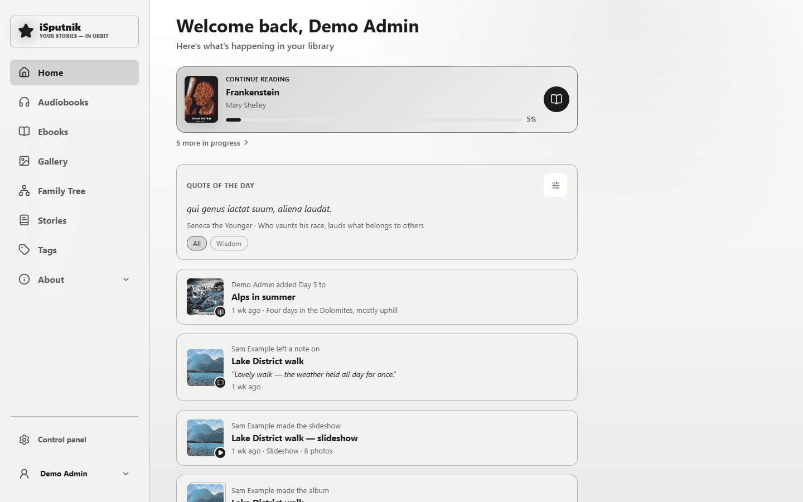
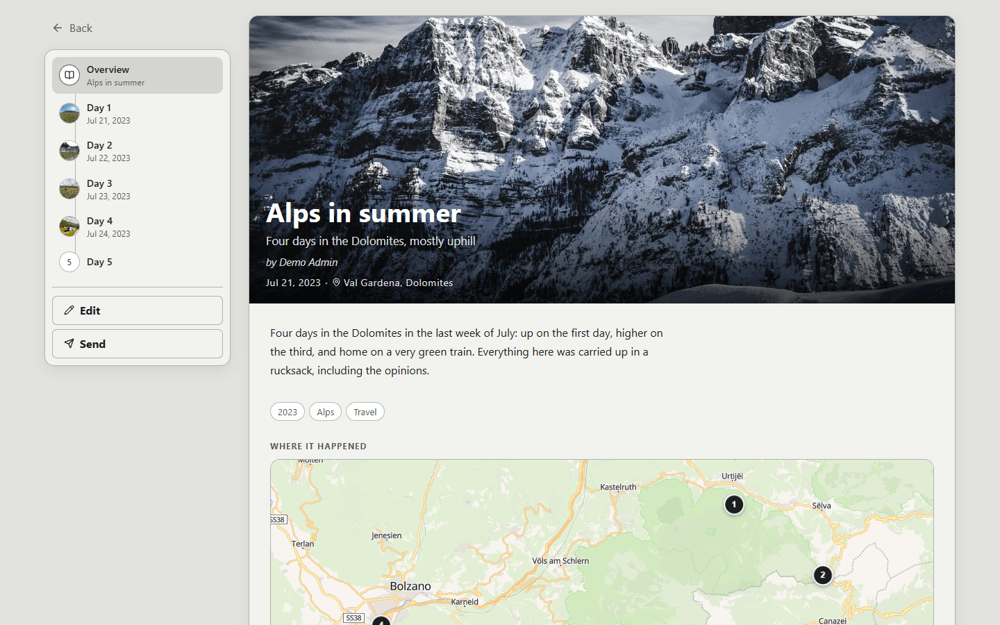

# About the Project

> **Beta — 4.0.0 and later.**
>
> iSputnik.home is in Beta. For you that means three things. **Your data is looked after:** the database migrates itself forward on every upgrade, the server saves a copy of it before each new version touches it, and backups (full, minimal, or a quick database copy) can be scheduled and restored from the Control panel. **Upgrades are routine:** pull the new image and restart; if one goes wrong, [rolling back](docs/rollback.md) is a documented procedure, not a rescue. **Features are still moving:** screens change, new things arrive often, and some parts are marked as still being proven in the app itself. It is one family's server shared with anyone who finds it useful — not a product with a support team — so keep your own copies of anything irreplaceable, as you would with any server.

iSputnik.home is a self-hosted home server project created as a personal vision of what a modern family-oriented digital hub could be. The project is heavily assisted by AI and serves as both a learning experience and an exploration of new ideas in software design, automation, and media management.

The inspiration for iSputnik.home comes from several excellent open-source projects, including Audiobookshelf, Immich, Paperless-ngx, and other self-hosted applications. Rather than replicating any single solution, the goal is to combine the best ideas from these projects into a unified platform tailored for personal and family use.

This project represents my vision of a self-hosted home server where media, books, stories, and other personal content can be organized, accessed, and shared through a simple and modern interface. It started with audiobooks and ebooks and has since grown a photo and video gallery, face recognition, a family tree, and stories the family writes itself; the long-term goal is a broader home hub platform with additional modules and services.



## Documentation

* [User guides](docs/users/README.md) — setting up a new install, and using each
  part of it. Start with [first run](docs/users/first-run.md). The same guides
  ship inside the app, under Help.
* [Configuration reference](docs/configuration.md) — every environment variable,
  its default, and where it is set.
* [Upgrading and rolling back](docs/rollback.md) — the automatic pre-upgrade copy,
  and how to get back to the previous version.
* [Exposing it to the internet](docs/users/exposing-to-the-internet.md) — HTTPS,
  a reverse proxy, and the settings to turn on first.
* [Technical reference](docs/architecture.md) — architecture, schema, and the
  design notes behind each module.

## Quick start

The app ships as a Docker image, `ghcr.io/isputnikdotnet/isputnik.home`. Everything
it keeps — database, thumbnails, backups, settings — lives by default in one volume
mounted at `/config`; your media is mounted beside it and is never modified by a
scan. Every setting the container reads is in the
[configuration reference](docs/configuration.md).

**docker compose** — a trimmed copy of [`docker-compose.yml`](docker-compose.yml):

```yaml
services:
  isputnik:
    image: ghcr.io/isputnikdotnet/isputnik.home:latest
    container_name: isputnik
    restart: unless-stopped
    stop_grace_period: 30s
    logging:
      driver: json-file
      options:
        max-size: "10m"
        max-file: "5"
    ports:
      - "4000:4000"
    environment:
      PUID: 1000                      # the owner of your /config folder
      PGID: 1000
      APP_URL: http://localhost:4000  # the address you will open it at
      COOKIE_SECURE: auto
    volumes:
      - /path/to/appdata/isputnik:/config
      - /path/to/library:/media:ro    # :ro if another app manages these files
```

```bash
docker compose up -d
```

**Unraid** — the repository carries a Community Applications template,
[`isputnik-home.xml`](isputnik-home.xml). It maps `/config` to
`/mnt/user/appdata/isputnik`, runs as `99:100` to match a default appdata share,
and offers the reverse-proxy and cookie settings as fields.

Then open `http://<your-server>:4000`. The first visit asks you to create the
setup admin, and a short setup guide takes you through storage, the recycle bin,
backups and email — see [first run](docs/users/first-run.md). Do this on your home
network: until the first account exists, anyone who can reach the app can claim it.

To choose when you upgrade, use an exact version tag (`:4.0.0`) instead of
`:latest`; `:4.0` follows only the patch releases of 4.0.

## Requirements

* **Docker on a 64-bit x86 machine** (`linux/amd64`). No ARM image is published, by
  decision rather than oversight: an arm64 image would be built under emulation, several
  times slower per release, and never run by anything but "it built". Unraid servers
  and ordinary home servers are x86.
* **Disk:** the image carries its own ffmpeg and the 167 MB face-recognition model.
  Thumbnails and backups grow with your libraries; a full backup includes every
  cover image, so keep an eye on the size of the `backups` folder.
* **CPU and memory:** browsing and streaming are light. Two jobs are not. The
  first face scan of a large photo library is CPU-heavy and runs for a long time —
  by default it uses every core but one, so the app stays responsive
  (`FACE_ORT_THREADS` caps it further). Rendering a slideshow to MP4 is the other;
  in the project's own measurements a render peaks at around 600 MB of memory.
  There is no measured memory figure for face recognition yet.
* **A browser** — any current one. Installing it as an app (PWA) works on Android
  and iPhone. Two things depend on the address you use: passkeys need HTTPS at a
  domain name, and recording voice notes needs HTTPS (or the server itself), because
  that is what browsers require.

## Current Progress

The project has grown into a working family media library with three media types — audiobooks, ebooks, and a photo/video gallery — sharing one catalog: libraries, scanning, metadata, cover artwork, authors and narrators, series, categories, tags, collections, favorites, and search with an A–Z index run across all of them. On top of it sit the things a family makes itself: stories, recipes, quotes, notes, voice recordings and a family tree.

Users stream audiobooks and read ebooks directly in the browser, with progress, bookmarks, and highlights that follow them across devices. The gallery organizes photos and videos into timeline and folder views, recognizes faces and groups them into people, and connects those people to an interactive family tree. Multiple user accounts with per-user progress and permissions let a household share one server while keeping personal things personal.

The server side has matured alongside: a full control panel, scheduled jobs, a recycle bin, three kinds of backup with automatic pre-upgrade copies, activity logging with a dashboard, and a security layer (passkeys, two-factor sign-in, account lockout, rate limits, trusted zones) designed for cautiously exposing the server beyond the home network. Releases ship as Docker images with an Unraid Community Applications template.


## Current Features

### Library Management

* Audiobook, ebook, and photo/video gallery libraries, several of each if you like
* Automatic, scheduled library scanning
* Scan layouts: tell the scanner how your folders are arranged (Author / Series /
  Title, books split into parts), with rules for folders arranged differently and
  a preview before saving
* Metadata from the files' own tags, online lookup, and a manual editor whose
  edits later scans never overwrite
* Cover artwork, authors, narrators, series, publishers, and categories
* Tags, collections, and favorites shared across media types
* Search and filtering, with an A–Z index on browse pages (English and Russian
  alphabets)
* App storage: one folder for everything the app keeps for itself — thumbnails,
  the Recycle Bin, backups, rendered movies, the Photo Inbox and the files the
  family records or uploads in the app — with a Contents page, and moves that are
  checked file by file when a location changes

### Listening

* Built-in audiobook player with chapters (including `.m4b` chapter marks)
* Resume playback across devices, per account
* Bookmarks, playback speed, sleep timer
* Mark books as finished or reset progress

### Reading

* Built-in ebook reader for EPUB and FB2, plus in-browser PDF viewing
* Books that come in more than one format, grouped as one title
* Editions — multiple releases of the same work under one entry
* Quotes and highlights, captured from the reader or added by hand, a quote of the
  day, and importable quote packs
* Send to e-reader, and OPDS feeds for reading apps

### Photos & Videos

* Timeline, Memories (the same date in past years), albums, folders, people, and
  a map
* EXIF metadata, video playback, and web-playable copies of videos the browser
  can't decode
* Face recognition that groups faces into people — on the server, nothing leaves
  the machine
* Voice recordings kept on a photo, played back with a waveform
* **Photo Inbox** — a holding library for scans and photos from relatives: a copy
  check against what you already have, Keep / Replace / Discard one delivery at a
  time, and drop links that let someone without an account send you photos
* **Review mode** — one photo at a time, four questions (when, where, who, what you
  remember), for the relative who knows the answers, who can dictate instead of
  typing; send it with **Ask someone**
* Folder locks that protect precious folders from cleanup tools, and moving a
  folder to another library without breaking anything that points at it

### Slideshows & Movies

* Ordered sets of photos and videos, playable full-screen in the browser
* Transitions, your own music track, and a configurable title card
* **Render to MP4** (H.264, 1080p) as a background job with live progress and
  cancel — the live preview and the exported movie use the same timings
* Suggested slideshows, clustered from dates, places, and named people — with
  burst shots and near-duplicates automatically collapsed to one photo

### Stories

* Pages the family writes itself, with photos, videos, albums, slideshows, maps,
  family-tree people, quotes, books and recordings placed where they belong
* Chapters, narration, collections with their own access, and guest links
* Recipes and reviews as kinds of story
* A story points at what's already in the house and never copies it — and never
  shows a reader something they couldn't already open



### Family Tree

* Relatives, relationships, life events, and photos
* People from the gallery take their place on an interactive chart
* Branch editing — let someone maintain their own part of the tree
* GEDCOM import and export

### Sharing with Family

* One **Send to** button everywhere: to a member of the household, to your own
  e-reader, or to anyone through an expiring guest link
* **For you** — one page with everything waiting on you, with its top rows on Home
* Notes left under a book, a photo or a person, for the next person who opens it
* A Home feed: continue reading or listening, what arrived in the house, what
  everyone else has been making, and photos from this day in past years

### Duplicate Cleanup

* A job-based cleanup that survives the browser: close it, come back next week,
  and every decision you already made is still there
* Identical folders, folders already stored elsewhere, identical files, and
  near-identical photos — the last clearly marked as a judgement call
* Everything removed goes to the Recycle Bin and can be restored until it is
  emptied deliberately

### User Experience

* Modern, responsive web interface for desktop, tablet, and phone
* The whole interface in English or Russian, chosen per person
* Six themes, light and dark
* Progressive Web App: installable on Android and iPhone with phone-style bottom
  navigation
* Download audiobooks to the device and keep listening with no server in reach;
  progress made offline syncs back after reconnecting
* **Link a device** — sign a TV or wall display in by scanning a code with your
  phone, instead of typing a password on a remote

### Security

* **Passkeys** — sign in with a fingerprint, face or PIN
* Two-factor sign-in with an authenticator app (TOTP) or emailed one-time codes,
  plus backup codes
* Account lockout after repeated failed sign-ins, and IP blocking for persistent
  offenders
* Trusted zones, so your home network isn't treated like the open internet
* Email alerts to admins when something security-relevant happens
* Global rate limiting and a strict Content Security Policy
* HTTPS-aware out of the box: secure cookies, HSTS, an http→https redirect, and
  reverse-proxy trust settings (`TRUST_PROXY`) so logs and rate limits see the
  real visitor
* The server process never runs as root inside the container
* A step-by-step [guide to exposing the server to the internet](docs/users/exposing-to-the-internet.md)

### Administration

* Docker deployment with a health check and an orderly shutdown, plus an Unraid
  Community Applications template
* Full control panel: libraries, storage, members and groups, security, logs, and
  settings
* Scheduled jobs and a recycle bin
* Three kinds of backup — full, minimal, and a quick database copy — each on its
  own schedule and retention, with upload and restore
* An automatic copy of the database before every upgrade, for
  [rolling back](docs/rollback.md)
* Activity dashboard with charts, sign-ins and their locations
* In-app user guides that ship with the server

### Still Moving

* Deeper mobile versions of the library pages
* Additional home server modules beyond the media library

## Contributing

Bug reports and documentation fixes are welcome; please open an issue before
starting anything large. See [CONTRIBUTING.md](CONTRIBUTING.md), and report
security problems privately as described in [SECURITY.md](SECURITY.md) rather
than as a public issue.

## License

Licensed under the [GNU Affero General Public License v3.0](LICENSE).

In short: you are free to use, modify, and redistribute this software, but any
modified version you distribute — **or run as a network service that other
people use** — must also be made available under the same license.
