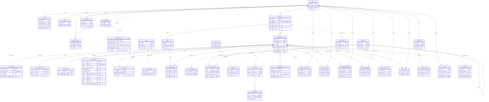

# iSputnik Home — Database

Canonical reference for the schema. The authoritative DDL is
[`apps/server/src/db/schema.sql`](../apps/server/src/db/schema.sql); this
document explains the model and the conventions behind it.

> **Status:** the live schema of the unified `library_items` model (it replaced the
> `books`-centric schema). Released databases are upgraded in place: 3.0.0 set the
> migration baseline at `user_version` 32, and every schema change since ships as a
> numbered migration (33 onwards) — see [Versioning & migrations](#versioning--migrations).
> The [table reference](#table-reference) names every table in `schema.sql`, one line
> per group; the diagrams below draw only the library core.

---

## Design principles

1. **Generic spine, typed extensions.** Every item — audiobook, ebook, future
   gallery/document — is one row in **`library_items`**. Shared descriptive data
   lives in **`item_metadata`** (1:1); media-specific columns live in per-type
   detail tables (**`audiobook_details`**, **`ebook_details`**, **`gallery_details`**) keyed 1:1 by
   `item_id`. Adding a media type = one library `type`, one `*_details` table,
   and its file/progress tables — never a reshape of the core.
2. **Shared concerns are media-agnostic.** Categories, tags, collections,
   permissions, sharing, likes (the `item_saves` table), and the recycle bin attach to
   items generically, so every library type gets them for free.
3. **People are global; series are per-library.** `people` is not scoped to a
   library, so the same author/narrator can appear across libraries; a book
   `series` belongs to one library. Item links go through `item_people` and
   `series_items`.
4. **One permission model.** All access resolves through `assignments`
   (see [`permissions.md`](permissions.md)) — `object_type` is `'library'`,
   `'library_item'`, `'collection'`, … Public = the Everyone group's row;
   an owner = a `manager` row.

## Conventions

- **Naming.** snake_case, plural tables. `*_id` foreign keys, `*_at` timestamps,
  `*_json` JSON blobs, `*_hash` hashes, `is_*` / `*_from_*` booleans. Join tables
  read `noun_noun` (`item_people`, `series_items`, `collection_items`).
- **Primary keys.** `TEXT` nanoid for entities; composite PKs on join tables.
- **Timestamps.** ISO-8601 UTC with milliseconds — `'YYYY-MM-DDThh:mm:ss.sssZ'`.
  The SQL default `strftime('%Y-%m-%dT%H:%M:%fZ','now')` produces exactly what
  JS `new Date().toISOString()` produces, so a column never mixes formats. App
  code uses a shared `nowIso()` helper.
- **Booleans** are `INTEGER` `0/1` with a `CHECK`. **Enums** are
  `CHECK (col IN (...))` — except `libraries.type` and the polymorphic `*_type`
  columns, left unconstrained so new types need no schema change (validated in
  app code via Zod).
- **Source tracking.** `item_metadata.source`, `item_categories.source`, and
  `series_items.source` mark `'manual'` rows the scanner must not overwrite.
- **Soft delete.** `library_items` / `audio_files` / `document_files` carry
  `deleted_at` (set on rescan when a path disappears, cleared if it returns).
  User-initiated deletion goes through the Recycle Bin (`trashed_items`,
  see [`recycle-bin.md`](recycle-bin.md)).
- **Polymorphic links** (`assignments`, `taggables`, `collection_items`,
  `story_blocks`, `shares`, `share_links`, `trashed_items`) carry **no FK** on the polymorphic
  id by necessity — the owning module must delete their rows when a resource is
  removed. This is the schema's one integrity trade-off; the cleanup helpers and
  the access-control tests guard it.

---

## Model overview

```text
users ─┬─ sessions / invites
       ├─ user_groups ── group_members
       └─ assignments ───────────────►  (library | library_item | collection)

libraries
   └── library_items ──┬── item_metadata        (1:1 shared)
                       ├── audiobook_details     (1:1)   ┐ exactly one
                       ├── ebook_details         (1:1)   ┘ per item type
                       ├── item_people ───── people       (global)
                       ├── series_items ──── series       (per-library)
                       ├── item_categories ─ categories ── category_aliases
                       ├── taggables ─────── tags          (polymorphic)
                       ├── collection_items ─ collections  (polymorphic)
                       ├── audio_files ───── audio_chapters
                       ├── document_files
                       ├── playback_progress / track_progress / audio_bookmarks
                       ├── reading_progress / reading_bookmarks
                       └── item_saves   ("My List")

shares / share_links   ── item-level sharing (module, resource_id)
trashed_items          ── recycle bin
activity_logs / app_settings / jobs / storage_roots  ── system
```

---

## Entity-relationship diagram

Renders on GitHub. Dotted relationships are **polymorphic** — enforced in app
code, not by a foreign key (the `*_type` column says which table the id points
at). System tables with no relationships (`activity_logs`, `app_settings`,
`jobs`) are omitted.


```mermaid
erDiagram
  users {
    TEXT id PK
    TEXT email UK
    TEXT role
  }
  sessions {
    TEXT id PK
    TEXT user_id FK
    TEXT token_hash UK
    TEXT expires_at
  }
  invites {
    TEXT id PK
    TEXT created_by FK
  }
  user_groups {
    TEXT id PK
    TEXT name UK
  }
  group_members {
    TEXT group_id FK
    TEXT user_id FK
    TEXT role
  }
  assignments {
    TEXT subject_type "user|group"
    TEXT subject_id
    TEXT object_type "library|library_item|collection"
    TEXT object_id
    TEXT role "viewer..manager|deny"
  }
  storage_roots {
    TEXT id PK
    TEXT path UK
    TEXT created_by FK
  }
  libraries {
    TEXT id PK
    TEXT type "audiobook|ebook|…"
    TEXT source_path
    TEXT owner_id
    TEXT policy_json
  }
  library_items {
    TEXT id PK
    TEXT library_id FK
    TEXT type
    TEXT folder_path
    TEXT series_source
    TEXT status
  }
  item_metadata {
    TEXT item_id PK "FK"
    TEXT source "scan|manual"
    TEXT title
    TEXT cover_storage_key
  }
  audiobook_details {
    TEXT item_id PK "FK"
    TEXT asin
    INTEGER duration_seconds
  }
  ebook_details {
    TEXT item_id PK "FK"
    INTEGER page_count
  }
  gallery_details {
    TEXT item_id PK "FK"
    TEXT kind "photo|video"
    TEXT relative_path
    INTEGER width
    INTEGER height
    REAL duration_seconds
    TEXT taken_at
    REAL gps_lat
    REAL gps_lng
    TEXT preview_storage_key
  }
  people {
    TEXT id PK
    TEXT name UK
    TEXT image_storage_key
  }
  item_people {
    TEXT item_id FK
    TEXT person_id FK
    TEXT role "author|narrator|…"
  }
  person_aliases {
    TEXT alias UK
    TEXT canonical_name
  }
  series {
    TEXT id PK
    TEXT library_id FK
    TEXT name
  }
  series_items {
    TEXT series_id FK
    TEXT item_id FK
    REAL position
    TEXT source
  }
  categories {
    TEXT id PK
    TEXT key UK
    TEXT parent_id FK
  }
  category_aliases {
    TEXT keyword UK
    TEXT category_id FK
  }
  item_categories {
    TEXT item_id FK
    TEXT category_id FK
    INTEGER is_primary
    TEXT source
  }
  tags {
    TEXT id PK
    TEXT key UK
  }
  taggables {
    TEXT tag_id FK
    TEXT entity_type
    TEXT entity_id
  }
  audio_files {
    TEXT id PK
    TEXT item_id FK
    INTEGER track_number
  }
  audio_chapters {
    TEXT id PK
    TEXT audio_file_id FK
    INTEGER ordinal
  }
  document_files {
    TEXT id PK
    TEXT item_id FK
    TEXT role "content|companion"
    TEXT format
  }
  playback_progress {
    TEXT user_id FK
    TEXT item_id FK
    TEXT current_file_id FK
  }
  track_progress {
    TEXT user_id FK
    TEXT item_id FK
    TEXT file_id FK
  }
  reading_progress {
    TEXT user_id FK
    TEXT item_id FK
    TEXT document_id FK
    TEXT location
  }
  audio_bookmarks {
    TEXT user_id FK
    TEXT item_id FK
    TEXT file_id FK
  }
  reading_bookmarks {
    TEXT user_id FK
    TEXT item_id FK
    TEXT document_id FK
  }
  item_saves {
    TEXT user_id FK
    TEXT item_id FK
  }
  collections {
    TEXT id PK
    TEXT user_id FK
    TEXT name
  }
  collection_items {
    TEXT collection_id FK
    TEXT entity_type
    TEXT entity_id
  }
  shares {
    TEXT id PK
    TEXT module
    TEXT resource_id
    TEXT user_id FK
  }
  share_links {
    TEXT id PK
    TEXT module
    TEXT resource_id
    TEXT token_hash UK
  }
  trashed_items {
    TEXT id PK
    TEXT library_id
    TEXT library_type
  }

  users ||--o{ sessions : "has"
  users ||--o{ invites : "issues"
  users ||--o{ user_groups : "creates"
  user_groups ||--o{ group_members : "has"
  users ||--o{ group_members : "in"
  users }o..o{ assignments : "subject"
  user_groups }o..o{ assignments : "subject"

  users ||--o{ libraries : "creates"
  users ||--o{ storage_roots : "configures"
  libraries ||--o{ library_items : "contains"
  library_items ||--|| item_metadata : "described by"
  library_items ||--o| audiobook_details : "if audiobook"
  library_items ||--o| ebook_details : "if ebook"
  library_items ||--o| gallery_details : "if gallery"

  library_items ||--o{ item_people : "credits"
  people ||--o{ item_people : "credited on"
  people ||..o{ person_aliases : "alias (by name)"
  libraries ||--o{ series : "scoped to"
  series ||--o{ series_items : "orders"
  library_items ||--o{ series_items : "in"

  categories ||--o| categories : "parent"
  categories ||--o{ category_aliases : "matched by"
  categories ||--o{ item_categories : "applied to"
  library_items ||--o{ item_categories : "categorised"
  tags ||--o{ taggables : "linked via"
  library_items }o..o{ taggables : "tagged (poly)"

  library_items ||--o{ audio_files : "has"
  audio_files ||--o{ audio_chapters : "has"
  library_items ||--o{ document_files : "has"

  library_items ||--o{ playback_progress : "progress"
  users ||--o{ playback_progress : "by user"
  library_items ||--o{ track_progress : "progress"
  users ||--o{ track_progress : "by user"
  library_items ||--o{ reading_progress : "progress"
  users ||--o{ reading_progress : "by user"
  library_items ||--o{ audio_bookmarks : "bookmarks"
  users ||--o{ audio_bookmarks : "by user"
  library_items ||--o{ reading_bookmarks : "bookmarks"
  users ||--o{ reading_bookmarks : "by user"
  library_items ||--o{ item_saves : "saved"
  users ||--o{ item_saves : "by user"

  users ||--o{ collections : "owns"
  collections ||--o{ collection_items : "contains"
  library_items }o..o{ collection_items : "member (poly)"
  users ||--o{ shares : "granted to"
  library_items }o..o{ shares : "shared (poly)"
  library_items }o..o{ share_links : "shared (poly)"
  libraries }o..o{ trashed_items : "snapshot (no FK)"
```

## Migration from the `books`-centric schema

Table/column map for anyone porting old queries:

| Old | New |
|---|---|
| `books` | `library_items` |
| `book_metadata` (shared cols) | `item_metadata` |
| `book_metadata.duration_seconds`, `.asin` | `audiobook_details` |
| *(new)* | `ebook_details` |
| `book_metadata.category_id` | `item_categories` (M2M, `is_primary`, `source`) |
| `authors` (library-scoped) | `people` (global) |
| `book_authors` | `item_people` |
| `series` (library-scoped), `books.series_id/series_position` | `series` (library-scoped) + `series_items` |
| `book_files` | `audio_files` (`chapter_title` → `title`) |
| `book_chapters` (`book_file_id`) | `audio_chapters` (`audio_file_id`) |
| `book_documents` | `document_files` (+ `role` content/companion) |
| `book_bookmarks` (`book_position_seconds`) | `audio_bookmarks` (`item_position_seconds`) |
| `ebook_bookmarks` (`cfi`) | `reading_bookmarks` (`location`) |
| `reading_progress.cfi` | `reading_progress.location` |
| `book_saves` | `item_saves` |
| `sessions.last_seen` | `sessions.last_seen_at` |
| `assignments`, `shares`, `share_links`, `tags`, `taggables`, `collections`, `collection_items`, `trashed_items`, `users`, `sessions`, `invites`, `user_groups`, `group_members`, `categories`, `category_aliases`, `person_aliases`, `storage_roots`, `libraries`, `activity_logs`, `app_settings`, `jobs` | unchanged (categories gains `slug`/`parent_id`) |

Polymorphic `*_type` values that referenced `'audiobook'`/`'ebook'` as the item
kind become `'library_item'` (the item's own `type` column carries the media
kind). `module` on `shares`/`share_links` is unchanged.

---

## Versioning & migrations

`schema.sql` is the **whole** schema and is idempotent (`CREATE TABLE IF NOT
EXISTS`), so a fresh database is built in one pass and stamped with `baseline`
(`PRAGMA user_version`). Schema changes are then **ordered, append-only
migrations** run by a small runner that compares `user_version` to the highest
migration and applies the gap inside a transaction. Seed data (navigation
categories and alias keywords) is applied idempotently after migrations.

**The baseline has been reset twice.** 2.0.0 folded migrations 2–22 back into
`schema.sql`; **3.0.0 did the same with 24–31 and set the baseline to 32**, as a
fresh start rather than an upgrade. Migrations since then are numbered from 33 and
run on every released database. Consequences:

- A database from the last 2.x schema (`user_version` 31) is structurally identical
  to a fresh 3.0.0 one and adopts the baseline unchanged.
- A database older than that (`user_version` 1–30) stops the server with an
  explanatory error: the steps it would need no longer exist, so it has to start
  empty (libraries rescan from their files; export the family tree as GEDCOM first).
- Migrations only go forward. Nothing stops an older version starting against a
  database a newer one migrated, and it must not — which is why the first start of
  a new version copies the database before migrating (see [rollback.md](rollback.md)).
- **What needs a migration, and what doesn't.** `schema.sql` is re-run on every
  boot, before the migrations, so a **new table** or a **new index** needs no
  migration: add it to `schema.sql` and every database gets it on its next start.
  A **new column on an existing table** does — `CREATE TABLE IF NOT EXISTS` never
  touches a table that is already there — as does a widened `CHECK` or a table
  rebuild. An index over a column a migration adds belongs in that migration, not
  in `schema.sql`: run before the column exists, it would fail on every upgrade.
- **Both places must stay in step.** A new column on an existing
  table needs the `ALTER` in `migrations[]` *and* the column in `schema.sql`,
  or fresh installs and upgraded ones drift apart. (In-development tables that
  have never shipped can still be edited in `schema.sql` alone.)
- A widened `CHECK` can't be altered in place: rebuild the table (back up
  children, drop child-first, recreate from `schema.sql`, restore) — never
  `RENAME`, which rewrites children's `REFERENCES` even under
  `legacy_alter_table`. Migration 22 in the 1.x history was the worked example.

---

## Table reference

**Identity & access** — `users`, `sessions`, `invites`, `user_groups`,
`group_members`, `assignments` (the unified role engine; see
[`permissions.md`](permissions.md)).

**Second factors & devices** — `mfa_challenges` (the short-lived step between a
correct password and a session, also carrying emailed codes);
`webauthn_credentials` + `webauthn_challenges` (passkeys: public keys only);
`device_link_requests` (a TV waiting for a phone to approve it) +
`device_link_windows` (an admin's one-person, one-device permission to link from
outside the house); `api_tokens` (personal access tokens for OPDS readers, hashed).
See [`auth.md`](auth.md).

**Sign-in defence** — `login_attempts` (every attempt, plus anonymous probe and
bad-token hits, feeding lockout and auto-block), `blocked_ips`, `ip_reputation`
(cached AbuseIPDB answers), `trusted_networks` (CIDR zones that skip the rate
limits, lockout and MFA), `known_login_networks` (the /24 or /64 each account has
signed in from, for the new-network alert).

**Libraries & items** — `storage_roots`, `libraries` (owner + `policy_json`
write gates), `library_items` (the spine), `item_metadata` (1:1 shared),
`audiobook_details` / `ebook_details` / `gallery_details` (1:1 typed; a gallery
item is one file, described in its detail row). `works` + `work_items` group
editions of the same book across libraries and types. `library_scan_rules` +
`library_scan_rule_paths` are scan layouts (the folders a rule owns);
`library_folder_locks` are "nothing under here may be deleted" marks.

**People, series, taxonomy** — `people` + `item_people` + `person_aliases`;
`series` + `series_items`; `categories` (+ `parent_id`) + `category_aliases` +
`item_categories`; `tags` + `taggables`. See [`categories.md`](categories.md)
and [`tags.md`](tags.md).

**Media files** — `audio_files` + `audio_chapters`; `document_files` (`role`
content = the ebook itself, companion = a doc bundled with an audiobook).

**Progress & bookmarks** — `playback_progress` (linear audio),
`track_progress` (episodic), `reading_progress` (ebook); `audio_bookmarks`,
`reading_bookmarks`; `item_saves` (Likes — the table kept the "My List" name it
shipped with).

**Gallery** — `gallery_people` (named people, doubling as face clusters) +
`gallery_faces` (one appearance of a person in one asset, manual or detected) +
`gallery_face_scans` (which items the face pass has processed, failures included) +
`gallery_face_exclusions` ("not in this photo", re-applied after every clustering);
`gallery_albums` + `gallery_album_items`; `gallery_slideshows` +
`gallery_slideshow_items` + `gallery_music_tracks` (soundtracks — built-in, or an
audio asset of the App files library); `gallery_voice_notes` (a recording tied to
the photo it is about); `inbox_delivery_seen` (when someone last looked at a Photo
Inbox delivery). See [`gallery-library.md`](gallery-library.md) and
[`gallery-slideshows.md`](gallery-slideshows.md).

**Duplicate cleanup** — dismissals that survive a rebuild, stored as pairs:
`gallery_duplicate_ignores` (files), `gallery_duplicate_folder_ignores`,
`gallery_duplicate_folder_overlap_ignores`, `gallery_duplicate_contained_ignores`
(ordered: "A is inside B"). The saved cleanup job: `duplicate_jobs` →
`duplicate_job_libraries` (what each library was when the job began),
`duplicate_job_results` → `duplicate_job_result_folders` +
`duplicate_job_result_members` (each doomed copy names its keeper),
`duplicate_job_folder_preferences`, `duplicate_job_actions`,
`duplicate_job_errors`. See [`duplicate-detection.md`](duplicate-detection.md).

**Quotes** — `quotes` (reader highlights, hand-typed and imported quotes in one
table; FKs degrade to SET NULL so a quote outlives its book) + `quote_imports`
(one row per pack imported, so a pack can be taken back out).

**Social** — `recommendations` (Send to: a pointer plus a line of text, never a
copy) and `notes` (what the household says about a thing; flat, plain text),
both polymorphic over the subject resolver in `modules/social/subjects.ts`.

**Collections & sharing** — `collections` + `collection_items` (polymorphic);
`shares` + `share_links` (item-level; see [`sharing.md`](sharing.md));
`share_link_items` (the snapshot behind a multi-photo guest link);
`share_link_drops` (each file received through a Photo Inbox drop link, counted
against its quota).

**Stories** — `stories` → `story_chapters` (partial dates + place) →
`story_blocks`. A block is text/map, or a polymorphic reference to a photo,
album or slideshow; see [`stories-proposal.md`](stories-proposal.md).
`story_block_points` (the stops of a map block's route), `story_updates` (a
chapter added to an already-published story), `story_collections` (the shelf
above stories; access rides `assignments`), `story_saves` (favourites),
`story_audio` (narration owned by the story, from before recordings moved into
the library).

**Family tree** — `family_tree_persons` (with `gallery_person_id`, the bridge to
a face cluster), `family_tree_unions` + `family_tree_children`,
`family_tree_events` + `family_tree_event_photos`, `family_tree_sources` +
`family_tree_citations`, `family_tree_photos`. See [`family-tree.md`](family-tree.md).

**System** — `trashed_items` (recycle bin), `activity_logs` (the audit log, with
the requesting IP), `app_settings` (key → JSON/text; among them
`app.last_booted_version`, the version that last started against this database,
which is how a boot recognises an upgrade and takes the pre-upgrade copy — see
[`rollback.md`](rollback.md)), `user_seen_versions` (the newest release each
person has been told about on Home), `jobs` (the background queue),
`scheduled_jobs` (per-key state of the recurring maintenance tasks defined in
`modules/maintenance`).
