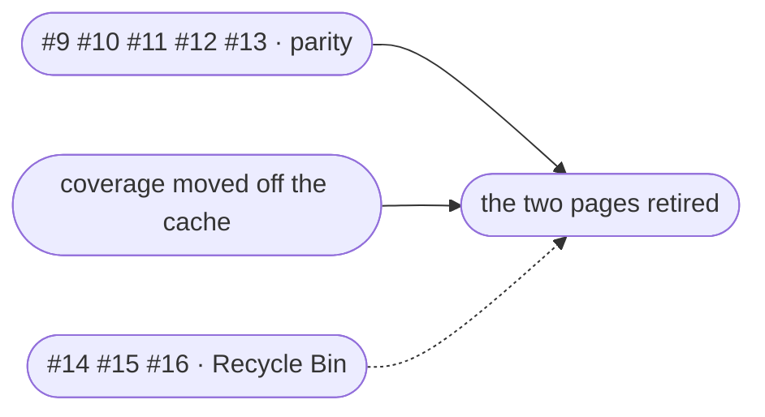

# Duplicate cleanup — working plan

**Goal:** Duplicate cleanup absorbs the two older pages (Duplicate photos, Duplicate folders)
and they are retired. The Recycle Bin gains a location you choose and a clock that depends on
what put things there. No Archive.

**Done, in 3.0.0.** Kept as the record of what was decided and why — the reasoning is
worth more than the plan was.

This is a plan, not a specification. Decisions are recorded so they need not be re-argued;
open questions are recorded so they are not silently answered by whoever writes the code
first. How detection actually works is a separate document —
[`duplicate-detection.md`](duplicate-detection.md).

---

## Where it stands

**The restructuring and the engine are done.** The duplicate feature lives in
[`gallery/duplicates/`](../apps/server/src/modules/library/gallery/duplicates) on the server,
[`sections/duplicates/`](../apps/web/src/features/control/sections/duplicates) on the web, and
its own [`styles/duplicates.css`](../apps/web/src/styles/duplicates.css). The cleanup page went
from 1,456 lines to 444.

Duplicate cleanup now finds everything the older pages do:

- **fingerprints on demand** — Run scan queues a pass over the job's libraries and returns
  at once, with progress on the job card (#4)
- **all five tiers** — identical files, near-identical, identical folders, stored
  elsewhere, and sharing photos (#5, #6)
- **dismissals survive a re-scan**, which they never did before (#17)
- **a refused delete says what moved**, and the check runs before you press it (#8)

Two quality fixes came out of running it against a real library: bursts that look like
copies are told apart from real ones (#18), and the twin whose name gained a suffix is no
longer the one kept (#19).

**Surface parity is finished too.** Everything the older pages could do that cleanup could
not — the side-by-side set viewer (#9), the folder compare (#13), the bulk sweep (#10), and
the keep/clear folder instructions (#11, now the job's own, in wizard step 2) — is on the
cleanup page. Certainty is shown on every set as two separate chips (#12).

**The Recycle Bin track is finished.** Each binned item carries its own purge date (#14),
there are two retention clocks — the bin's, and a shorter one for cleanups (#15) — and the
bin can be one folder outside your libraries instead of a `.trash` inside each (#16).

What remains is **retirement itself**: moving the test coverage off the cache branch, then
the commit that deletes the two pages and the roughly 2,000 lines of cache code behind them.
How detection works is [`duplicate-detection.md`](duplicate-detection.md).

---

## How it ended

The retirement commit deleted both sections and the whole cache branch behind them:
`duplicates/routes.ts`, 31 exports from `items.ts` and 34 from `folders.ts`, the six
`gallery_duplicate_*` cache tables (migration 31), the weekly `find_duplicate_photos`
job, and the install-wide keep/clear instructions. What stayed: the shared engine (the
size gate, the hashing pass, keeper scoring, the folder fingerprint) and the four
dismissal tables, because a dismissal is a decision and a cleanup still writes them.

Every address the old pages ever had resolves to the cleanup.

---

## Decisions taken

1. **Duplicate cleanup replaces both older pages.** They are a live view of the last scan —
   open, act, leave — and every rebuild renumbers everything underneath you. Three pages over
   one scan was already recorded in [`nav.ts`](../apps/web/src/features/control/nav.ts) as more
   chrome than it was worth. Converging also collapses two parallel implementations of
   grouping, reading and resolving into one.

2. **No Archive. The Recycle Bin is extended instead.** It already is a 30-day cool-down,
   already type-agnostic, and already moves files rather than deleting them. What it lacked — a
   location you choose, and a clock that depends on why something was removed — is cheaper to
   add than a second holding area is to build.

3. **Fingerprinting happens on demand, not on a schedule.** A weekly disk pass for a page
   nobody opened is work nobody asked for, and the re-read is mtime-gated anyway, so only the
   genuine first run is expensive. The job model absorbs that wait properly — a cleanup is
   built to be put down and returned to.

4. **Hashing is scoped to the job's libraries; the size gate stays global.** A digest outside
   scope is one the job will never read. But a photo's only twin is very often in a library the
   job does not cover, so narrowing the *gate* would silently stop finding those pairs. These
   pull in opposite directions on purpose — do not "fix" the inconsistency.

5. **Scan progress lives on the job card, not in a modal.** A modal says "wait here". The card
   says "this is running, go away if you like", which is both true and the premise of the whole
   feature.

6. **One Recycle Bin location for every library, chosen on the Storage page.** Set it before
   creating libraries; after that it can only change while the bin is completely empty. Unset
   keeps today's behaviour, so existing installs are untouched.

7. **Retention is two levels, not a general system.** The bin's own setting is the default;
   duplicate cleanup gets one override. Room for more sources later, but not built now.

8. **Expiry is written when an item is trashed, not computed at purge.** Today lowering the
   global retroactively condemns everything already in the bin past the new window. Each item's
   fate should be fixed at the moment the promise was made.

9. **Certainty is two measures, never one number.** Match certainty (identical bytes, or how
   many bits apart) and keeper certainty (real evidence, or the last-resort tiebreak). A
   byte-identical set is certain about the match and can still be a coin toss about which copy
   to keep.

### The finding that settled decision 6

Immich's [external library docs](https://docs.immich.app/features/libraries/) say plainly that
*all* files in an import path are added, with no built-in handling of hidden or dot-directories
— exclusion is opt-in glob patterns their own docs call unreliable for advanced use. So anyone
running Immich over the same share is indexing `.trash` today, and every photo deleted in the
last 30 days appears there as live. Syncthing, Nextcloud and backup software walking the
library tree have the same problem. You cannot rely on other tools' ignore rules, because most
have none.

---

## Still open

None of these block #4, but each changes work further down.

- **Folders XOR files.** A job answers one question and only one job can be active install-wide,
  enforced by a partial unique index. That was deliberate — mixing them produced a list nobody
  could work through — but it was decided when the old pages were a fallback. Once they are
  gone, wanting both means finishing one cleanup first. Keep it and make the sequencing
  explicit, relax the index to one active job *per type*, or let one job hold both with the list
  still split by kind.

- ~~**Where the global folder instructions live.**~~ **Settled:** they are the *job's*, edited in
  wizard step 2. The install-wide set survives only as the seed a new job starts from, and its
  editor (on the old pages) goes with them — so the retirement commit has to decide whether the
  seed is worth keeping without a UI, or whether `PREFERRED_FOLDERS_KEY` and
  `folderPreferences()`/`setFolderPreferences()` go too. Nothing depends on that choice any more:
  every cleanup can now say what it wants for itself.

- **Whether the folder compare view can act.** Review-only is simpler and avoids a second action
  surface that would have to re-implement the revalidation.

- **Whether the cross-storage warning appears at setup or at library creation.** At setup time
  there may be no libraries to compare against, so the honest comparison can only happen later.
  Probably both: guidance on the Storage page, and a specific notice when a library is created
  on a different volume from the bin.

---

## The work

### Done

| # | | |
|---|---|---|
| 1 | Duplicate styles into their own stylesheet | `admin.css` 4,075 → 1,306; new `duplicates.css` at 2,781, sharing zero selectors so the cascade is provably unchanged |
| 2 | Server modules under `gallery/duplicates/` | Eight files, 6,844 lines — 49% of the gallery module — moved beside `faces/` |
| 3 | UI under `sections/duplicates/` | Five files moved; the cleanup page split into page, wizard, job card, result card and types |
| 4 | Fingerprints on demand | Two-phase scan through the existing queue job, scoped to the job's libraries; progress on the job card, not a modal |
| 5 | The `overlap` tier is produced | Both folders stay; only the shared copies leave one side, and the card says so |
| 6 | Near-identical tier in files mode | New `distance` column (migration 27); `tier` derived from it, so shape and certainty stay separate axes |
| 7 | The detection map written down | [`duplicate-detection.md`](duplicate-detection.md) — the cache/snapshot fork, the size gate, the five tiers, the keeper ladder |
| 8 | A refused delete says what moved | `ApiError` now carries its payload; the check runs when the confirm opens, and `ConfirmDialog` gained `confirmDisabled` |
| 17 | Dismissals survive a re-scan | All three remaining passes consult the ignore tables; one dismissal no longer shatters a set of three |
| 18 | Bursts told apart from copies | Same dimensions + similar size, plus either a small time gap or consecutive frame numbers. 52 near sets → 29 on the dev library |
| 19 | The right twin is kept | `derivedCopyIds` asks relationally within the set, so `Picture 071.jpg` beats `Picture 071-001.jpg` without a pattern that could misfire |
| 20 | The near tier stops matching strangers | Two photos can share a tonal layout and nothing else; graded `unsure` rather than offered as a match |
| 9 | Side-by-side set viewer on the cleanup | Full-size comparison of one set's copies — unavoidable once near-identical sets exist |
| 12 | Certainty on every set | Two chips, never merged: match certainty from `distance`/`tier`, keeper certainty from the winning criterion's rank (`keeper_rank`, migration 28) |
| 13 | Side-by-side folder compare | Two folders in two columns from `keeper_member_id`; extras on one side for `contained`, on both for `overlap` |
| 10 | Bulk sweep on the cleanup | Filtered to `tier = 'exact'` in the server's own scope builder, so one click can never clear a judgement call |
| 11 | Folder instructions have a home | Wizard step 2, per job: `jobFolderOptions()` lists folders from the CATALOGUE (there is no scan yet), and the draft is saved on leaving step 1 so the instructions have a job to attach to |
| 14 | An expiry per binned item | `expires_at` written when the item is trashed (migration 29); the purge reads the row, so lowering the window no longer condemns what is already in the bin |
| 15 | Two retention clocks | Bin default plus a duplicate-cleanup override, chosen by the new `source` column — which also lets the bin filter a hand delete out from under a cleanup's thousands of rows |
| 16 | One configurable bin location | Storage page; `trash_root` per row (migration 30) so a row always finds its own files, `EXDEV` fallback on all three move sites, editable only while the bin is empty |
| — | Test coverage moved off the cache branch | 26 new cases: the exact-tier guards, the banding invariant, folder nesting, mutual cover, the clear-out rules, and a new suite that runs a cleanup over real files. Found a real defect on the way (see below) |

## The last two steps, as they went

- **The test coverage moved first.** Of the 131 cases in the two cache suites, 100 called a
  cache-only entry point; the other 31 tested the shared engine and moved into
  [`gallery-duplicate-engine.test.ts`](../apps/server/test/gallery-duplicate-engine.test.ts).
  The job side gained 26 cases first, including a new suite that runs a cleanup over real
  files — and the move turned up a real defect, nested folder pairings reported at every
  level, which the cache had a filter for and the snapshot did not.

- **Then the retirement.** Hand-picking a keeper and resolving a partial selection did not
  come across: a cleanup re-snapshots rather than editing keepers in place, and resolves a
  whole result. Both are deliberate — one keeper implementation, one unit of work.

### What went with them

The old pages were an escape hatch, and it was invisible until they were gone: only one
cleanup can be active install-wide, so if someone else owned it — or you were halfway
through a folder cleanup and wanted to check one photo — you went to the other page. The
quick "do I even have duplicates?" question was one click and is now a created job.

Neither was a reason to keep two pages built on a cache that renumbered itself under
whoever was reading it. Both are worth remembering if the one-active-job rule ever starts
to chafe: relaxing it to one job per type is the obvious first move.
