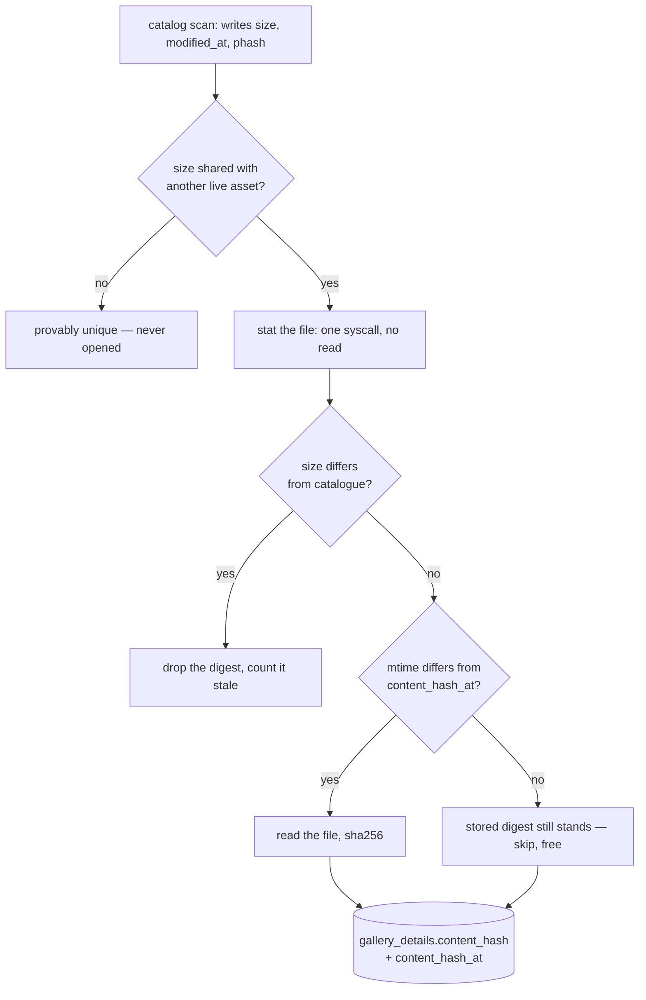
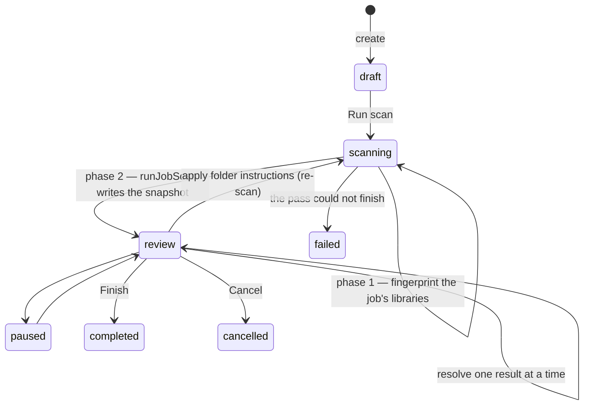
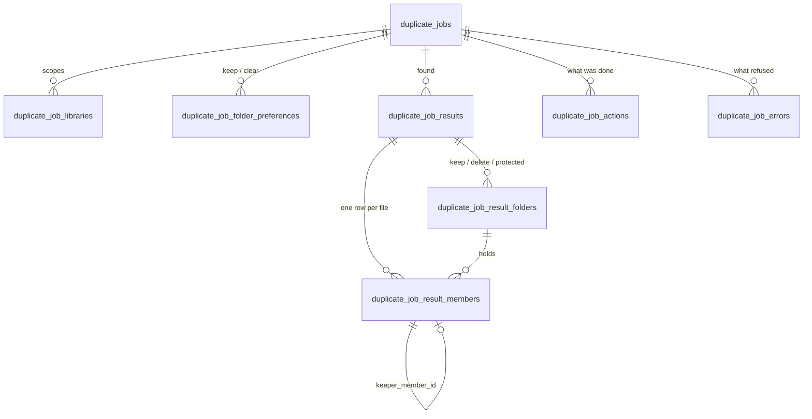

# Duplicate detection

**In one sentence:** detection happens once, into `gallery_details.content_hash`, and
everything after that is bookkeeping over those digests, into the **snapshot** a cleanup
job owns.

Code lives in [`gallery/duplicates/`](../apps/server/src/modules/library/gallery/duplicates);
the UI in [`sections/duplicates/`](../apps/web/src/features/control/sections/duplicates)
with its own [`styles/duplicates.css`](../apps/web/src/styles/duplicates.css). The
user-facing guide is [`users/duplicate-cleanup.md`](users/duplicate-cleanup.md); how this
arrived at one page is [`duplicate-cleanup-plan.md`](duplicate-cleanup-plan.md).

---

## One place results live

Everything a scan finds is written into the job's own tables (`duplicate_job_*`) by
`runJobScan(jobId)`: written once, stable for weeks, scoped to that cleanup's libraries.

There used to be a second set — `gallery_duplicate_*`, an install-wide **cache** that the
Duplicate photos and Duplicate folders pages read. It was dropped and rebuilt whole by
every scan, which is what made those pages a thing you open, act on and leave: anyone
pressing Rebuild renumbered every row underneath everyone else. A job deliberately held
no foreign key into it. Both pages and all six cache tables were retired in 3.0.0
(migration 31).

**Dismissals outlived them**, and are the one part of the old schema still in use:
`gallery_duplicate_ignores`, `…_folder_ignores`, `…_contained_ignores`,
`…_folder_overlap_ignores`. Pressing **Not the same** in a cleanup writes one, and every
snapshot pass consults them before it groups anything — a decision that two things are
not duplicates has to outlive the scan that proposed them, or the next scan asks again.

---

## Stage 1 — how a file gets hashed

The catalog scan deliberately never re-reads a file it has already seen
([`scanner.ts`](../apps/server/src/modules/library/gallery/scanner.ts) skips on unchanged
size + mtime), so hashing everything there would undo the one optimisation that keeps
rescans cheap. Instead the pass exploits what byte-identical files must share: `size`.

Two things worth knowing:

- **The size gate is global**, even when a scan is scoped to particular libraries. A
  photo's only twin is very often in a library the scan doesn't cover, and narrowing the
  gate would silently stop finding those pairs.
- **Freshness comes from `stat`, not the catalogue.** `content_hash_at` records the file's
  own mtime at the moment it was hashed, so a photo edited in place between catalog scans
  still re-hashes without one having run in between.

A file whose byte size is unique is therefore **never hashed**. That is correct — it cannot
be anyone's twin — but it has a consequence for folders, below.

---

## Who asks for a scan

One trigger: **Run scan** on a cleanup, over that cleanup's libraries, through the
`SCAN_GALLERY_DUPLICATES` queue job — which yields to catalog and face scans and requeues
itself after a restart. The pass is two phases: fingerprint the job's libraries, then
snapshot.

There were two other triggers, a Scan button on Duplicate photos and a weekly
`find_duplicate_photos` job, and both existed to rebuild the install-wide cache. With the
cache gone they had nothing left to write, so they went with it: a scheduled pass feeding
a page nobody can open is work nobody asked for. Fingerprinting is on demand now, and
mtime-gated, so only the genuine first read of a photo is expensive.

`duplicate_jobs.scan_progress` carries phase 1's percentage, throttled to whole-percent
changes — writing per file would be one UPDATE per candidate. `setJobStatus` only resets
it on *entering* `scanning`, because a two-phase scan says "scanning" twice and the second
would otherwise wipe what the first filled.

**One active job at a time**, enforced by a partial unique index rather than a check two
browser tabs can race. Completed, failed and cancelled jobs fall out of it.

---

## What counts as a duplicate

Five tiers, two kinds of evidence: **identical bytes**, and a **perceptual fingerprint**.
Every folder answer is a rollup of the first.

| Tier | Test | Media | Certainty |
|---|---|---|---|
| Identical files | same sha256 of the original bytes | photo + video | absolute |
| Near-identical | 64-bit dHash within **3 bits** | photo only | high, not certain |
| Identical folders | same folder digest | via identical files | absolute |
| Stored elsewhere | every file below A has a twin outside A | via identical files | absolute |
| Sharing photos | some files in common, neither equal nor contained | via identical files | absolute |

### Identical files — the 100% case

Same bytes, so the copies are interchangeable in every respect. Which one survives is
purely a question about *location and links* — there is nothing to choose between the
files. This is the only tier a bulk sweep may touch.

### Near-identical — same picture, different file

The fingerprint: grayscale, squashed to 9×8 *ignoring aspect ratio*, then 64
adjacent-pixel comparisons — computed from the cached preview thumbnail, which is why
resolution differences converge and a 3-bit window works.

> **Easy to break.** The window is only safe because the hash is split into **4 × 16-bit
> bands**: pigeonhole guarantees any pair within 3 bits shares an untouched band, so
> bucketing misses nothing. Raising `NEAR_IDENTICAL_DISTANCE` without raising `BAND_COUNT`
> silently starts missing pairs. Lowering it is safe.

**These copies are not interchangeable** — different resolution, often stripped EXIF — so
deleting one really loses something. They are never swept in bulk, and the card says so.

Distance is stored per member (`duplicate_job_result_members.distance`, 0 for
byte-identical) and the result's `tier` is derived from it. Two axes on purpose:
`result_type` says what SHAPE a result has, `tier` says what it rests on. A byte-identical
set is certain about the match and can still be a coin toss about which copy to keep.

### The burst problem

A fingerprint cannot tell a re-saved file from two exposures of the same scene: consecutive
frames land one to three bits apart, exactly where a re-compression does. On a real library
that is most of what the tier matches — of 52 near sets on the dev library, 23 were bursts.

`looksLikeSeparateShots` drops those. All of the first two, plus either of the last:

1. **Same pixel dimensions** — a resized or re-exported copy is not
2. **File sizes within 20%** — a re-compressed copy is a fraction of its original
3. either **timestamps 1–120 s apart** — bounded because `taken_at` falls back to file
   mtime with no EXIF, and two copies written months apart must not read as a burst
4. or **consecutive frame numbers** — `IMG_1109` beside `IMG_1110`: the same name but for
   a trailing counter one apart

The frame-number test is the one that matters in practice: cameras write whole seconds, so
a pair fired inside one second shares its EXIF timestamp exactly.

Pairs sharing a timestamp with no sequence evidence are **deliberately kept**. A camera
writing whole seconds puts burst frames at the same value, but so does a copy that
inherited its original's EXIF, and one of those must not be dropped. The count of what was
left out goes into the job's action log.

### Not a duplicate tier

[`similarity.ts`](../apps/server/src/modules/library/gallery/similarity.ts) has
`NEAR_DUPLICATE_DISTANCE = 10` — the "burst / same scene" band. It exists only so Memories
can pick visually distinct photos, and is far too loose to propose deleting anything. Don't
wire it into cleanup.

### Blind spots

- **Videos have no near tier.** `phash` is photos-only, so a re-encoded video is invisible
  to everything except byte-identity.
- **No folder tier over near-identical.** All three folder answers are built from exact
  digests, so a folder re-exported at lower quality pairs photo by photo but is invisible
  at folder level.
- **Rotation un-pairs a match, including from inside the app.** `gallery_details.rotation`
  is user-applied rotation baked into the thumbnail the fingerprint is computed from, so
  rotating one copy breaks the pairing on the next backfill.
- **Crops are unpredictable.** `fit: "fill"` squashes rather than preserving aspect.

---

## Which copy is kept

`pickKeeper` compares copies **criterion by criterion, first difference wins** — ordered,
not weighted. That keeps the answer explainable (the winning criterion *is* the sentence on
the card) and avoids a tuning problem.

| # | Criterion | Why there |
|---|---|---|
| 1 | In a library its files can't be deleted from | Naming it the loser proposes an action `trashBook` will refuse |
| 2 | In a folder you chose to keep | Explicit instruction |
| 3 | Not in a folder you're clearing out | Same instruction, negative side |
| 4 | Has tags, albums, people, collections… | User work — the only thing not recoverable from the file |
| 5 | Has hand-edited details | Manual date / location / metadata |
| 6 | Not a copy | See below |
| 7 | In an original folder | Not `Downloads`, `WhatsApp`, `Screenshots`, `tmp`… |
| 8 | Has date and camera info | EXIF survived on this copy |
| 9–11 | Resolution, file size, added first | Stable tiebreaks; the last always resolves |

**"Not a copy" is two rules.** `COPY_MARKERS` catches names that announce themselves —
`photo (2)`, `copy of…`, `…-duplicate`. But no pattern can say which of `Picture 071.jpg`
and `Picture 071-001.jpg` is the original: `-001` is a counter to scanner software and part
of the name to another camera. So `derivedCopyIds` asks the question **relationally,
within the set**: a member whose stem is another member's stem plus an appended suffix is
the copy of it. The extra part must start with a separator, so `IMG_1109` is not read as a
copy of `IMG_110`.

Because the ladder is ordered, **the rank of the winning criterion is itself a confidence
measure** — a keeper that won on tags was chosen on evidence a person created; one that
reached *"identical in every way — kept the one added first"* won a coin toss.

A cleanup job passes its **own** folder instructions in. They are seeded from the
install-wide set at creation and diverge from then on, and they are edited in **wizard
step 2** — before the scan, because the scan picks each set's keeper as it writes it.

The folders that step offers come from `jobFolderOptions()`, which reads the **catalogue**:
every folder holding photos in the job's libraries. It cannot list only folders a scan has
found duplicates in — the way the retired pages' folder picker did — because at the moment
the instructions are given, no scan has run. Changing them afterwards is a re-scan (`applyPreferences`), not a re-sort.

---

## The three folder answers

A folder has no row anywhere — it exists only as a prefix of `library_items.folder_path`.
Its fingerprint is every file below it as `<path below the folder>\0<digest>`, sorted and
hashed. The folder's own name is deliberately excluded; subfolder layout is included.

A folder is only fingerprinted when it holds **at least two files and every file below it
is hashed**. That gate is free rather than restrictive — if two folders really are
identical, every file in one has a same-size twin in the other — but it means **a single
genuinely unique photo makes its whole folder invisible** to all three tiers.

| Answer | Test | Action |
|---|---|---|
| **Identical folders** | same digest | one folder kept, the others can go whole |
| **Stored elsewhere** | every file below A has a counterpart outside A, multiplicity respected | A can go; nothing is lost |
| **Sharing photos** | some files in common, neither equal nor contained | **both folders stay**; only the shared copies leave one side |

They run in that order and each defers to the ones before it, so a pair is never answered
twice.

**The topmost pairing wins**, and this is two rules rather than one. A duplicated folder
duplicates everything inside it, so `Photos/2019` pairs with `Backup/2019` exactly as
`Photos` pairs with `Backup` — and removing the parent takes the child with it. So a group
is dropped when a parent and its own child are both in it, *and* when every member's parent
is itself in some group. The snapshot had only the first of those until the test-coverage
move; a duplicated tree produced a card per level, and clearing the top one left the rest
pointing at folders that were no longer there.

*Stored elsewhere* exists because the equal-contents test can never see a folder copied
**into itself** — a parent's fingerprint counts its child's files, so it always holds
strictly more. That is the commonest mess sync clients produce.

---

## The cleanup job's snapshot

`keeper_member_id` is the point of the shape. **Every doomed file names the copy that
survives it**, so "where do the copies live?" is answered by the union of the keepers'
folders. The retired contained cache stored ONE target folder per row, which could not express
copies scattered across several — the honest single answer was then the library root, and
the card said "everything in this library" and «copies sit in "."». That was re-worded
across four releases; the shape was what was wrong.

Result types and what they carry:

| `result_type` | Folders | Members |
|---|---|---|
| `photo_set` | none | the copies; `tier` = `exact` or `near` |
| `folder_set` | keeper + each doomed folder | every file, paired by path below the folder |
| `contained` | doomed folder + one destination | only the photos surviving *there* — one result per destination |
| `overlap` | the two folders | only the shared copies, paired across |

---

## Deleting

A snapshot is stale by design — that is what makes it useful — so nothing at this end
trusts it. `checkResult` compares every member against the library as it stands:

- the item is still there and still `ready`
- `size`, `content_hash` and `modified_at` all still match the snapshot
- for a doomed copy, its library still allows deleting
- **and the copy that was meant to survive it is itself fine**

**All-or-nothing per result.** A single disagreement refuses the whole set rather than
deleting the part that still matches, and the reply carries which members went stale and
why — `missing`, `modified` or `protected`. The page re-checks when the confirm dialog
opens, so a stale card says so before you press Delete rather than after.

Then, in order: each doomed photo hands its tags, albums, collections and tagged people to
its keeper, and only then does `trashBook` move the file to the Recycle Bin. Nothing is
ever erased, and a library the app may only read refuses outright.

> **Faces are the exception, and the distance decides.** On a byte-identical copy the
> pixels are the same, so a face box drawn on one describes the same spot on the other. A
> near-identical copy is a *different image*, and its boxes are normalised to its own
> frame — so `absorbDuplicateMetadata` is called with `moveFaces: member.distance === 0`.

---

## Where the code lives

| File | Owns |
|---|---|
| `duplicates/items.ts` | Size gate, sha256 pass, exact + near grouping, keeper scoring, folder instructions, the scan worker |
| `duplicates/folders.ts` | Folder fingerprints, the three folder tiers, their resolve paths |
| `duplicates/jobs.ts` | A cleanup job: scope, status, ownership, totals |
| `duplicates/job-scan.ts` | Starting a scan, and writing / reading the snapshot |
| `duplicates/job-review.ts` | Mark, dismiss, re-apply folder instructions |
| `duplicates/job-resolve.ts` | Revalidate, then move copies to the Recycle Bin |
| `duplicates/job-routes.ts` | The cleanup page's API |

---

## Known limits

- **Scoping a job can hide a set.** Photo sets are grouped from the digests inside the
  job's libraries, deliberately, so a set whose other copies were filtered out can't offer
  to delete the last copy in scope. The consequence: a two-library job won't show a photo
  whose only twin lives in a third.
- **Applying folder instructions is a full re-scan.** `applyPreferences` calls
  `runJobScan` again rather than patching keepers, so review marks are dropped and result
  ids change. Intentional — a second keeper implementation is exactly the class of bug this
  design exists to end.
- **Dismissing an identical-folders set can let the contained tier speak up about the same
  two folders.** "All of Copy's photos are also in Trip" is a different and true statement,
  so it isn't suppressed — but it reads as the same pair returning under a new heading.
