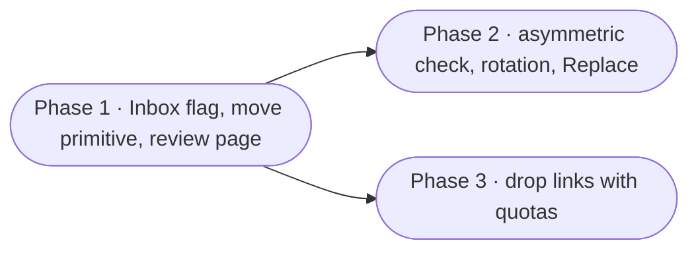

# Photo Inbox — proposal

Status: shipped in v3.67.0 (2026-09-06) — all three phases, drop links included; kept as
the record of what was decided and why, with each phase's as-built notes under its
heading. Still open: the open questions at the end that the build did not settle (a
drop link emails nobody, for one); question 4 was settled as two quota columns on
`share_links`.
Written 2026-09-06 from a brainstorm about re-scanning old prints. Companion to [gallery-library.md](gallery-library.md),
[duplicate-detection.md](duplicate-detection.md), [uploads.md](uploads.md) and
[sharing.md](sharing.md), which describe the pieces this stands on. Like the other
proposals, decisions are recorded so they need not be re-argued; open questions are
recorded so they are not silently answered by whoever writes the code first.

## Goal

A holding place for photos that are **not part of the collection yet**, and a review
that ends with every one of them either kept, used to replace a worse copy, or
discarded. Two situations drive it:

1. **Re-scanning a box of prints.** Many of them were scanned once before, years ago,
   at a worse resolution. The new scan should be checked against what is already in
   the library, and the better copy should win.
2. **A relative with a phone full of photos and no account.** They should be able to
   drop a bounded batch through a link, and someone in the house reviews it before it
   becomes part of anything.

The idea in one line: **new photos land in an Inbox, and the Inbox is emptied by
review.** Nothing in it is in the house until someone says so.

## The mental model

| Question | Answer |
| --- | --- |
| Where do unreviewed photos live? | In an **Inbox**, which is a gallery library with one flag set. |
| What does review mean? | Emptying the Inbox: every photo ends as Keep, Replace or Discard. |
| Who sees Inbox photos? | Only people browsing that library on purpose. Nothing resurfaces them. |
| How are they checked for copies? | An asymmetric duplicate job: Inbox photos against the rest, never the rest against itself. |
| How do photos get in? | The scanner picking up a folder, the existing upload, or a **drop link** for people without an account. |

## Non-goals

Each of these was considered and dropped on purpose.

| Not building | Why |
| --- | --- |
| A generic review surface for every media type | Duplicate detection lives in `gallery_details.content_hash`; an ebook "duplicate" is an edition question Works already answers. A generic page would be a second abstraction with one real user. |
| A per-item `review_state` on any library | The things a review needs — exclusion from feeds, a folder the scanner owns, a link to drop into, a scope for the job — are all per library. One flag on the library does all of it; a per-item state does none of it on its own. |
| A guest gallery for the uploader | The drop link is write-only. The uploader gets a count back and nothing else. Viewing is what the existing share links are for, after review. |
| A scheduled Inbox check | The check runs when a delivery finishes. A scheduled pass over an empty Inbox is work nobody asked for, the same lesson as the retired weekly duplicate job. |
| Crop-tolerant matching | dHash within 3 bits catches re-saves and resolution changes; a re-scan with a different crop is out of its reach. Rotation is cheap to close (see Phase 2); crop is not, and the guide should say so. |

## What already exists

The audit, so no phase re-invents a primitive:

| Piece | Status |
| --- | --- |
| Library flags | **Built** — `libraries.policy_json` carries `mode`, `allowUpload`, `allowDelete`; `settings_json` carries scan extensions. The Inbox flag joins them. |
| Batch upload into a gallery library | **Built** — `POST /api/library/gallery-libraries/:id/assets/upload` streams a batch into a hidden staging folder, then files each photo under `YYYY/YYYY-MM-DD` by capture date. |
| Duplicate cleanup jobs | **Built** — a job scoped to a set of libraries, two-phase (fingerprint, then snapshot), results in the job's own tables, dismissals that outlive a scan. |
| The global size gate | **Built** — a file is only hashed when another live asset shares its byte size, and that gate is global even when the job is scoped. Exactly the asymmetry this needs. |
| Near-identical tier | **Built** — 64-bit dHash from the preview thumbnail, banded into four 16-bit buckets, so a candidate's neighbours are an index lookup rather than a sweep. |
| Replace a photo's file | **Built** — `replaceGalleryAssetFile` keeps the item, its tags, faces and date, swaps the bytes, and parks the old file in `replaced/` beside the Recycle Bin. |
| Recycle Bin with a cleanup clock | **Built** — `trashed_items.expires_at` is fixed when an item is binned; duplicate cleanup has its own shorter retention. |
| Guest links | **Built** — `share_links` with hashed token, label, required expiry, revocation, an open `module` column and a `permission` column only ever set to `read`. Unknown tokens count as abuse. |
| Move an asset to another library | **Missing.** Gallery edits cover place, time, tags, rotate and replace. Nothing moves a file across libraries while carrying its `library_items` row, tags, faces and edits. Keep needs this. |

## Decisions taken

1. **The Inbox is a gallery library with a flag, not a module.** `policy_json.inbox: true`.
   It is managed, on disk where you choose, scanned by the normal scanner. A scanner
   app on a desk can write straight into its folder; a family member can upload to
   it; a drop link can fill it. The flag changes what the rest of the app does with
   its contents, nothing about how they get there.

2. **An Inbox is invisible everywhere it was not asked for.** Its items are excluded
   from the Home feed, the Timeline, Memories, Year in review, slideshow and album
   pickers, and the People list. Browsing the library directly, and the review
   page, are the only ways to see them. Each surface filters on the flag at the
   library join it already has for `libraries.type`.

3. **Faces wait for acceptance.** The face scanner skips Inbox libraries. A box of
   prints from a relative's side of the family would otherwise seed People with
   strangers before anyone decided the photos stay. Accepting a photo queues it for
   the face pass like any newly scanned asset.

4. **Review has three verbs, and the Inbox empties as they are used.**
   *Keep* moves the photo into a real library and folder. *Replace* swaps the photo
   in for an existing copy the check found. *Discard* bins it on the cleanup clock.
   There is no fourth state; a photo still in the Inbox is simply not reviewed yet.

5. **Keep asks where, it does not guess.** Uploads file by capture date, which is
   right for phone photos and wrong for scans, where EXIF holds the scan date. The
   Keep dialog names a destination library and folder, remembers the last choice for
   the session, and offers the dated-folder rule as one option rather than the
   default. Bulk place-and-time before Keep remains the way to fix dates first.

6. **The duplicate check is a job mode, not a new engine.** A cleanup gains a
   scope kind: *Check an Inbox against the library*. Candidates are Inbox photos
   only; twins are looked for in every other gallery library the owner can reach.
   Fingerprinting hashes the Inbox in full and, outside it, only files the size
   gate already singled out. The near-identical pass looks up Inbox hashes in the
   bands and never compares outside files with each other. Cost tracks the size of
   the delivery, not the size of the collection.

7. **In an Inbox check the outside copy is the keeper by default.** The question a
   set asks is "is the new one better?", not "which one stays?". A set shows the
   pair side by side with resolution and file size, and offers Replace (new pixels
   win), Discard (old copy wins), and Keep both (a burst or a different print).
   Keeper scoring from the symmetric mode is not consulted.

8. **Rotation is closed for Inbox photos only.** Scans come in sideways. Phase 2
   computes the dHash of the four rotations for Inbox candidates and looks each up;
   the collection keeps one hash per photo. Four lookups per delivered photo is
   nothing; four hashes per collection photo would be a schema change for a case
   only scans produce.

   *Widened after the fact (`duplicates/inbox-rescans.ts`).* The near tier links at
   three bits of a 9x8 grayscale grid, which is right for a re-save and hopeless for
   the case this feature exists to serve: one print scanned twice sits a dozen bits
   away, because a hand-placed print is framed a few percent differently and every
   scanner grades tones its own way. Widening the tier to a dozen bits would link
   half the seascapes in a library, so instead the fingerprint only PROPOSES — the
   nearest few within a wide gate — and each proposal is settled by correlating the
   two cached previews, normalised for brightness and contrast, over a few centre
   crops and the four rotations. One photograph twice scores ~0.94; two pictures
   that merely share a layout, ~0.1. Inbox-only, because the candidates are one
   delivery: the collection is never compared with itself.

9. **The check runs itself.** When an Inbox scan or a drop finishes, a check job
   is queued for that Inbox, so the review bar can open with "12 new, 3 look like
   copies". It obeys the one-active-job rule; if a cleanup is already running the
   bar says so and offers to queue.

10. **Drop links reuse `share_links`.** Module `gallery-inbox`, resource the
    Inbox library, permission `upload`, which gives the vestigial column a use
    instead of a third table. The link carries what the existing row has (label,
    expiry, revocation) plus a quota: a file count cap and a total size cap. The
    quota is the disk-fill defence and is enforced server-side per link, counting
    what already landed.

11. **"One time" is a property of the link.** A one-shot link revokes itself when
    its first batch completes. A standing link stays open until it expires or is
    revoked, for the relative who sends a few every week.

12. **Each delivery gets its own subfolder.** `<label or uploader>/<date>` under
    the Inbox root, so the review page can group by delivery and a reviewer can
    tell Grandma's box from this morning's scanner run. The link's label is the
    folder name for drops; the account name is for uploads; the folder the
    scanner found is kept as is.

13. **The uploader sees a count and a thank-you.** No thumbnails, no gallery, no
    way to see what else is in the Inbox. The drop page is the first anonymous
    write path in the app and it should have the smallest possible surface.

## Phase 1 — the Inbox and the review — BUILT

The part that is useful for the re-scanning project on its own, before any
duplicate check exists. As built (2026-09-06):

- The flag is `policy_json.inbox`, set from the library wizard's advanced Access
  tab and the edit dialog's Access tab (gallery only); `inbox-flag.ts` answers
  "is this an Inbox" for the surfaces that must skip one, `inbox.ts` holds the
  review. Exclusion lives in `resolveGalleryScopeLibraryIds`: an empty request
  drops every Inbox, an explicit library list keeps one — so every surface that
  asks for "everything I can see" skips it, and naming it is how it is browsed.
  The face scanner is gated three times (enabled list, queue, scan).
- The move primitive is `gallery/move.ts` (`moveGalleryAsset`): file, row,
  `scan_rule_id` cleared, `discovered_at` bumped on a cross-library move, and
  the thumbnails re-homed into the destination's bucket — thumbnail keys begin
  with the library id and deleting a library removes its whole bucket, which
  the proposal had not foreseen.
- Discard is a third `TrashSource`, `photo_inbox`, on the cleanup clock.
- Routes: `GET /api/library/gallery/inbox`, `GET …/inbox/:id/items?folder=`,
  `POST …/inbox/keep`, `POST …/inbox/discard`. The page is `/gallery/inbox`
  (`/gallery/inbox/:libraryId` for one), `PhotoInboxPage` with `GalleryKeepModal`;
  a nav entry appears in the gallery once an Inbox exists, and the Home feed pins
  a `photo_inbox` card while one has photos and the viewer may review it.
- Not built from the list below: the Home tile's exact wording, and the
  "Loose files" root delivery is shown as its own chip rather than hidden.

- **Flag and creation.** `policy_json.inbox: true`, set on the library create and
  edit dialogs as "This is an Inbox for photos under review". One install may have
  several, for the household that keeps a scanner box and a family drop apart.
- **Exclusion.** Feed, timeline, memories, year in review, album and slideshow
  pickers, People, and the face scanner all skip Inbox libraries. One helper,
  `inboxLibraryIds()`, so the filter is written once. A test per surface that
  seeds an Inbox photo and asserts it does not appear.
- **Move-asset primitive.** `moveGalleryAsset(itemId, { libraryId, folder })`
  in `gallery/edit.ts`: moves the file, rewrites `library_items.library_id` and
  `folder_path`, and leaves tags, faces, likes, collection membership, edits and
  the thumbnail cache untouched because they hang off the item id. Refuses when
  the destination is external, lacks upload rights, or is itself an Inbox, and
  when the source is locked. Bulk form takes a selection.
- **Review page.** A page on the Inbox library, reached from its card and from a
  Home tile that only appears while an Inbox is non-empty ("Inbox — 40 photos to
  review"). Grouped by delivery. A bar with Keep, Discard, and Select all. Keep
  opens the destination dialog (decision 5). Discard confirms per the
  ConfirmDialog conventions and bins on the cleanup clock. Kept and discarded
  photos leave the page; an empty Inbox shows an empty state and the page closes
  the loop.
- **Guide.** A section in `users/library-gallery.md` and a listing on the Help page.

Schema: none beyond the policy flag. No migration.

## Phase 2 — the Inbox check — BUILT

As built (2026-09-06), where it departs from the plan below:

- **One column, not two.** `duplicate_jobs.inbox_library_id` (migration 68) on a
  job stored as `duplicate_type = 'files'`; the API reads it back as
  `duplicateType: "inbox"`. Widening the type's CHECK would have meant rebuilding
  the table. The job model adds the Inbox to the job's libraries itself.
- **The wizard's second step**, not its first, carries the choice — that is the
  step that asks what a cleanup compares — with an Inbox picker under the cards;
  step 1 lists Inbox libraries with an "Inbox" badge and never ticks them by
  default. The card only appears when an Inbox exists.
- **Rotation is matched silently.** The four hashes are computed for incoming
  photos in the worker (`inbox-variants.ts`) and passed into the near grouping as
  variants (`groupNearIdentical`'s `candidates` + `variants` options); a match
  found that way is not labelled "rotated" on the card — recording it would need
  a column, and the distance shown is the best one either way.
- **Replace** is `POST …/results/:resultId/replace { memberId }` (`job-replace.ts`):
  hand-filed work moves to the library item, `replaceGalleryAssetFile` takes the
  Inbox file, the Inbox row is purged. Offered on near sets only — on an identical
  set there is nothing to gain. **Keep both** is the existing **Not the same**:
  the dismissal is recorded and the photo stays in the Inbox for the normal Keep.
- **The sweeps** are the existing exact-tier sweep (relabelled "Discard N identical
  copies") and `POST …/results/replace-larger`, which replaces every set on screen
  whose incoming copy has more pixels in both directions.
- **Auto-run** (`inbox-check.ts`): a finished Inbox scan or an upload into an Inbox
  queues a check — re-running the Inbox's own job when one waits in review, never
  touching another cleanup (the page says "another cleanup is in progress" and
  offers a button). The owner is the admin who uploaded, else the library's creator.
- **The Inbox page** shows the check's state — running with progress, "N look like
  copies" with a link to the cleanup page, "no copies found", or a **Check for
  copies** button — and does not embed the sets: they are worked on the cleanup
  page, which is where Replace, Discard and Compare already live.

The plan as written:

- **Scope kind on a job.** `duplicate_jobs.scope_kind` = `libraries` (today's
  behaviour) or `inbox`, with `inbox_library_id`. The wizard's first step gains
  "Check an Inbox against the library" beside the existing folder and file
  choices. A migration adds the two columns; existing jobs read as `libraries`.
- **Asymmetric scan.** `scanFiles` takes the Inbox for candidates and the size
  gate's matches elsewhere for twins. Exact sets are written only when one side
  is in the Inbox. The near-identical pass looks Inbox hashes up in the bands and
  writes a set per Inbox candidate with its outside neighbours; outside-to-outside
  pairs are never formed.
- **Rotation.** Four dHashes per Inbox candidate at scan time (decision 8), kept
  in memory for the pass, not stored. A match found through a rotated hash is
  labelled "rotated" on the set so the reviewer knows why it looks different.
- **Set review.** Side by side with pixel dimensions and size, the outside copy
  marked as what the library has. Replace calls `replaceGalleryAssetFile` with the
  Inbox file and then removes the Inbox item. Discard bins the Inbox copy. Keep
  both moves the Inbox copy through the Keep dialog and records a dismissal so
  the pair is never proposed again.
- **Auto-run.** A finished Inbox scan or drop queues the check (decision 9). The
  review page shows the job's progress on its bar, and its sets first, then the
  unmatched photos.
- **Bulk.** "Replace all where the new copy is larger in both dimensions" and
  "Discard all identical" are the two sweeps; near-identical sets with a smaller
  or equal new copy are never swept, matching the existing rule that only the
  byte-identical tier is bulk-safe.

## Phase 3 — drop links — BUILT

As built (2026-09-06), where it departs from the plan below:

- **Permission is `edit`, not `upload`.** The `share_links.permission` CHECK only
  admits read/edit/manage and widening it means rebuilding the table; the module
  (`gallery-inbox`) is what distinguishes a drop link. The quota is two nullable
  columns plus a `one_time` flag on `share_links` (migration 69, the story-column
  precedent), and what a link received is its own table, `share_link_drops` —
  needed anyway, since the quota counts what landed, not what remains.
- **Where it lives.** A **Drop link** button on the Inbox page (the reviewer's
  right, the same as Keep and Discard) opens a dialog that mints links and lists
  the ones out with status, usage and a take-back; the profile's Shared links
  page lists them too, and the general `DELETE /api/shares/:id` revokes them.
  Expiry runs 1–90 days (a box of prints takes a while), default 14.
- **The public pair** is `GET /api/drop/:token` (60/min) and
  `POST /api/drop/:token/upload` (20/min), with no preHandler like every guest
  route. CSRF still applies: the page's own GET issues the cookie the POST
  carries, as `SharePage` does. Files land in `<label>/<YYYY-MM-DD>/` and are
  catalogued one by one like an upload; the batch is refused whole when it would
  exceed what the link may still receive.
- **The review** marks a delivery that came through a link with a link icon on
  its chip, from the drops table; there is no per-photo chip.
- **A one-time link** closes in the same transaction that records its delivery.
  Two batches racing on one token can both stream before either commits; the
  second still lands (it is bounded by the quota) and the link is closed once.
- **The check** queued by a delivery is owned by the link's creator when they are
  an admin, else by the library's creator.

The plan as written:

- **Creating a link.** From the Inbox library's Share menu: label, expiry,
  file cap, size cap, one-time or standing. Stored on `share_links` with module
  `gallery-inbox` and permission `upload`; the quota lands in a small
  `share_link_quotas` table keyed by link, or as two nullable columns if the
  story-only column precedent is preferred. Raw token shown once, as with every
  other link.
- **Drop page.** `/drop/:token`, no account. Resolves the link through
  `resolveShareLink`, shows the label and what is allowed ("up to 200 photos,
  2 GB"), and the shared `FileUpload` dropzone in batch mode. Accepted extensions
  come from the Inbox library's own settings.
- **Server.** `POST /api/drop/:token/upload` streams through `receiveUploadBatch`
  into the delivery folder (decision 12), enforces the per-link quota against
  what has already landed, and queues an Inbox scan. Rate-limited like the other
  public routes. Completion of the first batch revokes a one-time link.
- **Feedback.** "Received 37 photos. Thank you." and, for a standing link, the
  remaining allowance. Nothing else.
- **Review.** Deliveries from links show the label and the link's creator on the
  review page, and a "from link" chip on each photo until it is kept.
- **Guide.** `users/library-gallery.md` gains "Letting someone drop photos", and
  `exposing-to-the-internet.md` notes what a drop link exposes.

## Security notes for Phase 3

The drop route is the first path on which an anonymous request writes to disk.
What keeps it bounded, so the review of it can be short:

- The token is 216 bits and a miss is counted as abuse by the existing resolver.
- The quota is enforced by the server on every batch, counting files already
  received, so a client that ignores the number in the page changes nothing.
- The accepted extensions are the library's image and video list; nothing else is
  written, and nothing written is ever executed or served back to the uploader.
- Files land in an Inbox only, which no surface resurfaces and no face scan reads
  until a member accepts them.
- The link expires; the row's `expires_at` is already required.

## Open questions

1. **Should Keep be allowed into an external library?** Today external libraries
   are read-only for the app. Leaning no: Keep goes to managed libraries, and a
   reviewer who stores the collection externally moves the files by hand from the
   Inbox folder, which the review page can point at.
2. **Should an Inbox photo count for storage stats and the library totals?** Leaning
   yes for storage, no for the "N photos" headline on Home.
3. **Where does the check's job live in the control panel?** It is a cleanup job, so
   it appears on the Duplicate cleanup page like any other. Whether the review page
   embeds it or links to it is a layout question for the mockup.
4. **Quota columns versus a quota table.** Two columns on `share_links` follow the
   story-only precedent and keep one table; a table keeps the link row clean. Decide
   when Phase 3 starts.
5. **Should a standing drop link notify anyone?** The email plumbing exists but is
   off by default. A "12 photos arrived from Grandma" mail is a natural fit and can
   ride the existing `shareNotifications` flag rather than a new one.

## How it ends

Phase 2 and Phase 3 are independent of each other. Phase 1 is enough for the
scanner box; Phase 3 is the one that lets the rest of the family help fill it.
