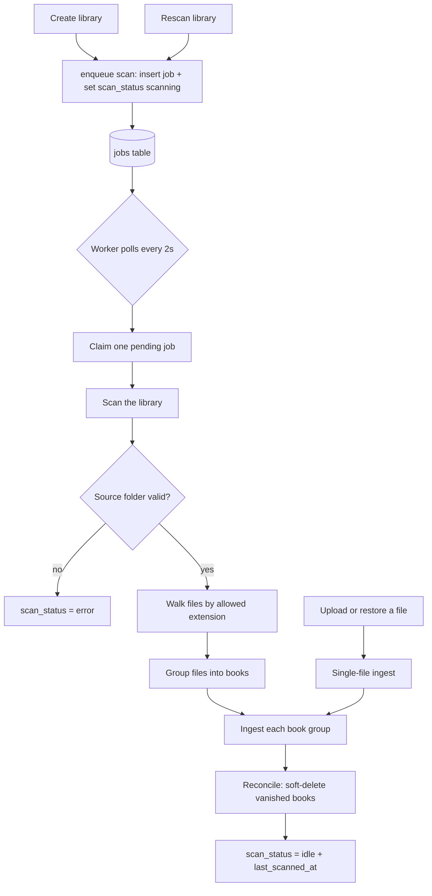
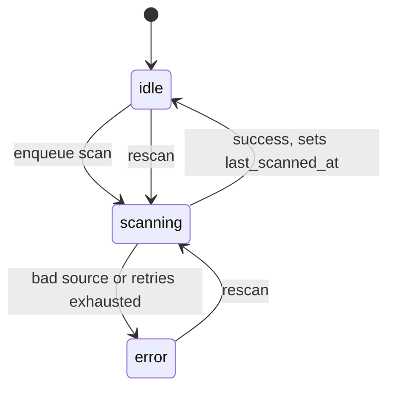
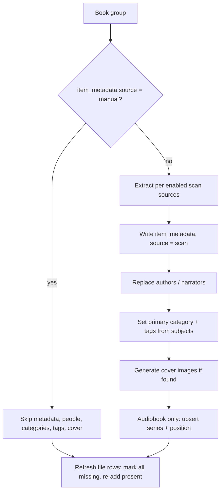

# Scanner

How the library scanners discover files on disk and turn them into catalog
entries. There is one scanner per media type — `audiobook` and `ebook` — and
they share the same shape: a background **job queue + worker**, a **library
scan** routine that walks/groups/ingests/reconciles, and per‑file **ingest**
that writes metadata. This document describes the process *as it works today*.

Key files:

| Area | Audiobook | Ebook |
| --- | --- | --- |
| Scanner | [`audiobook/scanner.ts`](../apps/server/src/modules/library/audiobook/scanner.ts) | [`ebook/scanner.ts`](../apps/server/src/modules/library/ebook/scanner.ts) |
| Worker start | `audiobook/index.ts` | `ebook/index.ts` |
| Scan sources | [`shared/metadata-sources.ts`](../apps/server/src/modules/library/shared/metadata-sources.ts) | same |
| Settings | [`shared/library-settings.ts`](../apps/server/src/modules/library/shared/library-settings.ts) | same |

## Overview

## 1. Triggers

A scan starts in one of these ways:

| Trigger | Entry point | Effect |
| --- | --- | --- |
| Create a library | `enqueue*Scan(libraryId)` in `routes.ts` (create handler) | Full library scan |
| Rescan a library | `POST /api/library/<type>-libraries/:id/rescan` → `enqueue*Scan(id, options)` | Full scan; `options` may override `scan_sources` / `tagEncoding` **for that run only** |
| Upload (ebook) | `scanSingleEbookFile(libraryId, relativePath)` | Ingests just that file's group, no full walk |
| Single-book rescan / metadata reset (audiobook) | `rescanSingleBook(bookId)` | Re-ingests one book |
| Restore from Recycle Bin | `rescanSingleBook` / `enqueueEbookScan` (`shared/trash.ts`) | Re-catalogs restored files |

Full scans go through the **job queue**; single-file paths run **inline** in the
request (they reuse the same ingest routine).

## 2. Job queue & worker

Full scans are rows in the `jobs` table (`type = SCAN_AUDIOBOOK_LIBRARY` or
`SCAN_EBOOK_LIBRARY`). Each scanner runs its own worker, started from the
module's Fastify plugin at boot:

- `start*ScanWorker()` polls every **2 s** (`setInterval`); the audiobook worker
  also runs once immediately on boot.
- `process*ScanQueue()` is guarded by an in-process `queueRunning` flag (no
  overlapping runs). It claims **one** pending, due job via an optimistic
  `UPDATE … SET status='running' WHERE id=? AND status='pending'` (so multiple
  pollers can't double-claim), runs it, then marks it `completed` or schedules a
  retry / marks `failed`.
- **One library job at a time (server-wide):** before every claim, each worker
  checks `shared/scan-lock.ts` (`libraryJobRunning()`) — while ANY library job
  (audiobook, ebook, gallery, or face scan) is running, other workers leave
  their queues untouched until the next poll. Heavy scans therefore run
  strictly one after another; everything else waits as `pending`.
- **Live progress:** while a scan runs, the worker throttle-writes
  `{processed, total, startedAt, etaSeconds}` into the job payload via
  `shared/job-progress.ts`. The ETA uses the rate over a recent (~30 s)
  window, not the whole-run average, so racing through already-cataloged
  items doesn't poison the estimate. The admin Tasks page (Control panel →
  Libraries → Tasks) renders counts, percentage, and time remaining.
- **Retries:** transient failures re-queue (`status='pending'`, future `run_at`)
  until `max_attempts` (default 3). Backoff differs by type — ebooks retry after
  a flat **5 s**, audiobooks after **1–5 min** (`min(attempts+1,5) × 60 s`).
- **Permanent failure:** a bad/missing source folder throws `LibrarySourceError`
  and fails the job at once (no retry) so the library doesn't sit stuck on
  "scanning".

The library's `scan_status` column tracks lifecycle:

## 3. Scan sources (per-library config)

A library stores an **ordered** subset of metadata sources in
`settings_json.scan_sources`. Order is priority (index 0 wins per field); the
enabled set gates which extractors run. Defined in `metadata-sources.ts`:

| Source | Applies to | Default | Notes |
| --- | --- | --- | --- |
| `file_metadata` | audiobook, ebook | on | Embedded metadata — audio tags, EPUB OPF, FB2 XML. Off ⇒ filename-derived records only. |
| `metadata_files` | audiobook | on | Sidecar files in the folder (`.json`, `.nfo`). |
| `folder_structure` | audiobook | off | **Changes grouping**: each top-level folder = one book; folder name parsed as `Author - Title [Narrator]`. |
| `online_metadata` | audiobook | off | Internet lookup (LibriVox, Open Library) to fill gaps. Slower; needs network. |

A one-shot override of these can be passed to `rescan` for a single run without
changing the saved config.

## 4. Library scan pipeline

`scan<Type>Library(libraryId, …)`:

1. Set `scan_status = 'scanning'`.
2. **Validate** the source folder (`validateLibrarySource`) → `LibrarySourceError`
   on failure (permanent).
3. **Walk** the tree for files whose extension is in the library's scan
   extensions. Symlinks that escape the source root are skipped.
4. **Group** files into books (see §5).
5. **Ingest** each group (see §6).
6. **Reconcile** (see §7).
7. Set `scan_status = 'idle'`, `last_scanned_at = now`.

## 5. Grouping files into books

| Type | Rule |
| --- | --- |
| Ebook | Group by **folder + basename** (`ebookGroupKey` = dir + filename without extension). `Title.epub` + `Title.pdf` + `Title.fb2` in one folder = **one book in three formats**. Loose files at the root are each their own book. |
| Audiobook | Default `folder_hierarchy` grouping (see `walkAudiobookFiles`). Enabling the `folder_structure` source switches to **top-level folder = one book**, gathering all audio inside it. |

## 6. Ingest pipeline

`ingestEbookGroup` / `writeBookScan` create or update the `library_items` row
(keyed by `library_id` + `folder_path`/group key) and its metadata. The first
decision is whether the book was **hand-edited**:

- **Manual protection:** if `item_metadata.source = 'manual'`, scanned metadata,
  people, categories, tags and cover are left untouched — only the content file
  rows are refreshed. Hand edits survive every rescan.
- **Metadata extraction** (when `source = 'scan'`):
  - *Ebook:* EPUB OPF (`extractEpubMetadata`) → FB2 XML (`parseFb2Metadata`,
    charset-aware) → filename fallback (`pdfMetadata`). Yields title, authors,
    language, subjects, description, year, cover.
  - *Audiobook:* audio tags (music-metadata / mp4 chapters), folder-name parse
    (`parseFolderName` → `Author - Title [Narrator]`), folder cover, optional
    online lookup; **series** via `seriesValue` (name + position).
- **People** are replaced via alias-aware upserts (`item_people`, roles
  `author`/`narrator`); **categories** from `matchCategoryId(subjects)`;
  **tags** from `setEntityTags(subjects)`.
- **Covers**: `sharp` writes small + large WebP thumbnails.
- **Content files**: every current file row is marked `missing`, then each
  present file is re-added — so a removed format drops out while the rest stay
  available (`document_files` for ebooks, `audio_files` for audiobooks).

## 7. Reconcile (deletions)

After ingesting, the scanner lists known non-deleted books for the library and
**soft-deletes** any whose group/folder no longer exists on disk: set
`library_items.deleted_at` and mark their files `missing`. Files on disk are
never modified — deletion is catalog-only and reversible from the Recycle Bin.

## 8. Single-file paths

Upload, restore, and metadata-reset reuse the same ingest without a full walk:

- `scanSingleEbookFile` reads the file's folder, regathers its format group, and
  calls `ingestEbookGroup` — so an uploaded PDF joins an existing EPUB instead of
  creating a duplicate.
- `rescanSingleBook` re-ingests one audiobook by id.

## 9. Per-type summary

| | Audiobook | Ebook |
| --- | --- | --- |
| Unit of a "book" | A folder (or grouped audio) | A file group (same stem, multi-format) |
| Embedded metadata | Audio tags, mp4 chapters | EPUB OPF, FB2 XML |
| Folder-name parsing | Yes (`Author - Title [Narrator]`) | No (filename only) |
| Online lookup | Optional | No |
| **Series on scan** | **Yes** (`upsertSeries` + `series_items`) | **No** |
| Online cover | Optional | Embedded only |

## 10. Extension points (not yet built)

For context when evaluating new scan behaviour — the natural hook is the
**ingest step (§6)**, after `meta` is built and gated by the same
`source = 'manual'` check:

- **Ebook series** are not derived at all today; an inference step would slot in
  here, persisting through the shared `upsertSeries` + `series_items` path the
  audiobook scanner already uses (`series_items.source` distinguishes `scan`
  from `manual`, which is what protects hand-curated series across rescans).
- Any folder-structure / layout interpretation would also live in ingest, *under*
  embedded metadata in priority, and apply on the next rescan.
