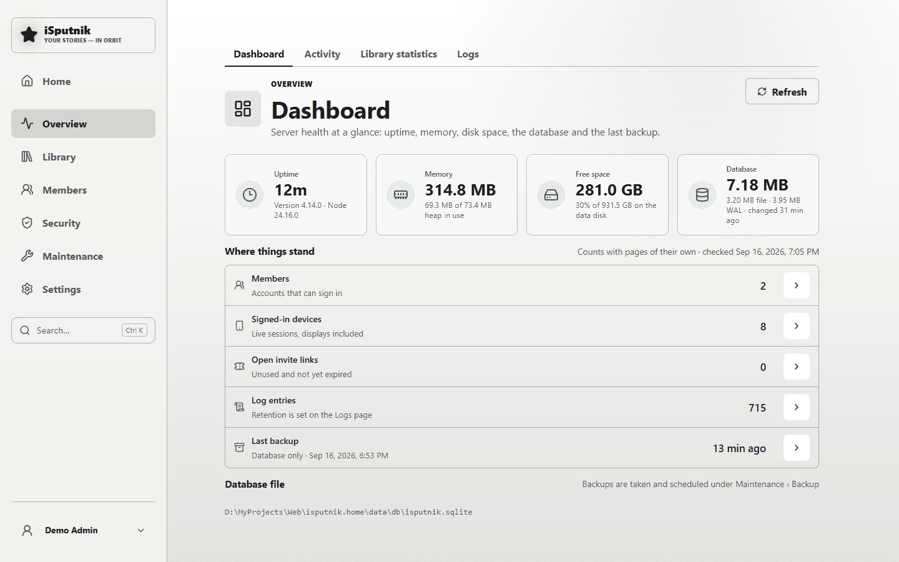
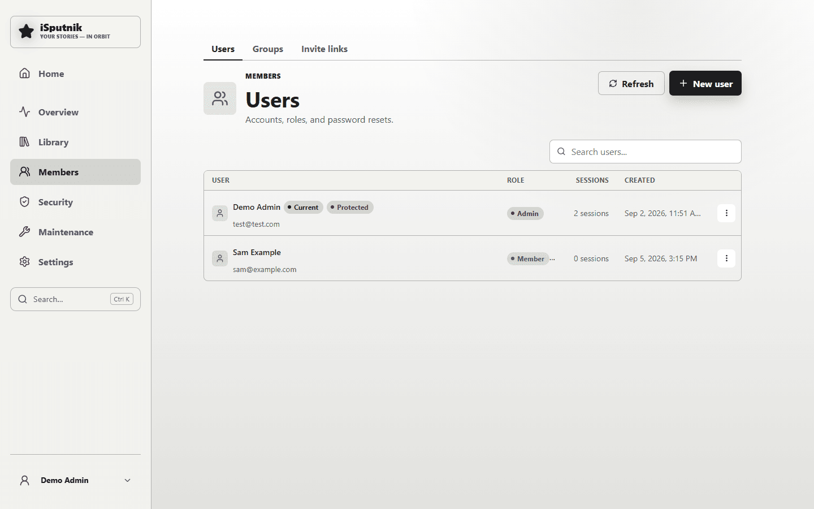
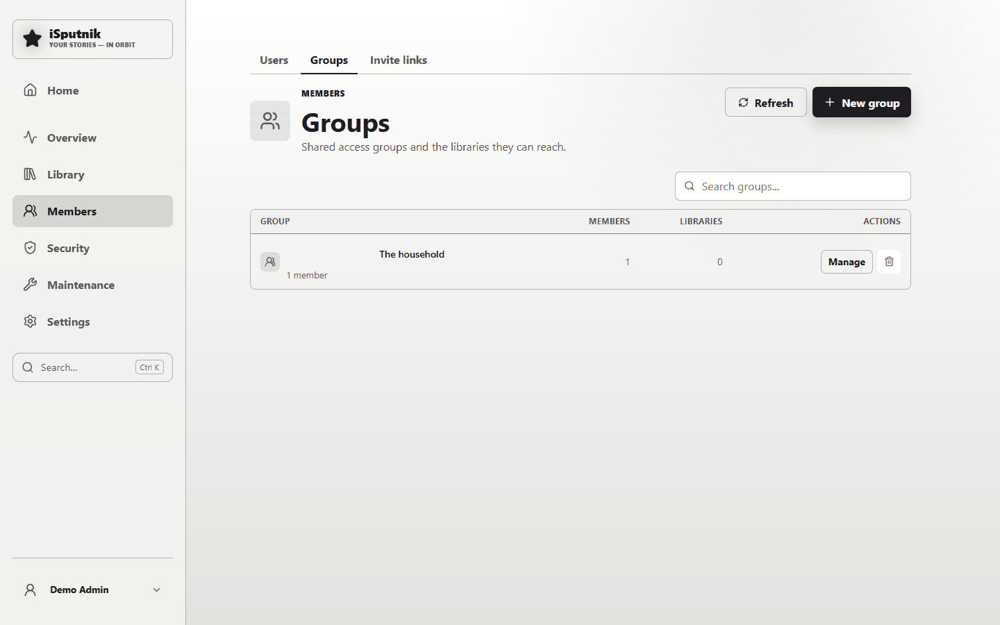
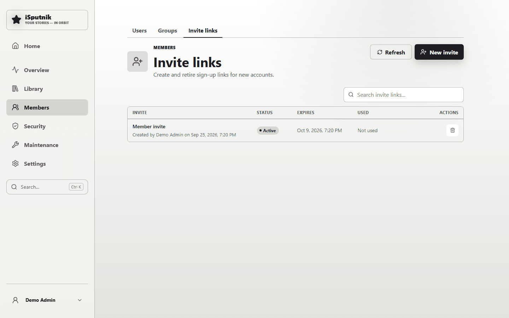
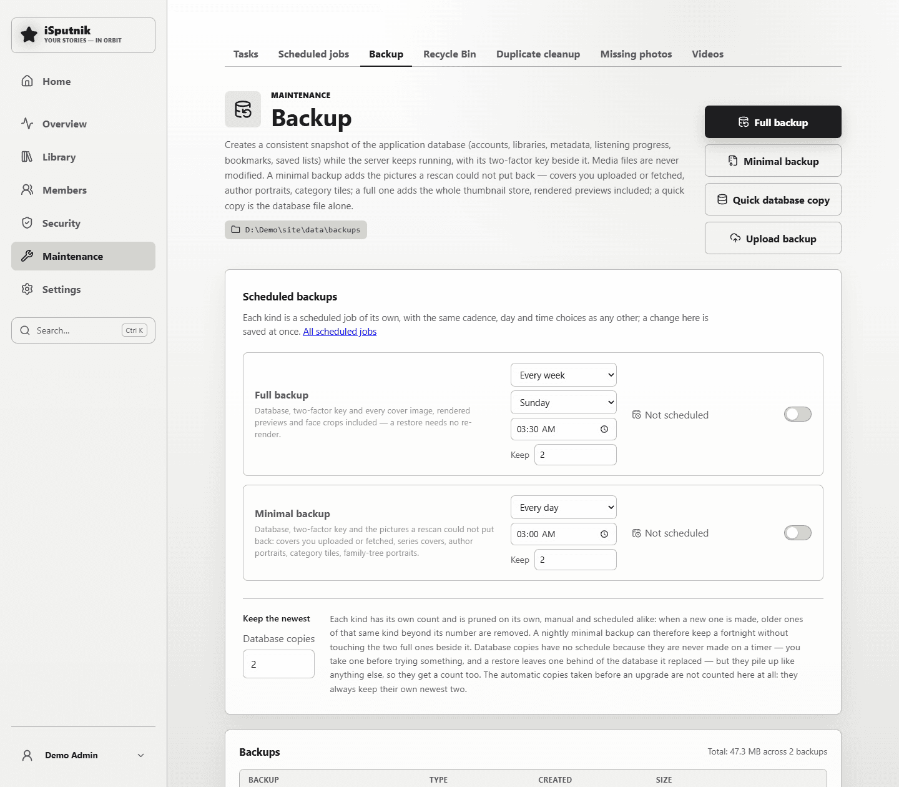
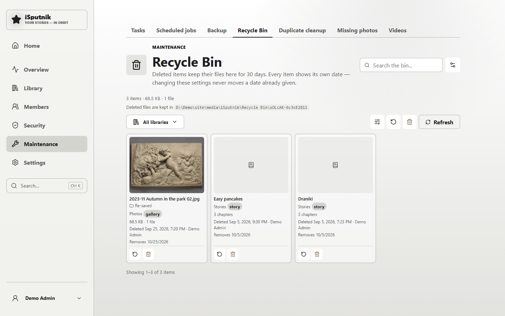
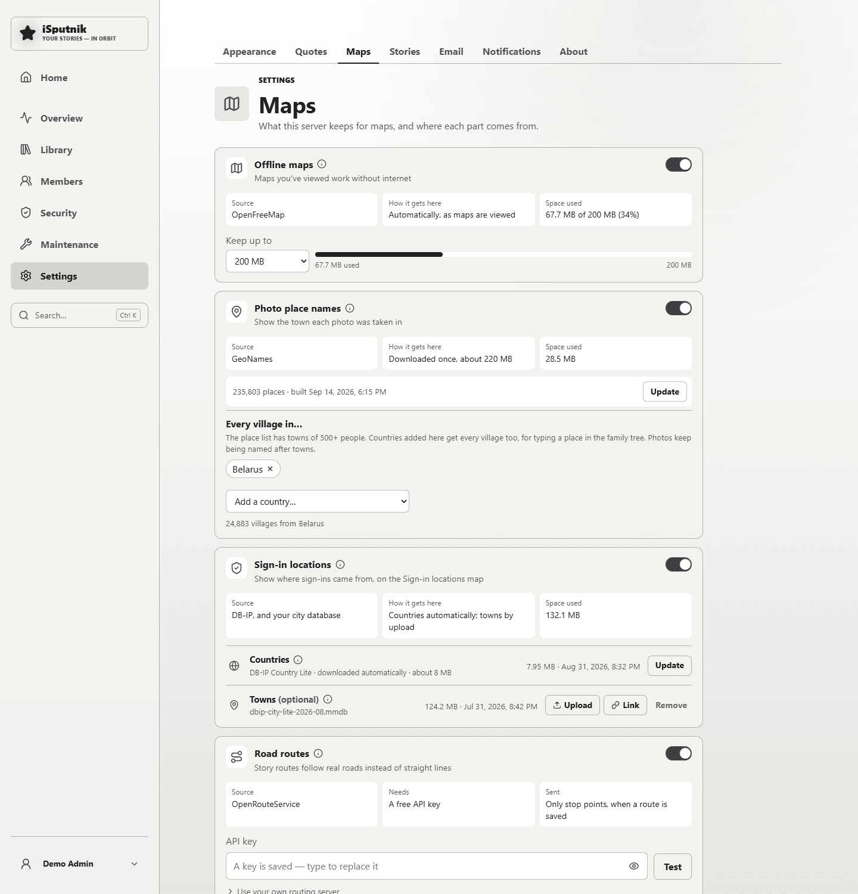

# The control panel

Everything an administrator runs the server with. **Control panel** sits at the
bottom of the sidebar, above the menu with your name on it, and only administrators
see it. Inside the panel that link steps aside; **Home** at the top of the panel's
own nav is the way back out.

The left-hand nav has six sections. Each opens on its first tab, with a row of tabs
across the top of the page. This guide walks them in order; where a page already has
a guide of its own, it points there rather than repeating it.

| Section | Tabs |
|---|---|
| **Overview** | Dashboard, Activity, Library statistics, Logs |
| **Library** | Libraries, Storage, Storage contents, Categories, Tags |
| **Members** | Users, Groups, Invite links |
| **Security** | Overview, Sign-ins, Sign-in locations, Policies, Trusted networks, Blocked IPs |
| **Maintenance** | Tasks, Scheduled jobs, Backup, Recycle Bin, Duplicate cleanup, Missing photos, Videos |
| **Settings** | Appearance, Quotes, Maps, Stories, Email, Notifications, About |

Every tab has its own address, so any page here can be bookmarked, linked to, or
opened in a new tab.

> **Rearranged in 4.15.** The Dashboard's row of views became tabs where they
> belong — Sign-ins and Sign-in locations under Security, Tasks under Maintenance,
> Activity and Library statistics under Overview. Utilities is gone: Duplicate
> cleanup and Missing photos are under Maintenance, Quotes under Settings. Maps is
> a Settings tab again. **Reader access** moved to your own Profile, since the
> tokens are yours, which also means every member can now make them. Old
> bookmarks still land on the right page.

## Finding things

**Search…** under the nav — or **Ctrl+K** (**⌘K** on a Mac) from anywhere in
the control panel — searches every page *and* the settings on them. Typing `smtp`
goes to Settings → Email; `lockout` goes to Security → Policies and scrolls to the
lockout card, which flashes so you can see which one it means; `duplicate` goes to
Maintenance → Duplicate cleanup. Arrow keys move through the results, Enter opens one.

Use it rather than hunting through tabs. It's usually faster even when you know
where a setting lives.

**One page usually leads to the next.** Where a task carries on somewhere else, the
page links there, already narrowed to what you were looking at: a library's scan
to its tasks, a failed task to its library and the schedule, a finished cleanup to
what it put in the Recycle Bin, a sign-in you're looking into to that address's
(or that person's) logs and the Block dialog. These are ordinary links, so Back and "open in new tab"
work.

**On a phone** the left-hand nav becomes one row: **Home**, a button naming the
group and page you're on, and search. The button opens a menu of every group and
its pages, scrolled to where you are.

---

## Overview

### Dashboard

Is the server well? The panel opens here.



Is the server well? Four cards: uptime with the version and Node
release under it, memory in use, free space on the data disk (green until a
fifth is left, amber below that, red below a tenth), and the database on disk
with its file and WAL sizes (the WAL is SQLite's write-ahead log, which grows
between checkpoints and is normal). Under them, a short table of counts that
have pages of their own — members, signed-in devices, open invite links, log
entries, and when the last backup was taken — each row a door to that page. Come
here first when something feels wrong.

### Activity

What the household has been doing with the library, over the
window you pick with the same date toolbar as Security → Sign-ins: cards for uploads,
downloads and deletes (each compared with the stretch before) and storage used;
two charts (uploads, downloads and deletes; and what was played, read or
viewed); the content events themselves; and what's currently in progress for
every member — a snapshot that doesn't follow the range, since a book's reading
position is overwritten as you go rather than logged session by session.

### Library statistics

What's *in* the catalogue, every media type on one page: a card
each for audiobooks, ebooks and photos & videos, and one for the total on disk;
every library in one table, biggest first, with its share of the storage drawn
beside it; and four short lists, paired two by two. People first — top authors
across both book types, top narrators by hours — then what is on the disk: the
biggest gallery files, and the folders holding the most photos. That last one
counts the folder each photo actually sits in, not its subfolders rolled up, so
it names the place to go rather than the library it is somewhere inside.

### Logs

The activity history: who signed in, what was scanned, what was deleted, what an
administrator changed. This is where you look after a security alert, to see
what actually happened.

Pick a window first — **All** for the whole archive, or the same 1h … 30d and
custom presets the dashboard uses — then search, filter by event (each event by
its full name, so "auth.login_failed" is a filter of its own), by user, or by
address, and click a column heading to sort by it. The arrow at the start of a
row opens the whole record underneath. A person's name or an outside address in
a row is a link into their Sign-ins dive. The download button exports exactly
what is on screen — every row matching the window, filters and sort, not just
the page — as a CSV, and the bin button clears records older than an age you
choose at the moment of deleting; the Dashboard tells you when they've grown
large enough to be worth it.

**What the app records about visitors.** Most entries here carry the address the
request came from, and that includes people without an account: a guest who opens
or downloads from a share link, or sends photos through a drop link, is logged
with their address like everyone else. Sign-in attempts (what Security → Sign-ins
reads) and signed-in devices keep their addresses too. Two things to know if you
share links outside the house:

- **Nothing here expires on its own unless you ask.** Log entries stay until you
  clear them with the bin button above (it offers 365 days, and you can pick any
  age); the bin clears this page only. For a standing limit, turn on **Prune the
  activity log** under Scheduled jobs: once a month it deletes log entries *and*
  sign-in attempts older than 365 days (the `ACTIVITY_LOG_RETENTION_DAYS` setting
  changes the window). It ships off because the Dashboard's all-time figures read
  the same history. The device list is never pruned — revoke devices under Profile.
- **The server's own output logs every request** with the visitor's address, and
  how long that is kept is up to Docker, not the app. The stock `docker-compose.yml`
  keeps five files of 10 MB each; setting `LOG_LEVEL=warn` stops the per-request
  lines altogether — see the
  [configuration reference](https://github.com/isputnikdotnet/isputnik.home/blob/main/docs/configuration.md).

Addresses are placed on the map from a database on your own server. With an
AbuseIPDB key set under Security → Policies, an address is also sent to AbuseIPDB
when it gets blocked automatically or when you ask for a check; without a key,
none is.

---

## Library

### Libraries

Adding libraries and pointing them at folders has [its own guide](libraries.md).

### Storage

Where the app keeps its own things, and the approved folders your libraries may
read. Has [its own guide](storage.md).

**System data** is the folder the app needs to run: thumbnails, backups and
metadata, the first two of which can each have a folder of their own. **App
storage** is one optional switch for the Photo Inbox, the App files library,
renders and map data, kept together in one folder. Every change is confirmed with
the exact folder before it happens. The **Recycle Bin location** is set on the
Recycle Bin page; changing it moves what is in the bin in the background.

### Categories and Tags

The two ways things get grouped across every library type. Categories are a fixed,
shelf-like taxonomy the scanner assigns; tags are free-form, and one tag can span
audiobooks, photos and family-tree people at once. Here you rename, merge and delete
them across the whole install.

---

## Members

Three tabs: the people, the groups you gather them into, and the invite links
that bring new ones in.



- **Users** — create accounts, set roles (**Member** or **Admin**), change
  passwords, and reset someone's two-factor when they've lost both their phone and
  their backup codes.

  **"Delete user" doesn't delete anything but the sign-in.** It deactivates the
  account and signs that person out everywhere; their libraries, groups, activity
  history and files all stay.

  The **first administrator** — the account created at first run — carries a
  **Protected** badge: its role can't be changed and it can't be removed here, so
  an install can never be left with no way in. You also can't change your own role
  or remove your own account, for the same reason.
- **Groups** — named sets of people you give access to as a unit. Worth it the
  moment you're giving the same three libraries to the same four people, and the
  usual way to set up a relative: make a group ("Petrov family"), give it what it
  should see, and add people to it. **Manage** opens the group's access, with its
  members first.
- **Invite links** — sign-up links, so you don't have to hand out passwords. Create
  one, send it, retire it when it's been used or you've changed your mind. Tick
  **Joins these groups** and the person arrives already in them, with everything
  the groups are given.





Signed-in devices are on Security → Sign-ins, which lists every
session with the ability to revoke any of them — where you go when a laptop is
lost, or when a sign-in alert names a device you don't recognise.

### Everything one person can reach

Click a person's name — or ⋮ → **Edit user** — to open
their page: who they are at the top, with **Preview as …**, a ⋮ menu of the
occasional things (password, two-factor, passkeys, remote linking, lockout) and
**Save changes**; then tabs, each with its own address:

| Tab | What it shows |
| --- | --- |
| **Account** | Their profile (name, email, role, whether the account is active), the groups they're in as chips you can remove or add to, **Who they are** — their person in the family tree and their face in the Gallery — and an **Access summary**. Beside them: their recent activity from the log, **Where their access comes from** (each group and what it gives, the people whose photos they see, what was sent to them, what was given to them by name) and, apart from the rest, **Delete account** |
| **Libraries** | A table of every library: the access they have and where it comes from ("from the household", a group, or given by name), then the choice made for them by name; **Same as their groups** gives them nothing extra. The Photo Inbox reviewer level is its own card |
| **Photos of people** | Whether they see photos of themselves, then the people and tree branches whose photos are shared with them, each with **Review** and **Remove**, and what it adds up to in their Gallery (see below) |
| **Family tree** | Whether they see the tree and living relatives' details, and the branches they may edit |
| **Stories** | The story collections they can open, in the same shape as Libraries |
| **Shared with them** | Albums, books and photos someone sent them, with who sent it and when, each with **Remove** |

The profile saves with **Save changes** at the top of the page; everything
else — groups, who they are, every access choice — saves the moment you change it,
as the page says.

**Preview as …**, at the top of a member's page, shows you the whole app as
they see it — their Home, their Gallery, their family tree — until you press
**Stop preview** on the banner, or close the browser. It is read-only: nothing
you do while previewing is saved, and nothing is logged in their name.

Only what was given *directly* changes here; what comes from a group names the
group, so changing it is a choice you make on the group, for everyone in it. The
same settings still live where they always did — a library's Members, a
collection's Access, the tree's branch editors — and both places show the same.

### Sharing photos by person

Instead of a whole library, a relative can be given **the people in the photos**:
on **Photos of people**, **Share photos of** someone. From then on they see every
photo where that person is *confirmed*, in their own Gallery like any other
photo — the timeline, the map, memories, the family tree's photo walls — and new
ones appear as they're confirmed. They can download them and leave notes or voice
recordings on them. They don't see folder names, the library's name, or the names
and faces of anyone else in the picture, and they only see where a photo was taken
if you tick **Show where photos were taken**.

Faces the gallery matched on its own don't count until someone confirms them:
**Review N** shows those photos with every one ticked — untick the ones that aren't
that person, and **Confirm**. From the other side, a person's page in the Gallery has
**Who can see photos of …**, and the photo viewer's ⋯ menu has **Don't share this
photo** for a picture that should never go out this way.

**Photos of themselves.** On **Account**, under **Who they are**, choose who the
person *is* in the Gallery — their own face in People (picking their family-tree
person fills it in when that person has a face). That link on its own shows them
nothing; on **Photos of people**, tick **Show them photos of themselves** and every confirmed photo of them appears in
their Gallery, the same way as a person shared with them (and new ones reach their
**For you**). **Who can see photos of …** on their Gallery page says whose account
it is. Each face in People can belong to one account.

**Whole branches.** If you tag people in the family tree by branch (a *Posse*
branch, say), **Share photos of a branch** on the same tab shares everyone in that
branch who is linked to a face in People, and relatives added to the branch later,
in one step, for a person or a group. A person blocked for someone stays blocked,
and **Who can see photos of …** lists who gets that person through a branch.

**What they can do with them.** A relative can put the photos shared with them in
their own albums and slideshows, and send them to other members with **Send to** —
but a member only ever sees the ones they could already see themselves. Guest links
(for people without an account) are never made for these photos: a link shows only
photos from libraries its maker looks after.

---

## Security

This is the section that matters if your library is reachable from the internet —
pair it with [Exposing your library to the
internet](exposing-to-the-internet.md).

- **Overview** — opens with a **Protection level**: a ring around a shield, a
  word (Strong, Good, Fair, Weak or Critical), and a score out of 100, with
  counters for how many policies are active, optional, off, or have an issue
  (on, but unable to work — an alert with no email set up, say). The score
  depends on one thing only you can tell it: whether the server is **home
  network only** or **reachable from the internet**, chosen with the two
  buttons on the card and saved on the spot. Both sit the same exam, but a
  home-only server has the questions that only matter against strangers
  waived — proxy trust, a second factor from outside, deletion protection and
  IP reputation are credited in full whatever they are set to, and sign-in
  alerts and device linking count half. So the same settings never score lower
  at home than on the internet; at home they can only score higher. An
  internet-facing server is held to all nine, with proxy trust, the second
  factor and sign-in alerts counting most — alerts are how you hear about a
  problem at all. If requests are arriving through a proxy while the card says
  home-only, it says so and asks you to check.

  Under the card, the **Policies** table: one row per protection — including
  the password policy, which grades Strong only when passwords must be at least
  eight characters *and* mix three of lowercase, uppercase, numbers and symbols;
  eight characters alone is Medium — each with its current value, its grade
  (**Strong**, **Medium** or **Weak**) and an arrow to the policy that owns it. Proxy trust is the one to read first: if the
  server isn't reading visitor addresses correctly through your reverse proxy,
  every address looks the same and lockouts hit the wrong people.
- **Sign-ins** — who got in, from where, and what is
  still signed in. Pick a window (1h, 7h, 24h, 7d, 30d, or a custom start and
  end) and everything below follows it: cards for attempts, successes (with the
  methods behind them) and failures (with any addresses blocked in that window),
  and how many people signed in from how many addresses.

  Under the cards, the two halves of "who is at the door" share one card, with a
  count on each so you can see what is in the half you are not looking at:

  **Devices still signed in** — every live session, a display, phone, tablet or
  computer, who it belongs to, its address, when it was last seen and when it
  expires, with a revoke button on every row but your own. That is where you go
  when a laptop is lost, or when a sign-in alert names a device you don't
  recognise. Above the table, a bar per person split by device kind — who is
  holding the sessions, which fifty rows only answer by scrolling — and the
  counter chips, which both count each kind and narrow the panel to it.

  **Sign-ins in this range** — the chart of successful against failed sign-ins
  over the window, and under it every attempt in it, 10, 20, 50 or 100 rows to a
  page, and it remembers which you picked. A row shows the address with the
  person under it, the method as an icon (hover for its name),
  the result, and — with an AbuseIPDB key set under Security → Policies — a
  coloured reputation light: one shield whose colour is the signal: green for a
  clean address, amber for one with some history, red for one the community calls
  abusive, an outlined shield for an address nobody has checked, and a muted
  house for your own network. Hover it for the score and where the address sits.
  The arrow at the start of a row opens the full record underneath it: user,
  address, method, result, time, the event name, the logged detail, and the
  reputation in words with a **Check with AbuseIPDB** button when that address has
  never been looked up. Nothing is sent to AbuseIPDB until you press it, and local
  addresses are never sent at all. Click IP address, User, Method or Time in the
  heading to sort by it, and again to reverse it. Only the newest few hundred
  attempts are kept in the panel; the count beside the tab is the true total for
  the window, and Logs holds the rest.

  Three tables follow the card. **Addresses** is one row per address with its
  location, how many connections and failures came from it, whether it is
  blocked, and any scanner traffic counted against it. **People** is the same by
  person, with the methods they used; failed attempts prove nothing about who
  typed them, so they gather under "Not signed in" rather than being hidden.
  **Names tried** appears when a stranger has been guessing: the sign-in names
  they tried that belong to no account here.

  **Narrowing it.** Everything above answers one scope at a time, shown as a chip
  at the top: everything by default, or one country, town, address or person.
  **Filter** sets it by hand, and the arrow at the end of any row on this page —
  or on the Sign-in locations tables, the Logs page, or Security → Blocked IPs — dives
  into that address or person. The scope lives in the address bar, so a dive can
  be sent to somebody, and Back walks up out of it. The ✕ on the chip returns to
  everything.

  Narrowed to one address, a line under the chip offers the usual next steps:
  **Everything this address did, in Logs**; **Block this address**, which opens
  Blocked IPs with the Block dialog filled in (not offered for your own network or
  an address already blocked); and the lockout and auto-block settings. Narrowed
  to one person, it offers **Everything they did, in Logs** — Logs filtered to
  that person's account, so two people with the same name stay apart.
- **Sign-in locations** — where sign-ins came from, over the window you pick: a world map
  shaded by how many connections each country sent, and a table of countries with
  connections, failures and how many distinct addresses were behind them. Sign-ins
  from inside your own house are counted separately as "Home network" rather than
  being dropped, so the numbers always add up to what Sign-ins shows — the
  line under the map spells that out: how many sign-ins the range holds, how many
  the map could place, how many came from your own network, and how many no
  database could place.

  Countries are worked out on your server from a database file, so no address is
  ever sent anywhere to draw this. Nothing is fetched until you ask: turn on
  **Sign-in locations** on [Maps](#maps) and it fetches DB-IP's Country
  Lite database (about 8 MB, free, no account) into your data folder. Until then
  the map still draws, with a notice offering the way there. That download is the
  only outbound call; lookups after it never leave the machine. Worth fetching
  again every few months, since addresses move between networks. The databases
  themselves are on the **Sign-in locations** card on [Maps](#maps), which
  **Location database** under the map opens.

  **Want town-level detail?** That database is yours to choose. Download any
  city-level database you like — DB-IP City Lite or MaxMind's GeoLite2-City,
  whichever licence suits you — and give it to the server from the **Towns** part of
  the **Sign-in locations** card on [Maps](#maps): **Link** to paste its download
  link and let the server fetch it, or **Upload** to pick the file from your
  computer. Dropping the `.mmdb` straight into the `Locations` folder of Map data
  works too. A `.mmdb.gz` from the vendor
  is fine either way — it is unpacked here — and a file that turns out not to be a
  database is refused rather than kept. It is picked up on the next lookup with no
  restart and nothing to configure, a city database always wins over the country
  one, and
  each town appears as a gold dot on the map (named in your own language, like
  photos are, once **Photo place names** is on under [Maps](#maps)) — placed from its coordinates and
  sized by how many connections came from it — with a **Towns and cities** table
  under it. The app never fetches these
  itself: they run from 70 MB to 400 MB and their terms are yours to accept.
  **Where is home?** Your own network never leaves the house, so no database can
  place it — but you can. Use **Set home location**, the second button under the
  map, click the spot, and give it a name ("The house", "Nan's flat"). Your own
  connections then get a ringed dot of their own, and the count card and table row
  take that name. It is stored on your server for that one purpose, never sent
  anywhere, and **Take it off the map** removes it again.
- **Policies** — the settings themselves, in order of how much they matter:
  lockout and auto-block thresholds, two-factor outside the house, sign-in
  alerts, deletion protection, device linking, the password policy, and the
  AbuseIPDB key. Each card saves on its own; changes apply immediately.
- **Trusted networks** — address ranges (your home LAN, typically) that are exempt
  from rate limits, lockout and the new-network alerts. Add your own network so
  household devices don't trip the protection meant for strangers. The **In use**
  column counts the live sessions inside each range — a range with none is
  either a spare or a typo.
- **Blocked IPs** — what's been blocked, and where you unblock it, add a block by
  hand, or make a temporary automatic block permanent (the ∞ button on rows that
  would otherwise expire). The chips above the list count and filter running,
  permanent and lapsed blocks; **Clear lapsed** removes the automatic blocks that
  have already run out in one go. The arrow at the end of a row opens that
  address's Sign-ins dive, where the attempts behind the block are. With an
  AbuseIPDB key set under Policies, the row shows the address's public abuse
  score, and the opened record carries the full picture — reports, country,
  network operator, when it was checked — with the **Check with AbuseIPDB** button
  there, as on the Sign-ins table.
- Under **Policies** you can also connect **AbuseIPDB** (free API key) so blocked
  addresses are checked against a community abuse database — and, if you keep the
  escalation switch on, known-abusive addresses stay blocked permanently instead
  of expiring. **Deletion protection** is there too: switch it on and deleting
  anything only works from a trusted network, for every account including admins.

The alerts these produce only reach you if email is set up.

---

## Maintenance

### Tasks

Scans and other background work. Four cards say what is running,
what is queued, how many tasks failed this week, and when the last one
finished; a row under them says when the next scheduled run is due and opens
Maintenance → Scheduled jobs. Running and queued tasks sit in their own tables
with live progress and a cancel button. The finished history can be narrowed
to failures only, to one kind of task, or to one library — so "which scans
failed, and where?" is a filter, not a scroll. A failed row's error opens
underneath it, with links to where a failure is usually put right: the library
the task was working on, and Scheduled jobs.

The filters live in the page's address, which is how **Follow on Tasks** — on the
Libraries page while a scan runs — opens straight onto that library's tasks, and
how a filtered view can be bookmarked.

### Scheduled jobs

The recurring work, one row each: scanning each library type for new files, scanning
new photos for faces, looking for duplicate photos, purging missing photos, cleaning
task history, purging expired recycle bin items, converting unplayable videos,
tidying the thumbnail store, and the two backups — full and minimal — that the
Backup page shows as well.
Sensible defaults ship enabled, except the two backups, which are off until you
choose one; the face scan runs after the nightly library scans so the day's new
photos are already cataloged.

None of them ever removes something ahead of its time. **Purge expired recycle bin
items** takes only what has outlived the window it was given when it was deleted —
emptying the bin outright stays a button on the Recycle Bin page, where you can see
what you're about to lose.

Rows are grouped by what the job is about — audiobooks, ebooks, gallery, then the
system chores — and each carries a matching tag, so the library scans sit together
instead of being scattered through the list. Hover a job's **i** for the full
description of what it does.

Each row carries how often it runs and at what time, when it last ran and when it
runs next, an on/off switch, and **Run now**. There's no Save button: a change to
the cadence, the day, the time or the switch is saved as you make it, and the "next
run" beside it updates to match.

**Run now** starts a job immediately, whatever its schedule says — and keeps
reporting until the work is genuinely finished. That matters because most of these
jobs don't do the work themselves; they queue it. A photo library scan hands off to
the scanner and returns in milliseconds, while the scan itself may run for an hour.
So the button stays spinning, and the message above the table says what was queued
with a link straight to **Maintenance → Tasks**, where you can watch the progress bars.
When the last queued task finishes, the message says so. Jobs that do their work on
the spot — purging expired recycle bin items, purging missing photos — simply report their
result and are done. Only one job can be started by hand at a time; several of them
skip themselves anyway when another heavy task is already running.

### Backup

Worth setting up on the day you install, not the day you need it.



There are three kinds, and the file name says which is which:

| Kind | What it holds | File |
|---|---|---|
| **Full backup** | The database, the two-factor key and every cover image | `isputnik-<date>-<time>.zip` |
| **Minimal backup** | The database, the two-factor key and the pictures a rescan could not put back | `isputnik-<date>-<time>-minimal.zip` |
| **Quick database copy** | A plain copy of the database file, taken in seconds — no archive, no key | `isputnik-<date>-<time>.sqlite` |

The database is the catalogue, who has access, what everyone has read and
listened to, and every setting. The key is what unlocks the two-factor secrets
inside it.

Pictures divide in two. A photo's preview, a video's poster and every face the app
has cut out are made from your own files, and a scan makes them again — so a
**minimal** backup leaves them out. A cover you uploaded or had the app fetch, a
series cover, an author's portrait, a category tile, a family-tree portrait: those
exist nowhere but the thumbnail store, and no amount of re-scanning brings them
back. A minimal backup takes those, which is why it is no longer database-and-key
alone. A **full** backup takes the thumbnail store whole, previews included, so a
restore has nothing left to re-render — and that is what makes it so much larger.

Media files are never in a backup, and never touched.

- The three buttons at the top make one now, of the kind you name. A backup runs in
  the background, and the page reports when the file is ready.
- **Scheduled backups** are two rows, one for full and one for minimal, and each is
  a scheduled job like any other: every day, every week on a weekday, or every
  month on a day, at a time you pick, with an on/off switch and the next run beside
  it. Both start off. A change is saved as you make it, and the same two rows sit on
  the Scheduled jobs page, where **Run now** works for them too. A daily minimal
  backup with a weekly full one is a sensible pair.
- **Keep**, under each row's time, is how many of that kind stay. Every kind is
  counted and pruned on its own, so a nightly minimal backup never pushes the weekly
  full ones out: when a new one is made, older ones *of that same kind* beyond the
  number are removed. The count covers the ones you make by hand too, not only the
  scheduled runs. Keeping a fortnight of the small nightly ones and two of the big
  weekly ones is a sensible pair of numbers.
- **Database copies** get a count of their own below, with no schedule beside it —
  nothing ever makes one on a timer. You take one before trying something, a restore
  leaves one behind of the database it replaced, and an uploaded `.sqlite` joins
  them; they pile up like anything else, so they are capped like anything else. The
  automatic pre-upgrade copies below are not counted here at all.
- You can **upload** a backup from your computer; it joins the list ready to
  restore, filed by what it holds.

**A copy before every upgrade, made for you.** The first time a new version of the
app starts, it saves the database as it was before that version changes anything,
and files it here as `isputnik-<date>-<time>-pre-upgrade.sqlite` — a database copy
like the quick kind above, which downloads and restores the same way. The newest two
are kept, and they are counted apart from yours: an upgrade never pushes out one of
your backups, and **Keep newest** never deletes one of these. The activity log notes
each one. It is the database only, no covers and no key, which is all it needs to
put this server back the way it was if an upgrade goes wrong — see
[Upgrading and rolling back](https://github.com/isputnikdotnet/isputnik.home/blob/main/docs/rollback.md).

**Where they land.** The page shows the folder the server writes to. In Docker that's
a path *inside the container* — `/config/backups` — which on the host is the `backups`
folder inside whatever you mapped to `/config`. On Unraid with the stock template that
means `/mnt/user/appdata/isputnik/backups`.

> Before 2.15.1 the container wrote backups to `/app/data/backups` instead, which is
> inside the image rather than your mapped folder: invisible from the host, and thrown
> away whenever the container was recreated. Updating fixes it — but updating *is* a
> recreation, so backups still sitting there go with it. To keep them, copy them out
> **before** you update:
>
> ```
> docker cp isputnik:/app/data/backups/. /mnt/user/appdata/isputnik/backups/
> ```
>
> (Substitute your container name and mapped folder.) The server also moves any it
> finds on startup, which covers installs that aren't containers.

**Restoring is a two-step operation.** Choosing Restore *stages* the backup; it
takes effect when you **restart the server**. That's deliberate — swapping the
database out from under a running server is how databases get corrupted.

> **The one thing covers aren't.** The thumbnail folder is mostly a cache and
> regenerates. The exception is family-tree portraits uploaded before 2.3.0, which
> exist nowhere else. If you have any, take full backups.

**Two-factor keeps working.** Two-factor secrets are stored encrypted, and the key
that unlocks them is a small file next to the database rather than something inside
it. Backups carry that key and a restore puts it back with the database, so anyone
using an authenticator app can still sign in afterwards. The key you were using
before is kept alongside it as `mfa.key.previous`, in case you restore something
older later and need to go back.

> Backups taken before 3.57.3 don't contain the key. Restoring one of those onto the
> same server is fine — the key never left. Restoring it onto a *fresh* server means
> everyone using two-factor has to set it up again, so either copy `mfa.key` across
> by hand or take a new backup first.

### Recycle Bin

Deleting from the app moves things here rather than erasing them. They keep their
files for a while, then go for good — and you can restore or empty by hand before
then.



Each card names the folder the item came from, its library, its size, who deleted
it and the date it will be removed — so a deletion is legible weeks later, when
you have forgotten making it.

**How long** is set at the top of the page, and there are two answers. The first is
for anything you delete yourself: 30 days to start with, and `0` means nothing is
ever removed automatically. The second is for items a **duplicate cleanup** removed;
leave it blank and cleanups follow the first setting. It exists because the two are
not the same kind of delete — deleting a book by hand is a mistake you might only
notice weeks later, while a cleanup can put thousands of photos in here at once, and
holding all of them for a month is a lot of disk.

Each item is given its date **when it is deleted**, and keeps it. Shortening either
setting therefore applies to what you delete from then on — it never brings forward
the date on something already in the bin, which would delete files you were promised
a month to think about.

Nothing on this page removes an item when its date comes: the **Purge expired
recycle bin items** job under [Scheduled jobs](#scheduled-jobs) does, once a day
while it is switched on. The settings dialog links there.

Above the tiles is what the bin holds: how many items, how much space they take, and
how many files that is. It follows the library picker, so it counts what you're
looking at — with a library chosen it also says what the whole bin holds, since
"what would emptying this free?" is usually the reason you came.

**Replaced originals** sit under the tiles, for administrators. When a photo's file
is replaced from the viewer, the version that was there is set aside in a
`replaced` folder beside the bin rather than overwritten, so a wrong file can be
put back by hand. Those files are not bin items: they have no retention date and
nothing removes them for you, so the list is where you see what has piled up —
which photo each one belonged to, its library, when it was set aside and its size
— and where you delete one, or all of them, once you are sure the replacement was
right. Moving the bin carries them along.

Under that is **where those files actually are** — a `.trash` folder inside each
library's own folder, so there is one per library rather than one for the install.
That's deliberate: deleting is then a rename within one filesystem, instant even for
a 4 GB video, instead of a copy across shares. It also means the space a deleted item
is still using is on that library's disk, which is the thing the path tells you.

Don't clear those folders by hand while the server is running: the bin's list would
still name files that are gone, and restoring one would fail rather than doing
anything graceful. Empty from this page instead.

Items show as tiles, each led by the cover it had when you deleted it, so you can
recognise a photo or a book without reading filenames. Underneath: the name, the
folder it came out of, its library, its size, when it was deleted and by whom, and
the date it disappears on — its own date, not the page's. A **cleanup** tag marks
anything a duplicate cleanup removed. Anything with no cover — audiobooks without
art, or anything binned before covers were kept — shows an icon for its media type
instead.

The bar above filters to one library and sorts the tiles (most recently deleted
first by default, or by size, name, or what's about to be removed), and sets how
many appear per page. Once the bin holds both kinds, it also filters by how the item
was removed — which is how you find the one book you deleted by hand under a
cleanup's thousands of photos. The two buttons on each tile restore that item or
delete it for good.

**Restore all**, beside Empty in the header, puts back everything in the chosen
library — so with a library picked it restores that library's items and leaves the
rest alone. Each item is put back on its own, so one that can't be doesn't stop the
others: an item whose library has since been removed, or whose old place on disk is
now occupied, stays in the bin and is named afterwards. Nothing is deleted either
way, which is why it asks in ordinary terms rather than the red warning Empty gets.

**Empty** follows the same library picker: with a library chosen it empties only
that one, and says so. With **All libraries** chosen it reaches every library,
including any the page is not showing — so that one asks you to type the number of
items back before it will go ahead. Both dialogs open by stating exactly what is
about to be lost: how many items, how much disk, how many files, and how many of
them were still inside the retention window they were given and would not have gone
on their own.

Note that the search box and the source/retention filters narrow the *tiles*, not
the action. Empty and Restore all always work on the whole library you have picked,
which is why their dialogs count that rather than what is on screen.

### Duplicate cleanup

A folder imported twice, a phone backup copied in beside the originals, a whole
library copied into a subfolder of itself — all of it leaves the same pictures in the
library more than once. A cleanup finds them, holds what it found, and lets you work
through it whenever you like.

It has [its own guide](duplicate-cleanup.md), which is worth reading before the first
one: what it looks for, how sure it is of each answer, and what happens when you
confirm.

Once a cleanup has removed anything, its card links to **the copies it removed in
the Recycle Bin** — the bin opened on cleanup removals only, and on the one library
when the cleanup covered one. While it scans, **Follow it on Tasks** opens the scan
among the other background work.

> **Experimental.** Duplicate detection is still being proven. Look at what a set
> contains before removing anything, and start with a few rather than the bulk action.
> Everything removed goes to the Recycle Bin, so it can be undone until you empty it —
> but check, test, and check again first.

Two earlier pages, **Duplicate photos** and **Duplicate folders**, did some of this
and are gone as of 3.0.0. They were two views of a single install-wide scan that was
rebuilt every time anyone opened either one, so the list renumbered itself underneath
you and nothing you decided survived the next rebuild. The cleanup answers everything
they answered, and remembers. Old links to them land here.

### Missing photos

Files the catalog knows about that are no longer on disk. Usually a drive that
didn't mount, which is why they aren't removed automatically.

Each row shows the photo's last known thumbnail, where it was, and when it went
missing. Restore the drive and the next library scan clears the row on its own.
Photos missing longer than the window at the top are purged automatically — catalog
entry, thumbnail and all — and **Purge eligible now** does it immediately.

### Videos

Videos that are slower to start than they need to be.

An MP4 keeps a small index of itself — where every frame is — and most phones and
video editors write that index at the *end* of the file, after the picture. Nothing
can start playing until a player has it, so before the first frame appears the
player has to reach all the way to the end of the file and fetch it. At home you
may not notice. Over the internet, or on a phone, it is a pause before anything
happens, on every video, every time.

This page lists the videos in that state, biggest first, and **Optimise** rewrites
one with its index at the front. The picture and the sound are copied across
exactly as they are — nothing is re-encoded, nothing loses quality, and the file
stays the same size. It takes a minute or two for a large video and runs in the
background, yielding to any scan already going; follow it on **Tasks**.

This is the one thing in the app that changes an original file, so it only ever
happens when you ask for it — there is no schedule. The new file is checked against
the old one first (same tracks, same running time, index in front) and only then
replaces it; if any check fails, the original is kept exactly as it was. A video in
a [locked folder](libraries.md) or in a library the app only reads is listed with
the reason, and left alone.

Videos already written this way never appear here, and nothing new needs doing
after a video is optimised once.

---

## Settings

- **Appearance** — the default theme for new accounts. Everyone can override it in
  their own profile.
- **Quotes** — the house's quotes for the home page's Quote of the day: import a
  pack, and take one back out. It has [its own guide](quotes.md).
- **Maps** — below.
- **Stories** — whether members may start a recipe from a link, and which library
  narration goes to (App files, shown here, not chosen). Narration recorded
  before recordings lived in the gallery moves into App files by itself once App
  storage is on; the page says how many recordings are still waiting.
- **Email** — outgoing mail, needed for two-factor codes, security alerts and Send
  to e-reader. It has [its own guide](email.md).
- **Notifications** — whether members are emailed when something is shared with
  them or sent to them by a family member. Off until you turn them on, and they
  need Email set up first.
- **About** — version, credits, and what changed in each release.

**Reader access** — OPDS tokens that let a reading app (KOReader, Moon+ Reader,
Thorium) browse your ebooks — is under **Profile → Reader access** now. Each person
makes tokens for their own devices: one per device, read-only, removable at any time.

### Maps

The maps across the app — the gallery map, a photo's location, a story's route,
Security → Sign-in locations — and what this server keeps for them. It is one page
of four cards. Each says in a line what it does, where its data comes from, how that
gets here and how much space it takes, with a switch to turn it on or off. Turning
one on says what will be downloaded, how big it is and where it goes before it does
anything; turning one off says what it frees. The ⓘ beside each name says more about
the source, with a link to it. Maps work with every card off.



- **Offline maps** — maps come through this server and are kept, so places you've
  viewed draw without internet, and OpenFreeMap (the map provider) no longer sees
  where you look. An area nobody has viewed still needs the internet the first time.
  **Keep up to** sets how much is kept, from 100 MB to 2 GB (200 MB to start); when
  it is full, what was viewed longest ago goes first, and lowering it trims the cache
  there and then. Turning it off deletes what was kept; maps carry on, straight
  from OpenFreeMap.
- **Photo place names** — the town each photo was taken in, worked out from its
  location on this server and shown in each person's own language: "Verona,
  Veneto, Italy" in the photo viewer, and a **Places** view and filter in the
  gallery. Turning it on downloads about 220 MB from [GeoNames](https://www.geonames.org)
  once and builds a 27 MB database in the background, which takes a few minutes;
  the card, and **Maintenance → Tasks**, show how far it has got. **Update** builds it
  again from GeoNames' latest, and the names already shown stay until the new one is
  ready. No photo's location is ever sent out. Turn it off and the names go with
  it — the photos' locations, and anything people typed as the place, stay.

  The place list holds towns of 500 or more people. **Every village in…** on the
  same card adds every village of the countries you choose (Belarus, Ukraine…),
  so a small village of the family's past can be found when typing a place in the
  family tree. Villages are only for that search: photos keep being named after
  towns. **Save and rebuild** builds the list again with them, downloading the
  usual GeoNames files plus one file per country.
- **Sign-in locations** — where each sign-in came from, on Security →
  Sign-in locations. It is used for nothing else. Two parts:
  - **Countries** — DB-IP's free Country Lite database, about 8 MB, downloaded when
    you turn the card on. **Update** fetches the latest; addresses move between
    networks, so every few months is worth it.
  - **Towns** (optional) — a city-level database you download yourself: the ⓘ
    links to DB-IP City Lite (free, no account) and MaxMind GeoLite2 City (free
    account). **Upload** the file, or **Link** to paste its download address and
    let the server fetch it; a `.mmdb` or `.mmdb.gz` both work. Once added, each
    sign-in also gets its region, town and a dot on the map. The app cannot fetch
    this file for you, so removing it cannot be undone from here.

  Turning the card off deletes both. None of these databases are in backups: the
  country one can be fetched again, a towns one has to come from your own copy.
- **Road routes** — whether a route in a [story](stories.md) follows real roads.
  Turn it on and paste a free **OpenRouteService** key (the ⓘ links to the sign-up;
  the service is run by a research institute at Heidelberg University, not the
  similarly named delivery-planning company a search may turn up), then **Save and
  test**. Legs travelled on foot, by bike, by car or by bus are then drawn along the
  roads they actually took; without a key they stay straight lines between the
  stops. The service is asked only when a route is **saved**, and only the two
  coordinates of each leg go to it — never the story, the place names, or who is
  asking. What comes back is stored with the story, so reading one never calls out,
  a shared link works for a guest, and the map still draws if the key later lapses.
  Under **Use your own routing server** you can point it at your own
  OpenRouteService container instead, if you would rather nothing left the house.
  Turning the card off removes the key; routes already saved keep their roads.

Everything the cards keep is in the **Map data** part of App storage
([Storage](#storage)), named at the bottom of the page. Offline maps and place names
wait while App storage is off: their switches are disabled, with a link to Storage.

---

## A sensible first pass

On a new install, in this order:

1. **Library → Storage**, then **Library → Libraries** — nothing works before these
   ([storage](storage.md), [libraries](libraries.md)).
2. **Maintenance → Backup** — schedule it now.
3. **Settings → Email** ([guide](email.md)) — so alerts can reach you.
4. **Security → Trusted networks** — add your home network.
5. **Members → Invite links** — bring in the household.
6. Your own [two-factor](two-factor-authentication.md), especially as an admin.
