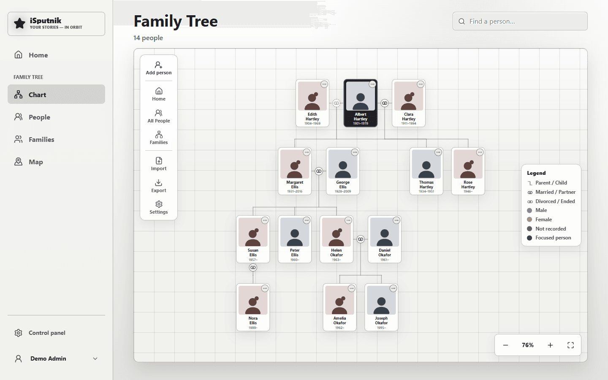
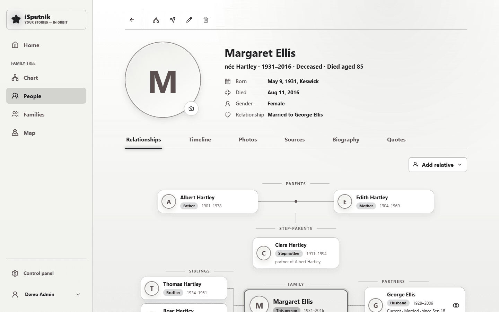

# Family tree

The family tree records the people in your family, how they're related, what
happened in their lives, and the photos that go with it. It sits beside your
libraries in the main menu.

Unlike a library, it isn't pointed at a folder — there's nothing to scan. You
either type people in, or import a GEDCOM file from another genealogy service.

> **Worth knowing up front:** a library can always be rebuilt by re-scanning its
> folder, but **the family tree exists only in the app's database**. Include the
> database in your backups, or export a GEDCOM file now and then.

## Adding people

**Add person** creates a family member. Only a name is required; everything else
— dates, places, a photo, a life story — can come later.

Dates are deliberately forgiving. Each date is **Day · Month · Year**, and only
the year is needed: `1943`, May 1943 and 9 May 1943 are all valid, because
genealogy is full of records where only the year is known. A year-only date
stays a year-only date; nothing silently invents a day for it. A day without a
month (or a month without a year) is pointed out rather than quietly dropped.

**Place** takes whatever you type — a country, a parish, a village no map
knows. As you type it offers real places only: towns from the place list
(Control panel → Settings → Maps → Photo place names), and places in the tree that were
picked from it before. Picking one fills the place in and pins it on the map;
changing the words afterwards removes the pin. When nothing matches, the box
says so and keeps your words as typed. Towns there have 500 or more people; for
small villages an admin can add a country under **Every village in…** on that
card.

Under that list is **Search online for “…”**. The place list is offline and holds
towns; a parish, a hospital, a street or a village too small for it can still be
found by pressing that button, which asks OpenStreetMap for the words you typed
— the one moment they leave the house, which is why it is a button and not
search-as-you-type. What it finds is shown in full so you can tell one Veselovka
from another; picking it shortens the place for the field and pins it on the map.
The place of a marriage and of a life event work the same way.

**Other language name(s)** holds the same person's name as written in another
language — *Владимир Посс* beside *Vladimir Posse*. The profile shows it under
the name, and searching for either spelling finds the person.

Once someone exists, open their profile and use **Add relative** to attach a
**parent**, **partner**, **child** or **sibling**. Relationships hang off
couples, which is what lets the app handle remarriages, single parents, and
step- or adopted children without special cases.

You can also build the tree without leaving the chart: each card you're allowed
to edit carries a **+** button that adds a **parent** or a **child** to that
person directly. Partners and siblings stay on the profile, where the rest of
their family is in view.

## The chart

The tree view centres on one person: parents and grandparents above,
children below, partners alongside, and siblings and cousins on their own
generation's row. Click any card to re-centre on that person — the browser's
Back button retraces your steps. Drag to pan, scroll or pinch to zoom.

Down the right edge of each card are small round buttons: **open their profile**,
and — if you're allowed to edit that person — **edit** them and **+** to add a
parent or child.

**Where it starts.** Opening the family tree centres on the **starting person**,
which an admin chooses once in Settings → Starting person. It's the same for
everyone. Until one is chosen the tree opens on whoever happens to come first,
which is rarely the person you'd pick. Following a link to a particular
person — from search, All people, or a bookmark — still opens on them.

## A person's profile

Six tabs:

- **Relationships** — the person's close family drawn as a small tree: each
  parent under their own parents, the parents joined by a line down to this
  person, siblings on one side, partners on the other (a solid line and rings
  for the current partner, a dashed line and a broken heart for a former one),
  and children below. When children come from more than one partner, each card
  says which. A parent's other partners are listed under the parents as
  **step-parents**, and the children they had together join the siblings as
  **half-brothers and half-sisters**, each saying which parent they share. The
  chart draws them the same way: the step-parent beside that parent, the
  half-siblings on this person's row. Click any card to open that person.
- **Timeline** — their life in order: birth, marriages, the births of children,
  death, plus any events you add (education, work, homes, military service,
  travel, awards, graduations, retirements, baptisms, naturalisations…). Each
  event can carry its own photos and notes.
- **Photos** — see below.
- **Sources** — where a fact came from: a parish register, a certificate, a web
  page. Sources are shared, so one record can back many facts.
- **Biography** — their life story in your own words. Edit person → *Bio /
  notes* has the same formatting buttons as a story's text: bold, italic,
  headings, lists, quotes and links.
- **Quotes** — the things they said, whenever anyone recorded one against their
  name. See [Quotes](quotes.md).

## Photos

Two ways a photo reaches a profile:

1. **You attach it.** *Add photos* opens a browser over your gallery libraries;
   pick any photos and they're attached. Nothing is copied — the tree points at
   the photo where it already lives.
2. **Face recognition finds it.** Link a person to a face group (Photos tab →
   *Link gallery person*) and every photo of that face appears automatically.
   See [Gallery](library-gallery.md#face-recognition).

The tab shows a preview with **View all photos** for the rest. Photos open in a
viewer over the family page, so closing one brings you back to the tree rather
than dropping you in the gallery.

**Uploading new photos** works from the same picker's *Upload* tab, once App
storage is switched on (Control panel → Library → Storage), for anyone who may
edit part of the tree. Files are added to the App files library, in its
`Family tree` folder, and attached in one step; every member can see them. Every
photo picker lists them again (Folders → *Family tree*), so you can use them for
someone else or as a portrait; in the Gallery they show when you choose **Family
tree photos** under Filter → Libraries.

### The portrait

The camera button on a profile picks the portrait from the same three places:
face matches, the gallery, or a new upload. You then **frame it**: every face the
gallery found on the photo has a box around it, and clicking one frames that
person, even in a crowded group photo. Drag the frame to move it, drag a corner
to resize it, or use the mouse wheel to zoom. The round preview beside it is what
the tree will show. **Save portrait** keeps it.

A portrait is its own picture: everyone who can see the family tree sees it,
even when the photo it was cut from is in a library they can't open. A copy is
kept in App files, in `Family tree/Portraits`, named after the person. It isn't
counted as a new photo of them, so it won't show up again in their photos or
under People.

**Adjust portrait**, under the picture, reopens the frame on the same photo.
Portraits uploaded before frames existed are kept as photos in App files, in
`Family tree/Uploaded portraits` (the server does this by itself when it
starts), so they show in the pickers, and Adjust opens the frame on them. Face boxes appear on them once the gallery has looked for faces.
**Remove portrait** takes it off and moves the copy to the Recycle Bin.

## The map

**Map** in the family tree menu shows where the family's lives happened: every
birth, death, marriage and life event whose place has a pin. Places at the same
spot share one pin, with a number when more than one thing happened there; the
pin's colour says what (blue births, rose marriages, green life events, grey
deaths, gold when it's a mix).

The list beside the map is every place, busiest first. Choose one to fly there
and see what happened there, oldest first, with each person linked to their
profile. The buttons above the map switch births, marriages, life events and
deaths on and off, and the search box narrows the map to the people you type.

On a profile, **Show on map** opens the map with only that person's places,
joined by a dashed line in the order they lived them.

Only places picked from the place search carry a pin, so a place typed in by
hand isn't on the map. The page says how many there are; pick them from the
search when editing to add them — including with **Search online for “…”**,
for the places the offline list does not hold.

## Settings

The gear on the tree page — admins only — holds four things:

| Tab | What it's for |
|---|---|
| **Photo library** | Where uploaded family photos go — the "App files" library, chosen in the control panel; this tab only says which |
| **Starting person** | Who the chart opens on, for everyone |
| **Import / export** | GEDCOM in and out, and the family-tree package for another isputnik.home server |
| **Security** | Who may edit which branch — see below |

**Starting person** — select **Choose a person**, search for them, and that's it;
the change applies immediately for everyone. **Change** picks someone else and the
**✕** clears the setting, putting the tree back to its own guess. If the person
you chose is later deleted from the tree, the setting quietly stops applying
rather than breaking the chart.

## Who sees the tree, and living relatives

Everyone signed in can see the tree unless you block it for them: in Control panel
→ Members, open a person (or a group) → **Family and stories** → **Seeing the tree**
→ **Can't see it**.

**Living relatives' details are private** to anyone who doesn't edit their branch
and hasn't been allowed to see them. Those people see a living relative's name, their
place in the tree and their portrait, and nothing else: no dates, places, life
story, events, sources or map pins. Everyone who had an account before this came in
keeps seeing everything; anyone added later starts without it, and **Show details
of living relatives** on the same tab turns it on, for one person or a group.

Someone counts as living unless they have a death date, are marked **Deceased
(date unknown)** (under the death date in Edit person), were born more than 100
years ago, or have a child born more than 85 years ago — a parent is at least
about fifteen years older than their child, so that child's date settles it.
Someone with no dates on them or their children counts as living — so for old
ancestors nobody has dates for, **Select** them on **People** and **Mark as
deceased**. A bare year is read as any day of that year: someone born "1926" may
still be 99, so they count as living until the whole year is more than 100 years
past.
To see who counts as living, choose **Shown as living to others** above the
people (administrators only): it narrows the page to them, ready to select.

### "You" in the tree

An administrator can say who each member *is* in the tree: Control panel → Members,
open them → **Account** → **Who they are** → **In the family tree**. From then on the
chart opens on them, their card says **You**, **Go to you in the tree** (beside the
search) brings them back, and their profile says **This is you**. They always see
their own details, even when living relatives are private to them — but nobody
else's, and the link gives no other access. If that person has a face in the
Gallery, **Use their face from the tree in the Gallery too** links it there as well
(see [Photos of themselves](control-panel.md#sharing-photos-by-person)).

## Letting a relative maintain their own branch

By default everyone can *see* the tree but only administrators can change it.
That's often too strict for a family where a cousin knows their own side best.

**Branch access** solves it with tags:

1. **Tag the people in a branch.** The quickest way is the tag button (🏷) on a
   family's card on the **Families** page — it opens with that family's members
   already gathered. **Add relatives** then pulls in everyone connected to them
   through the tree, which is what you usually want: surnames change with
   marriage, so a married-in spouse belongs to the branch without sharing its
   name. Drop anyone who doesn't belong with the **✕** on their chip, type a tag
   name, **Create** it, and **Apply tags**.

   You can start from **People** instead when the branch isn't one family:
   **Select**, tick the people (or **All** to take everyone the current search
   and tag filter leave on screen), then **Tags**. Tagging one person on their
   own still works from Edit person → *Tags*.

   Tags add up rather than replace: someone who sits in two branches can carry
   both tags, and a bulk add never disturbs the tags a person already has. Click
   a tag once to give it to everyone in the selection, again to take it from
   everyone, and a third time to leave each person as they are.
2. **Grant editing on that tag.** Settings → Security → pick the tag, choose a
   person or group, and add them as **Editor**.

That person can now edit everyone carrying the tag and add relatives to them —
and anyone they add joins the branch automatically. They cannot delete people,
unpick relationships, import GEDCOM files, or change tags; those stay with
administrators.

Assigning tags is deliberately admin-only. If editors could tag, they could pull
any person into their own branch and give themselves rights over them.

## GEDCOM — bringing a tree in, or taking it out

GEDCOM is the standard genealogy file, understood by Ancestry, MyHeritage,
Gramps and others.

- **Import** (Settings → Import / export) reads people, families, events and
  sources. It offers **add** — merge into what's here — or **replace**, which
  clears the existing tree first. Anything it can't interpret becomes a warning
  rather than a failed import.
- **Export** writes the whole tree to one file — the simplest backup of your
  genealogy work there is. Administrators and branch editors can export; an
  editor's file keeps living relatives they may not see the details of as name and
  relationships only. A
  biography's formatting is left out of the file (other programs would show the
  marks as symbols); its words and line breaks are kept.

Photos are *not* part of a GEDCOM file, since they live in your gallery. After
an import you'd re-attach them.

## Moving the tree to another isputnik.home server

For that there is the **family-tree package**: a zip that carries everything the
GEDCOM file leaves out — portraits and how they were cut, the photos attached to
people and life events, place pins, names in other languages, branch tags, and
the person the chart opens on. Admins only, on both sides.

- **Export** (the chart's Export button → *Family-tree package*, or Settings →
  Import / export → *Export package*) downloads `family-tree-<date>.zip`. It
  holds the photos themselves, so it can be large.
- **Import** takes the same file through the Import button. Nothing is written
  at once: you first see a **preview** of what the package holds beside what is
  already here, and choose how to bring it in.

**Merge into the current tree** is the default and the safe one. Nothing here is
deleted or changed on its own. People found on both sides are *matched* — by
having been imported from the same server before, else by the same name and birth
date, else by a name that is unique on both sides when one side has no date. Two
people of one name with different dates are never matched. For a matched person
the package fills in what is blank here; a field that is set here stays, and the
preview lists it as a *difference* for you to check by hand. Everyone else is
added, with their families, events, sources and photos. A photo the gallery
already has (the same file) is reused rather than copied again; a new one goes to
App files → Family tree → Imported.

The preview lets you decide **person by person**:

| Choice | What happens |
|---|---|
| **Merge — fill in the blanks** | The default for a match: blanks fill, everything set here stays |
| **Use the package's values** | The package wins on every field it has, portrait included |
| **Keep as it is here** | They are the same person, but nothing about them changes — only relationships connect |
| **Add as a new person** | Undo a match: they become a new person |
| **Skip this person** | Left out, with their own families and events |
| **Match with someone here…** | For a person the matcher didn't find: pick who they are here |

**Replace the current tree** deletes everyone here first, then creates the package
in full. It asks before it does. Gallery photos are never touched either way.

Not carried over, since they are per server: links to face clusters in the Gallery,
and who may edit which branch. Importing the same package again later adds nothing
twice — each record remembers where it came from.
