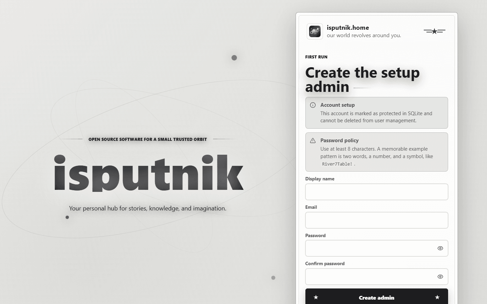
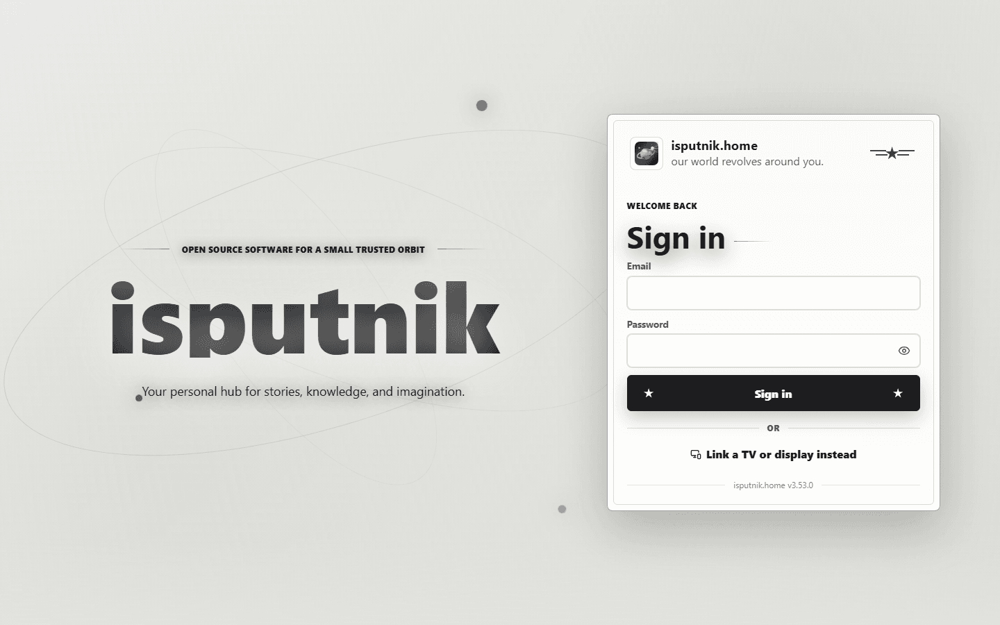

# First run — creating your account

The very first time you open isputnik.home there are no accounts yet, so it asks
you to create one. This is the **setup admin**: the account that owns the server
and can configure everything else.

## Create the setup admin

Open the app in a browser. Instead of a sign-in form you get **First run —
Create the setup admin**:

Fill in three things:

| Field | Notes |
|---|---|
| **Display name** | How your name appears in the app. Change it later in Settings. |
| **Email** | Used to sign in. It doesn't have to be a real, reachable address if you never plan to send mail from the server — but it does if you want password resets or security alerts. |
| **Password** | At least 8 characters. A memorable pattern like two words, a number and a symbol is easier to live with than something you'll write down. |

Two notes the screen gives you, and what they mean:

- **"This account is marked as protected in SQLite and cannot be deleted from
  user management."** You can't lock yourself out of your own server by deleting
  the only admin. You can still rename it, change its email, or add other admins.
- **The password policy** is what an administrator has configured. On a fresh
  install it's the default minimum of 8 characters. You can tighten it later in
  Control panel → Security.

Once you submit, you're signed in and land on the Home page.

## The setup guide

The first time an administrator signs in, the app opens a short guide at **/welcome** —
five steps, in the order they depend on each other:

1. **Storage** — somewhere for the thumbnails the app generates, and at least one folder
   your libraries are allowed to read. Nothing else works until these exist.
2. **Recycle Bin** — one folder for deleted files, instead of a hidden `.trash` inside
   every library. Locked until storage is done: the bin has to live inside a container
   you have approved.
3. **Email** — the SMTP details, and a test message to your own address.
4. **Security alerts** — write to me when an account signs in from a network I haven't
   seen before. Locked until email is set up, because an alert nobody receives reads
   exactly like nothing having happened.
5. **Appearance** — the theme the sign-in screen uses and new members start with.

Every step saves through the same place its Control panel page does, so none of it is
your only chance to answer. **Skip for now** is a real answer — it closes the guide for
good rather than asking again at every sign-in — and **Settings → About** has a *Run the
setup guide* button for whenever you want it back.

Folders are browsed rather than typed. Both the Recycle Bin's folder and a library's have
to be the path the *server* sees — in Docker that's the path inside the container, not the
host path you know — and both have to already exist, so a typo can't quietly send files
somewhere new.

## Signing in afterwards

From then on the app opens at the sign-in screen. The QR code beside the form
opens the same page on another device on your network — handy for getting the
app onto a phone or tablet without typing the address.

If you later turn on [two-factor authentication](two-factor-authentication.md),
a code prompt follows the password.

## What you see before anything is set up

Home is empty on a new install, and every library section says it has nothing in
it — that's expected. Each one offers a **Create a library** button that takes
you where libraries are made.

Before you can create one, though, the server needs to know two things about
where files live. That's next: **[Storage](storage.md)**.

## Adding other people

You don't have to hand out your own account. In **Control panel → Members** you
can invite family members, each with their own sign-in:

- **Member** — can browse and read/listen/watch everything shared with them.
- **Admin** — can also configure libraries, storage, and the rest of the control
  panel.

Give people member accounts unless they genuinely need to administer the server.
Individual libraries can then be shared more narrowly — see
[Setting up libraries](libraries.md#who-can-see-it).
