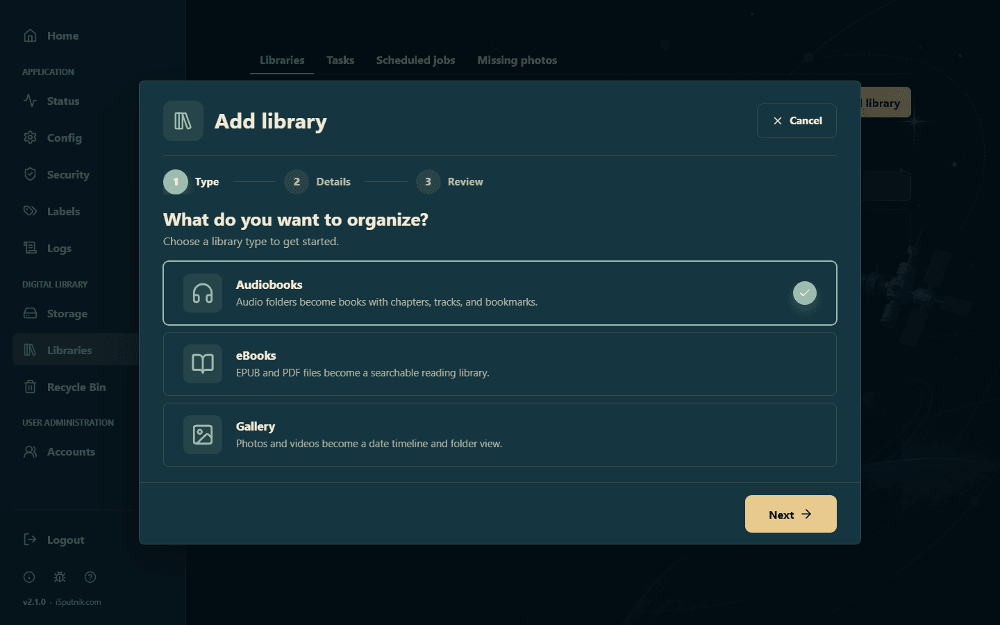
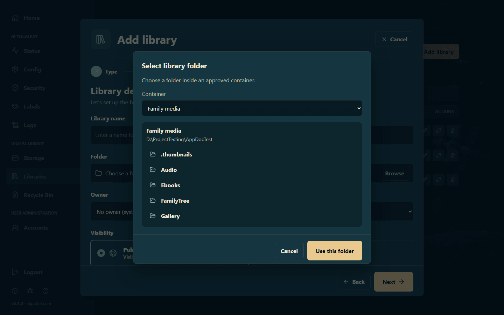
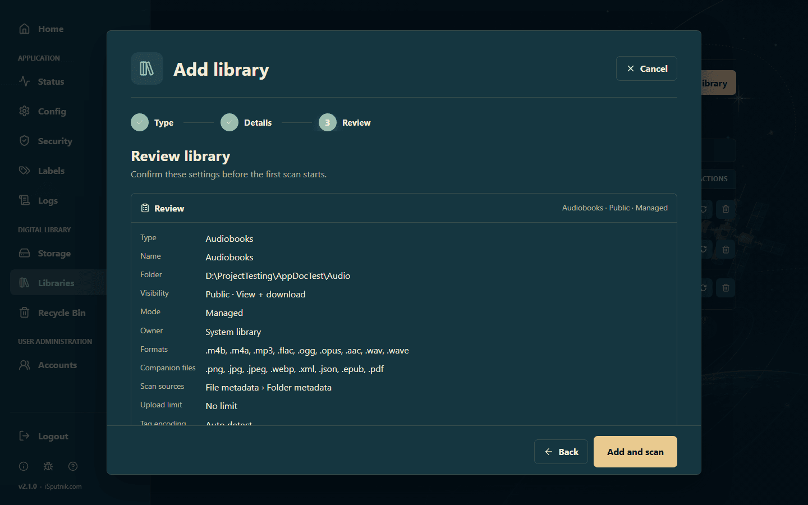
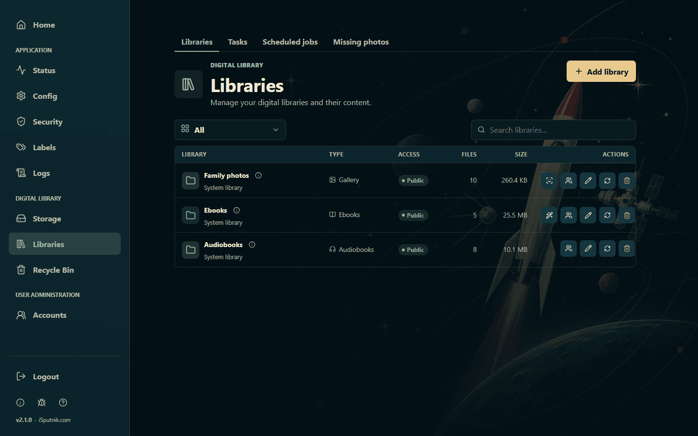

# Setting up libraries

A **library** points the app at one folder and says what kind of media is in it.
You can have as many as you like — one per drive, one per person, one per
collection — and they can be shared with everyone or kept to yourself.

Libraries live in **Control panel → Libraries**. If **Add library** is greyed
out, [storage](storage.md) isn't set up yet.

## The wizard

**Add library** walks through three steps.

### 1. What kind of media?

| Type | Use it for | How files become items |
|---|---|---|
| **Audiobooks** | Spoken-word audio | A *folder* of audio files becomes one book, its files becoming tracks/chapters |
| **eBooks** | EPUB and PDF | Each file becomes one book; the same title in several formats groups together |
| **Gallery** | Photos and videos | Each file becomes its own item |

The type can't be changed afterwards — the way files are interpreted is
fundamentally different. If you get it wrong, delete the library and add it
again; your files are untouched either way.

### 2. Details

Give it a name, then choose the folder with **Browse**. You can only pick
inside an approved container, and you can go into subfolders:

**Visibility** decides who gets it:

| | Who can see it |
|---|---|
| **Public** | Everyone with an account on your server |
| **Private** | Only you, plus anyone you invite to the library afterwards |

**Owner** is optional. Leaving it as *No owner (system library)* makes it a
shared household library; naming an owner makes it theirs to manage.

**Advanced options** covers file formats, upload rules and how metadata is read.
The defaults suit most people — you can change all of it later from the
library's Edit dialog.

### 3. Review

The last step lists everything back to you — type, folder, visibility, formats,
where metadata comes from — before anything happens. **Add and scan** creates
the library and immediately starts reading the folder.

## The first scan

Scanning runs in the background; you don't have to wait on the page. While it
runs the library shows **Scanning**, and item counts climb as it goes.

What a scan does:

1. Walks the folder for files it recognises.
2. Creates an item for each book, ebook or photo it finds.
3. Reads metadata from the files — titles, authors, chapters, capture dates.
4. Generates covers and previews into your thumbnail folder.

**Only one scan runs at a time** across the whole server, so starting several
just queues them.

Re-scan any time from the library's ⟳ button — after adding files, for
instance. A re-scan picks up what's new and leaves your own edits alone: titles
you corrected, series you arranged, and tags you added are marked as yours and
aren't overwritten.

## Adding files later

Two ways:

- **Copy them into the folder** and re-scan. Best for bulk additions.
- **Upload from the app** if the library allows it — the upload button appears
  on the library page. Uploads land in the library folder like any other file.

## Editing and removing

Each library row has:

- **⟳ Scan** — re-read the folder.
- **✎ Edit** — name, visibility, formats, upload rules, scan behaviour.
- **Members** — for a private library, who else may see it and what they may do.
- **🗑 Delete** — removes the library *from the app*. **Your files stay on
  disk.** Only the catalogue entry, and the covers generated from it, go away.

## Next

- [Audiobooks](library-audiobooks.md)
- [Ebooks](library-ebooks.md)
- [Gallery](library-gallery.md)
