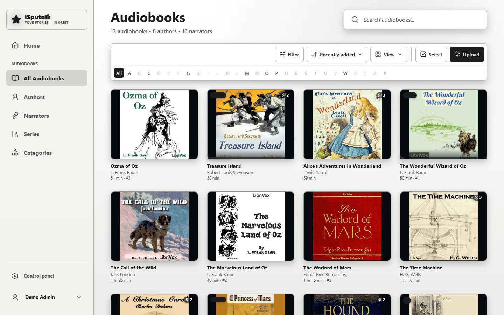

# Audiobooks

An audiobook library turns folders of audio files into books you can play, with
chapters, and with your place kept for each one.



## How folders become books

**One folder, one book.** This is the rule that matters when arranging files:
the scanner treats each folder inside the library as a single audiobook, and the
audio files within it as that book's tracks, in filename order.

```
Audio\                                        ← the library
├── Children's Short Works Vol 25 - Various\  ← one book
│   ├── csw025_bulka_nr_128kb.mp3             ← track 1
│   ├── csw025_clarabarton_bbs_128kb.mp3      ← track 2
│   └── …
└── Short Poetry Collection 047 - Various\    ← another book
    └── …
```

A single-file book (one long `.m4b`, say) works too — it just sits in its own
folder like any other.

> **Loose files at the top level?** If your library is a flat pile of
> single-file audiobooks rather than folders, turn on **Each file is a book** in
> the library's advanced options. Files directly in the library folder then each
> become their own book, while subfolders keep grouping as usual.

Supported formats: `.m4b`, `.m4a`, `.mp3`, `.flac`, `.ogg`, `.opus`, `.aac`,
`.wav`.

## Where titles and authors come from

The scanner reads the files' own tags first — title, author, narrator, series,
year, cover art — and falls back to the folder name when tags are missing. In
the screenshot above, one book took its author from the MP3 tags and the other
fell back to its folder, which is exactly what you'd expect from files tagged to
different standards.

Anything wrong is editable, and **your edits win**: a field you set by hand is
marked as yours and won't be overwritten by later scans.

For books with poor tags, the metadata editor can also look the title up online
(Open Library, Apple Books, LibriVox, FantLab) and apply what it finds.

## Chapters

`.m4b` files carry real chapter marks, which the app reads and lists. For books
made of many MP3s, each file becomes a chapter entry named after the track. The
player's chapter list jumps between them.

## Playing

The player remembers your position continuously, per book and per account, so
you can stop on a phone and continue on a laptop. It also offers:

- Speed control, and skip forward/back.
- A sleep timer.
- **Bookmarks** at a moment you want to return to.
- Marking a book finished, which moves it out of "Continue listening" on Home.

## Finding things

**Authors**, **Narrators**, **Series** and **Categories** browse the library
different ways; search covers titles, authors and series. The filter button
narrows by library, category, tag, narrator, length and whether you've finished
it — pick one library to browse just that shelf, or several to combine them.
Whatever you choose shows as a chip under the toolbar, with **Clear all** beside
it.

The **A–Z strip** under the toolbar jumps to titles starting with one letter —
**#** collects the ones starting with a number or a symbol. Libraries holding
both Latin and Cyrillic titles get an **English / Русский** switch beside it;
letters with nothing behind them are greyed out. The letter you pick is part of
the page address, so the link can be bookmarked or shared, and reloading keeps
it. The same strip files authors and narrators by first or last name — whichever
that page is sorted by.

## Offline

The app is installable. Download a book from its page and it stays playable
without a connection — useful for a commute or a flight.
