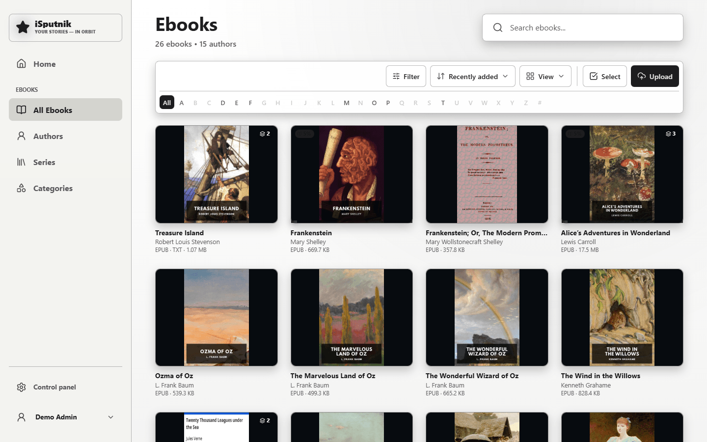

# Ebooks

An ebook library turns a folder of EPUB and PDF files into a searchable reading
library, with an in-app reader that remembers where you stopped.

## How files become books

**One file, one book.** Each EPUB or PDF becomes its own entry, and the scanner
reads the file's own metadata for the title, author, language and cover — which
is why a well-made EPUB needs no tidying at all. The files above came straight
from Project Gutenberg and arrived complete with covers.

If a file has no usable metadata, the filename is used instead. You can correct
anything by hand afterwards, and your corrections survive later re-scans.

### The same book in several formats

Drop `Frankenstein.epub` and `Frankenstein.pdf` in the same folder and you get
**one** book offering both formats, not two entries. Grouping is by folder plus
filename, so keeping matching names together is all that's needed. EPUB is
preferred as the primary format because it drives the in-app reader.

## Reading

Open a book and choose **Read**. EPUB (and FB2) open in the built-in reader:

- Font, size, spacing and theme are yours to set, and stick between books.
- Your position is saved continuously, per book, per account — so your place on
  the tablet is your place on the laptop.
- **Bookmarks** mark a spot to come back to; **highlights** capture a passage.
  Selecting text in the reader offers to save it as a quote.

PDFs open in the browser's own viewer, which means no reading position and no
highlights — a limitation of the format, not the app. If a book exists as both,
read the EPUB.

## Finding things

- **Search** covers titles, authors and series.
- **Filter** (the sliders icon) narrows by author, category, tag, language and
  whether you've finished it.
- **Authors**, **Series** and **Categories** tabs browse the same library other
  ways. Categories are a fixed shelf-like taxonomy the scanner assigns; tags are
  free-form and yours.
- **A–Z** under the toolbar jumps to titles starting with one letter, with **#**
  for numbers and symbols and an **English / Русский** switch when the library
  holds both alphabets. The letter is part of the address, so it survives a
  reload and can be shared.

## Taking books with you

- **Download** saves the original file.
- **Send to → My e-reader** mails it to a Kindle or Kobo, once mail is configured
  on the server ([guide](email.md)) and you've set your device address in
  [Profile → Devices](your-account.md#send-to-e-reader). Your device also has to
  approve the server's sender address, or it drops the mail silently. The same
  **Send to** button also passes a book to someone in the family — see
  [Sharing with family](family-sharing.md).
- The app is installable: add it to your home screen and downloaded books stay
  readable offline.

## Housekeeping

Adding files to the folder and re-scanning picks them up. Deleting a book from
the app moves it to the **Recycle Bin** rather than erasing it, so a mistake is
recoverable until the bin is emptied.
