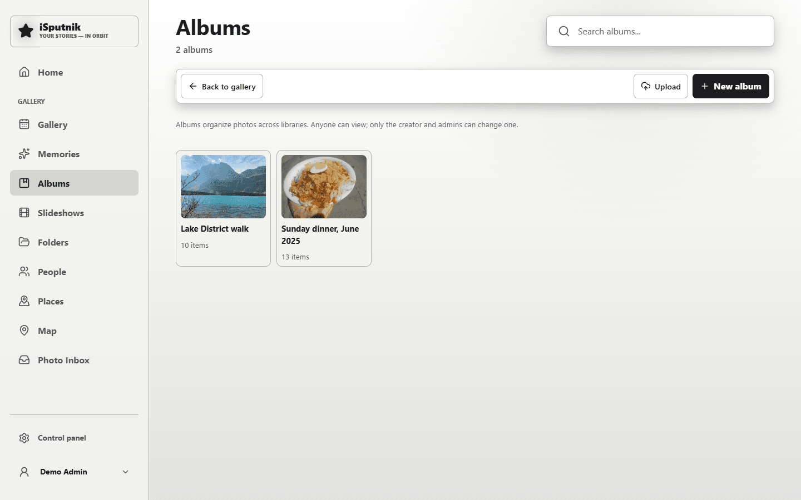
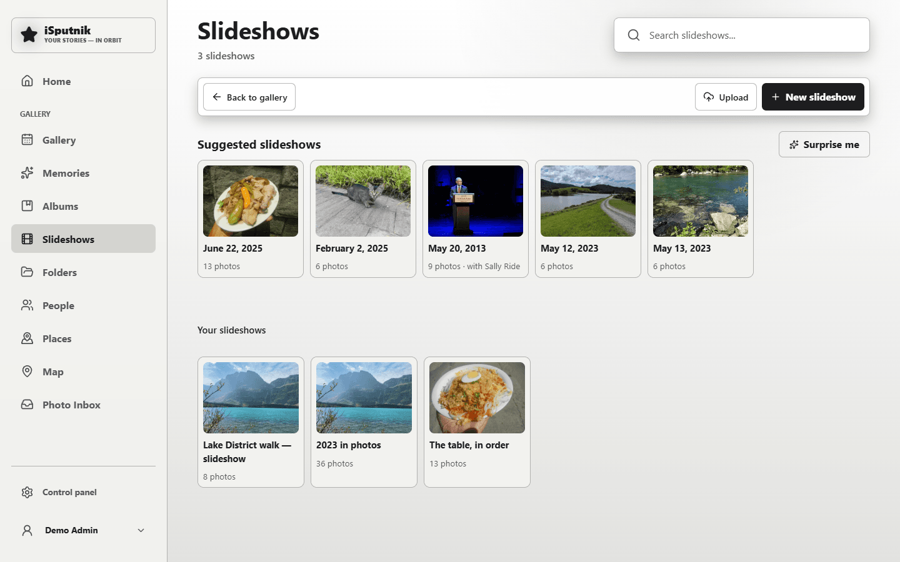
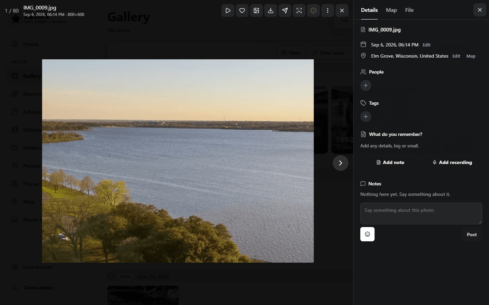
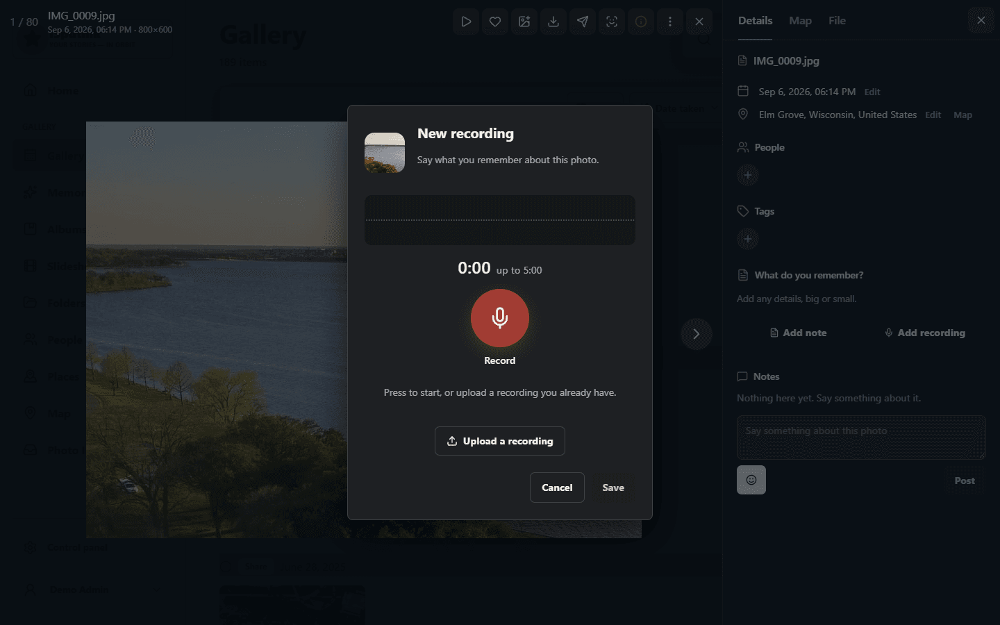
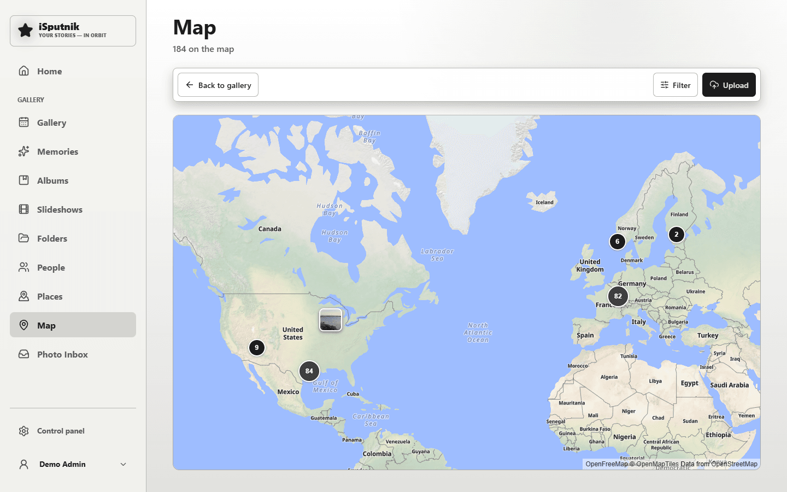
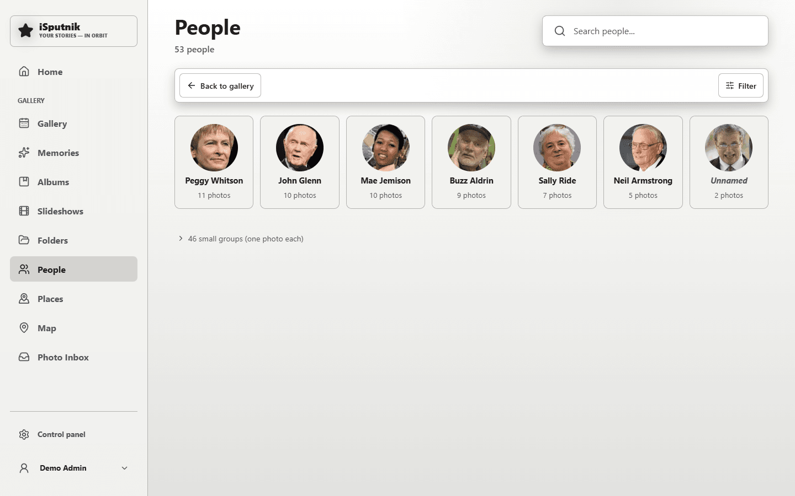

# Gallery

A gallery library turns a folder of photos and videos into a browsable timeline —
closer to Google Photos than to a bookshelf.

## How files become items

**One photo, one item.** Unlike audiobooks (a folder is a book), every file
stands on its own. That's what lets the same set of pictures be browsed several
different ways at once.

The scanner reads each file's EXIF data for the date it was taken, the camera,
and the location if the file carries one. When there's no EXIF date — as with
scans or exports — it falls back to the file's modification time.

## The views

Along the top:

| View | What it gives you |
|---|---|
| **Timeline** | Everything newest-first, grouped by date. The default. |
| **Memories** | "This month over the years" — the same date in previous years. |
| **Albums** | Sets you assemble by hand; a photo can be in several. |
| **Slideshows** | Saved sequences with music and transitions, playable or rendered to a movie file. |
| **Folders** | A file-explorer over the actual folder structure on disk. |
| **People** | Faces grouped into people, once face recognition has run. |

They're all views of the same photos — nothing is copied or moved between them.

**Albums** are the ones you build yourself, each with a name, a description and
a cover:

**Slideshows** keeps the ones you have saved, and offers a row of suggestions
built from the library itself — a day that has a lot of photos, or everything
featuring one person:

## How the grid looks

**View**, next to Filter and Sort, sets two things and remembers them for next
time:

- **Tile size** — Small, Medium or Large. Small fits far more on screen for
  hunting through a big year; Large is for actually looking at the photos. It
  applies to the timeline and to an open folder.
- **Dates** — *Group by day* is the default: a heading over each day, with the
  checkbox that takes the whole day at once. *One continuous grid* drops the
  headings and runs every photo together as a single wall, which reads better
  when you're scrolling for a picture rather than for a date. Selecting still
  works there — use **Select** in the toolbar, since there are no day headers to
  tick.

## Viewing

Click a photo to open the viewer. From there: pan and zoom, step through with
the arrow keys, rotate, like, send, or add to an album or slideshow. The panel
down the right has three tabs. **Details** is what the family knows about the
photo: when and where it was taken, who is in it, tags, the description,
recordings, and the notes people leave under it. **Map** is the pin, with a
search box for marking or moving it. **File** is what the camera and the disk
know, with Rotate and Replace file underneath. Videos play inline; a format the
browser can't decode is offered as a download, and the server can transcode a
web-playable copy.

**Recordings** are voice memories kept on the photo. Press **Record** on the
Details tab: one big button starts and stops, the waveform shows the microphone
is hearing you, and the take plays back before you save it, with Record again
and Discard beside Save. Each saved recording is a line with a play button;
pressing one loads it into the player above the list, which draws the
recording's wave and lets you jump around in it. Recording needs the app opened
over https, or on the server itself, since browsers allow the microphone only
there.

Rotation works for videos too — a clip filmed sideways turns upright in the
viewer and in its thumbnails, and keeps playing while you turn it.

**Replace file** puts a different file behind a photo you already have — the
high-resolution scan over the low-resolution one you catalogued years ago, or a
straightened version. The photo itself stays exactly what it was: the stories
and albums that show it, its tags, the people tagged in it, its date and place,
its likes, all follow the new file. (Deleting it and uploading the better copy
cannot do that — it makes a new photo, and everything pointing at the old one is
left pointing at nothing.)

It has to be the same kind — a photo for a photo, a video for a video — and the
date the photo shows stays as it is, even when the new file carries a different
one or none at all, so a fresh scan of a 1974 print doesn't file itself under
today. The file that was there isn't overwritten: it moves into a `replaced`
folder beside the Recycle Bin, so a wrong file can be put back by hand.

## Working with several at once

The **Select** button in the header turns the grid into a picker — click photos
to tick them, or use a date header's checkbox to take a whole day. A toolbar of
icons appears with what you can do to the selection: like it, add it to an
album, slideshow or collection, set the date taken, set the location, share it,
or move it to the Recycle Bin. Hover an icon to see what it does.

Date and location are two separate buttons, each with its own window — fix
whichever is wrong and leave the other alone. Both are for what the camera got
wrong or never knew, and what you set is kept as yours, so a later scan won't
overwrite it.

**Set date taken** works two ways. *Set one date* applies that exact date and
time to everything selected, so those photos sit together in the timeline —
right for a batch of scans that share one occasion. *Shift by an offset* moves
each photo from its own date by the same amount, in either direction, which
keeps the order and spacing the camera recorded — the fix for a camera left on
the wrong timezone or a clock that was hours out. Photos with no date at all
can't be shifted, and the message afterwards says how many that was.

**Set location** drops one pin for the whole selection, and they join the Map
view. Rather than hunting across a world map, type a place, address or postcode
into the search box and pick from the results — the map jumps there with the pin
already placed. Coordinates work too: paste `53.90064, 27.55910` and it goes
straight there. Clicking or dragging on the map still works for fine-tuning.

Plus Codes work as well, which is what "Copy address" in Google Maps usually
gives you for a spot with no street number: paste
`8MW8+4JV, Norman Manley Blvd, Negril, Jamaica` and the pin lands on the code,
not on the town. Those short codes only mean something next to a place name, so
keep whatever followed the code when you paste. A long code that starts with the
region — `77C38MW8+4JV` — stands on its own and needs no lookup at all.

The search asks OpenStreetMap's public lookup service, so it needs the server to
have internet access — the same place the map's tiles come from. Plus Codes are
worked out on the server itself, though a short one still needs that lookup for
the place beside it. Without any internet, dropping the pin by hand still works.

Anything with a location joins the **Map** view, where nearby photos gather into
one numbered cluster until you zoom in far enough to separate them:

## Uploading

If the library allows uploads, the upload button takes files straight in. They
land in dated subfolders (`2024/2024-06-15`) based on when each was taken, so
uploads blend into a folder structure rather than piling up at the top.

## What the app keeps for itself

Story recordings, voice notes, family-tree uploads, rendered slideshow movies
and uploaded music all land in the **App files** library ([Storage](storage.md)).
When that library sits inside App storage it stays out of the Timeline,
Memories, the Home page, People, the map and every picker, the same way a
Photo Inbox does: those files belong to the story, the photo or the tree that
made them, and that is where you meet them: a photo placed in a story, an
album or a slideshow keeps showing there, and opens in the viewer as any
other. To browse the library itself, choose it by name in the library filter,
where it is labelled *(App storage)*.
A library of your own that you nominate instead, outside App storage, shows in
the gallery as it always did.

## Photo Inbox

The whole process, from the scanner box to a tidy library, has
[its own guide](photo-inbox.md). In short:

A **Photo Inbox** is a gallery library for photos that are not part of the
collection yet: a box of prints you are re-scanning, or a batch a relative
handed over. An admin turns any gallery library into one with the **Photo
Inbox** switch in the library's settings (the Access tab). Everything that lands
in it stays out of the Timeline, Memories, the Home feed, People and the pickers
until someone decides it stays — face recognition waits too.

Fill it the way you fill any library: drop files into its folder and re-scan,
or upload. Then open **Inbox** in the gallery's left nav (it appears once an
Inbox exists; the Home page shows a card while photos are waiting). The review
page groups photos by **delivery** — the top-level folder each batch arrived in
— and selection offers two verbs:

- **Keep** moves the photos into a real library. You choose the library and
  either a folder (with suggestions from the folders it already has) or the
  dated `YYYY/YYYY-MM-DD` layout uploads use. Keep asks rather than guessing:
  a scanned print carries the scan date, not the day the picture was taken, so
  the dated layout is usually wrong for scans. Your last choice is remembered
  for the session. Tags, likes and edits travel with the photo.
- **Discard** moves them to the Recycle Bin on the shorter clock Duplicate
  cleanup uses.

An empty Inbox is a finished review. Keeping or discarding takes the delete
right on the Inbox and, for Keep, the upload right on the destination.

**Copies of what you already have.** After a scan or an upload the Inbox is
checked against the rest of the library on its own: byte-identical files, and
near-identical ones the way [Duplicate cleanup](duplicate-cleanup.md) finds
them, with an incoming scan also matched turned on its side. Only the Inbox's
photos are candidates, so the library is never compared with itself, and the
library's copy is always the one kept. The Inbox page says how many photos look
like copies; an admin works through them on the Duplicate cleanup page, where
each set offers **Replace** (the new file takes the library item's place, and
its albums, tags and people stay put), **Discard incoming**, or **Not the same**
(keep both — the photo stays in the Inbox for a normal Keep). **Replace larger**
does every set whose new copy has more pixels in both directions at once. The
check waits while another cleanup is in progress, and **Check for copies** on
the Inbox page starts it by hand.

**Letting someone drop photos.** A relative without an account can still fill an
Inbox: **Drop link** on the Inbox page mints a link for them. Give it a label
(it names the folder their photos land in), how long it lasts, and a cap on how
many files and how much in total it may receive; **One delivery only** closes
the link after the first batch. The address is shown once, so copy it then. They
open it, see your label and what they may send, pick their photos, and get a
"Received 37 photos" back — nothing more. What arrives waits in the Inbox like
any other delivery, marked with a link icon, and the copy check runs on it as
usual. Links you have handed out are listed in the same dialog and under
**Shared links** on your profile, and any of them can be taken back at once.

## Face recognition

**Off by default, and entirely local** — the models ship with the app, nothing is
sent anywhere. An admin turns it on per library in the library's settings.

Once enabled, a background job finds faces and groups them into people. You then
name the ones you care about; naming is what makes a group stick. The **People**
view lists them, and a person's page shows every photo they appear in.

This is also what connects to the [family tree](family-tree.md): link a family
member to a face group and their profile fills with photos automatically.

## Housekeeping

### Moving a folder to another library

Open the folder in the **Folders** view with a single library chosen in the
library filter, and an administrator sees **Move to another library** beside
Lock folder and Rescan. Pick the library to move into; the box says how many
photos go and the exact folder they land in, which keeps the same path inside
the new library. **Move folder** queues it.

The move runs as a task on the Tasks page. On the same disk it is one rename;
across disks every file is copied and checked by size before the original
goes. The photos keep their ids, so every story, album, slideshow, tag,
person and like that names them keeps working, and the folder locks inside the
folder come along. Until the last file is across, the folder is still where it
was; then it switches in one step, this view refreshes to the folder above,
and a scan of the folder's new home re-reads it. A folder cannot be moved into
a Photo Inbox or a read-only library, onto a folder that already exists there,
or while either library is being scanned.

This is the way to unmix a library: the family videos that landed in the App
files library go to Current Phone; a `Slideshow music` folder left in a family
library goes to App files.

Re-scan after copying files in. Deleting a photo moves it to the **Recycle Bin**
first, so it can be restored until the bin is emptied.

**Locking a folder.** An admin browsing the **Folders** view (with a single
library in scope) can open a folder and press **Lock folder**: from then on
nothing in it — or in any of its subfolders — can be deleted from the app, by
anyone, until it's unlocked from the same place. Locked folders wear a small
padlock on their tile. The lock only stops deleting: viewing, uploading into the
folder, editing details and rescanning all carry on as normal, and Duplicate
cleanup treats the locked copies as the ones to keep. It's the right guardrail
for the folders you'd never want a careless selection or cleanup to touch.

If the same picture has been imported more than once, **Duplicate cleanup** in the
control panel finds it — identical files, near-identical ones, and whole folders
that duplicate each other — and moves what you agree to remove to the Recycle Bin.
It has [its own guide](duplicate-cleanup.md).

Your originals are never modified — rotating a photo or video in the app changes
the generated preview, not the file on disk. (This is why a downloaded original
still has its old orientation.)
