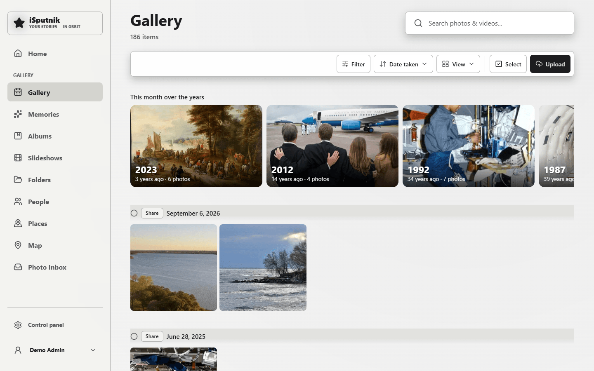

# Gallery

A gallery library turns a folder of photos and videos into a browsable timeline —
closer to Google Photos than to a bookshelf.

## How files become items

**One photo, one item.** Unlike audiobooks (a folder is a book), every file
stands on its own. That's what lets the same set of pictures be browsed several
different ways at once.

The scanner reads each file's EXIF data for the date it was taken, the camera,
and the location if the file carries one. When there's no EXIF date — as with
scans or exports — it falls back to the file's modification time.

## The views

Along the top:

| View | What it gives you |
|---|---|
| **Timeline** | Everything newest-first, grouped by date. The default. |
| **Memories** | "This month over the years" — the same date in previous years. |
| **Albums** | Sets you assemble by hand; a photo can be in several. |
| **Slideshows** | Saved sequences with music and transitions, playable or rendered to a movie file. |
| **Folders** | A file-explorer over the actual folder structure on disk. |
| **People** | Faces grouped into people, once face recognition has run. |

They're all views of the same photos — nothing is copied or moved between them.

The screenshot above shows the timeline grouping by date, with a Memories tile
on top, because the sample photos were deliberately dated across several months.

## Viewing

Click a photo to open the viewer. From there: pan and zoom, step through with
the arrow keys, see details in the info panel, rotate, favourite, share, or add
to an album or slideshow. Videos play inline; a format the browser can't decode
is offered as a download, and the server can transcode a web-playable copy.

## Uploading

If the library allows uploads, the upload button takes files straight in. They
land in dated subfolders (`2024/2024-06-15`) based on when each was taken, so
uploads blend into a folder structure rather than piling up at the top.

## Face recognition

**Off by default, and entirely local** — the models ship with the app, nothing is
sent anywhere. An admin turns it on per library in the library's settings.

Once enabled, a background job finds faces and groups them into people. You then
name the ones you care about; naming is what makes a group stick. The **People**
view lists them, and a person's page shows every photo they appear in.

This is also what connects to the [family tree](family-tree.md): link a family
member to a face group and their profile fills with photos automatically.

## Housekeeping

Re-scan after copying files in. Deleting a photo moves it to the **Recycle Bin**
first, so it can be restored until the bin is emptied.

If the same picture has been imported more than once, **Duplicate photos** in the
control panel finds the copies and lets you choose which ones stay — merging the
tags, albums and tagged people of the ones you remove onto a copy that survives.
See [the control panel guide](control-panel.md).

Your originals are never modified — rotating a photo in the app changes the
generated preview, not the file on disk.
