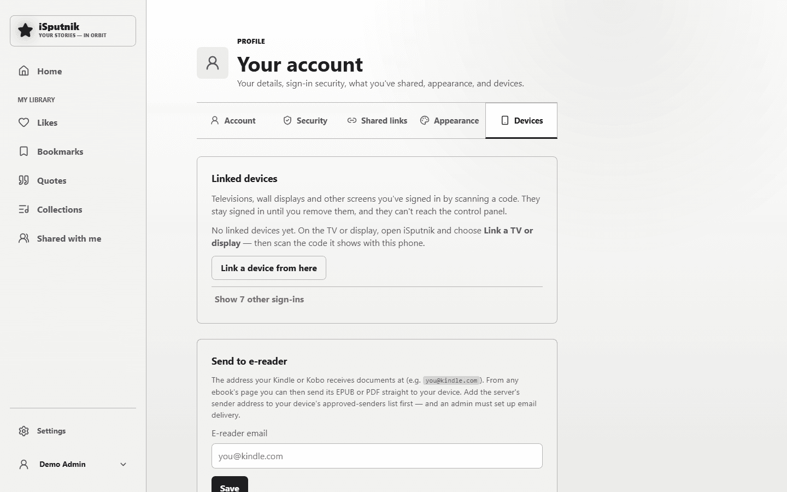

# Link a device

Some screens are miserable to type on. A television with a remote, a wall display
in the kitchen, a tablet propped in the hall — entering an email address and a
password on one of those takes a minute of jabbing at an on-screen keyboard, and
that's before a one-time code.

**Link a device** signs those screens in without typing anything on them. The
screen shows a code; you scan it with your phone and approve it there. The phone
does the actual signing in, because your phone is the thing you're already signed
in on.

## Linking one

**On the screen you want to sign in** (the TV, the display, the tablet):

1. Open iSputnik and choose **Link a TV or display instead** on the sign-in screen.
2. It shows a QR code, a short code like `K7M4-PQ2N`, and a web address.

**On your phone:**

3. Point the camera at the QR code and open the link. If scanning isn't practical,
   open the address shown and type the code instead — it's the same thing.
4. Sign in, if you aren't already.
5. Check that the code on your phone matches the one on the screen across the room,
   look at what's asking ("Chrome on Linux · Your home network"), and enter your
   password.
6. Choose **Authorize device**.

The screen signs itself in within a few seconds. Nothing was typed on it.

### Your phone has to be on the same network

This is the one thing that trips people up. Your library runs on a machine in your
house, so its address only works from inside the house. If your phone is on mobile
data, the QR code opens a page that can't load.

Turn Wi-Fi on and try again.

## Linking a device while away from home

Normally you can only link a device from inside the house — the sign-in screen
elsewhere doesn't even offer the option, which is deliberate: it's what stops a
stranger from starting a request and talking someone in your household into
approving it.

If you need to set up a screen somewhere else — a tablet at a holiday house, a
display at a relative's — ask whoever runs the server to **allow it for you**. They
turn it on for your account from Control panel → Members → Users, and then:

- you have **however long they set** — anything from a minute to an hour;
- it works for **one device** — the first screen you link closes it again;
- everything else is the same, including entering your own password to approve.

While it's on, **Link a TV or display** appears on the sign-in screen where you
are. If the hour runs out first, ask again — it can be turned on as many times as
you need.

Your administrator is emailed when you use it, so they know the permission they
gave was actually spent.

## Why it asks for your password

You're already signed in on the phone, so being asked again can feel redundant. It
isn't: approving a device creates a sign-in that lasts a year on a screen anyone
who walks past can use. That deserves the same proof as changing your two-factor
settings, which iSputnik also asks a password for.

It's also the thing that makes the flow safe to use at all. If someone sent you a
code and talked you into approving it, they'd be handing themselves your account.
The password is what stops a borrowed, unlocked phone from being enough.

**Never approve a device you didn't just set up yourself**, and always check the
code matches the screen in front of you. If a code arrives by message, or from
someone asking you to "just scan this", the answer is no.

## What a linked device can and can't do

A linked device can do everything your account can — read, listen, browse, watch —
with two deliberate exceptions:

- **It can't open the control panel**, even if your account is an administrator's.
  A screen in a hallway shouldn't be a way into the server's settings.
- **It can't authorize other devices.** Only a phone or computer you signed in on
  properly can do that.

## Seeing and removing your devices

**Profile → Devices** lists every linked screen, when it was last used, and what
network it was on.

- **Rename** gives it a name you'll recognise — "Living Room TV" beats
  "Chrome on Linux".
- **Revoke device** signs it out immediately. It'll need authorizing again to come
  back, and nothing else about your account changes.

The same list also holds your ordinary sign-ins — phones, laptops, browsers — folded
away under **Show other sign-ins**. Anything there can be signed out the same way,
which is worth doing if you've used a computer that isn't yours.

You'll also get an email whenever a device is linked to your account. If one arrives
that you didn't expect, revoke it from this page and change your password.

## Codes expire

A code lasts ten minutes, then the screen quietly shows a new one. That's so a
display left switched on overnight isn't sitting there with a live invitation on it.

If you see **That code has expired**, go back to the screen and use whatever code it
is showing now.

## For administrators

By default, **only devices on your home network can ask to be linked**. A wall
display is always in the house, and this setting is what stops someone elsewhere on
the internet from starting a request and trying to talk a household member into
approving it.

### Letting someone link a device from elsewhere

When a household member is away and needs to set a screen up, don't change the
policy — **allow it for that person**, from Control panel → **Members** →
**Users** → the monitor icon on their row.

You choose how long it stays open — anything from 1 to 60 minutes, defaulting to
the hour. It is good for one device, for that account only. Their row shows how
long is left, and the same menu cancels it early. Nothing lasting is switched on:
it closes itself when they link a device or when the time runs out, whichever comes
first, and you're emailed when it's used.

If you're on the phone with them while they set the screen up, a few minutes is
plenty and leaves nothing open behind you.

They still need their own password to approve the device, and what they link is
still barred from the control panel and from authorizing further devices.

### The blunt alternative

Control panel → **Security** → **Policies** → **Linking devices** can be set to
accept requests from anywhere — permanently, for everybody. It exists for the
household that genuinely wants it, but a one-hour window for one person does the
same job with a door that shuts itself. Reach for that first.

**Don't** use a trusted network for this either. Adding a remote address there
would let linking through, but trusted networks also skip two-factor
authentication, account lockout and rate limits at that address. It is a much
bigger change than it looks.

**If your server sits behind a reverse proxy**, set `TRUST_PROXY_HOPS` (see
[Exposing your library to the internet](exposing-to-the-internet.md)). Without it,
every visitor appears to be arriving from the proxy itself — so "home network only"
would quietly mean "anybody at all". Rather than guess, iSputnik refuses to link any
device until the setting is right, and says so on the Policies page.

Linked devices show up in the activity log, and admins are emailed when a link
request is refused.
