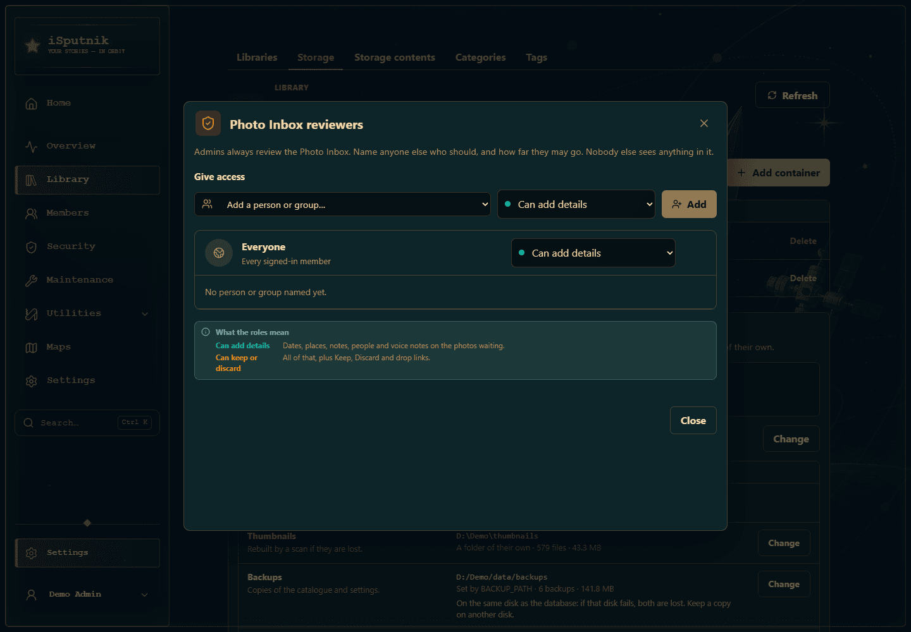
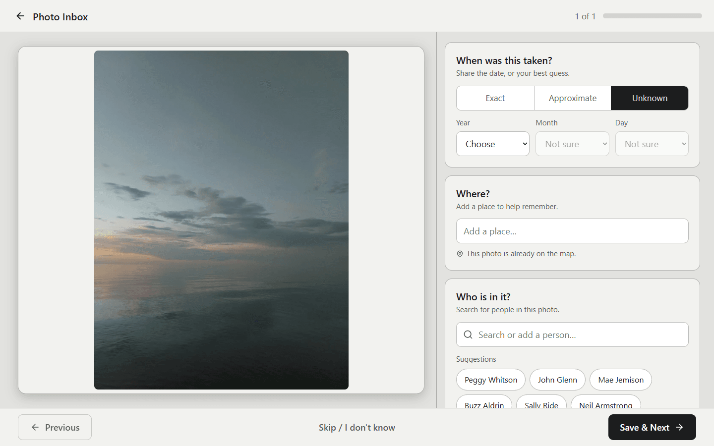
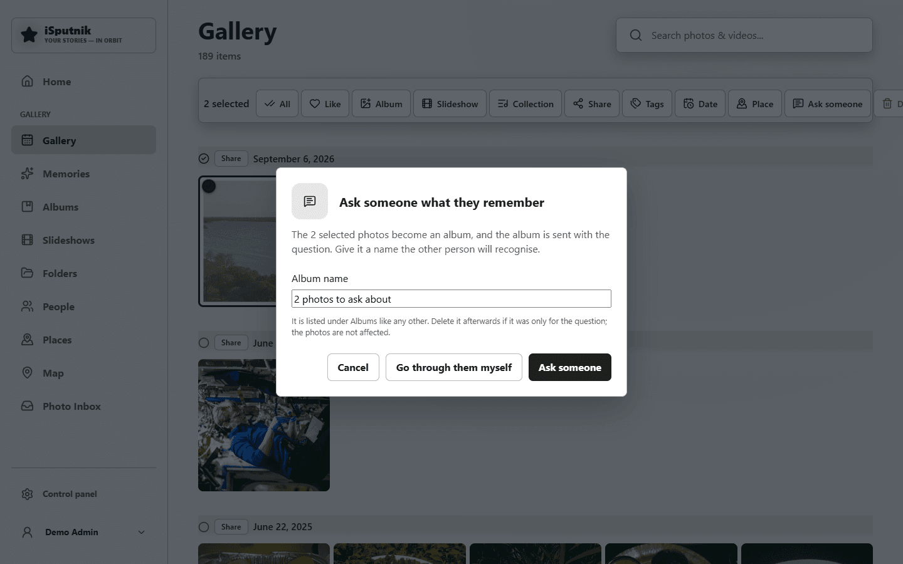

# The Photo Inbox

**Gallery → Photo Inbox** · part of App storage, under **Control panel → Library → Storage**

Some photos are not part of the collection yet. A box of prints you are feeding
through a scanner, most of which you scanned once before at a worse resolution.
A phone full of pictures a cousin wants to hand over, who has no account here
and never will. Neither belongs on the Timeline until someone has looked at it,
and the second is the wrong thing to be on the Timeline at all until you say so.

A **Photo Inbox** is a gallery library set aside for exactly this: a holding
place that nothing resurfaces. Photos land in it by scan, by upload, or through
a link you hand to someone, and they stay out of the Timeline, Memories, the
Home page, People and the pickers until you decide, one delivery at a time,
what stays. An empty Inbox is a finished review.

This guide walks the whole process from the scanner box to a tidy library.

## 1. Set up an Inbox

The Photo Inbox is part of **App storage**: switching App storage on in
**Control panel → Library → Storage** makes it, in its own `Photo Inbox` folder
([Storage](storage.md)). There is one Inbox per server, and it is a system library:
the app keeps its name and it is not listed among your libraries.

**Who reviews it.** Admins always do. Anyone else reviews because you named them:
**Reviewers** on the Inbox's row of the Storage page lists people, groups or
Everyone, each at one of two levels:

- **Can add details**: dates, places, notes, people and voice notes on the photos
  waiting.
- **Can keep or discard**: all of that, plus Keep, Discard and drop links.

Nobody else sees anything of the Inbox: not the page, not Review mode, not the
rows on For you. An Inbox made before 4.6 carried its old access across: whoever
managed it can keep or discard, and anyone who could see it can add details.

While it is empty, members don't see it anywhere; admins reach it from the Storage
page and the gallery, which is where the first scan and drop links start.

Two things set it apart from a library:

- **Nothing resurfaces it.** The Timeline, Memories, the Home page's photo cards,
  People, the map, the library filter and every picker for albums, slideshows and
  stories leave the Inbox out. **Gallery → Photo Inbox** is the one way in.
- **Faces wait.** Face recognition skips an Inbox, so a box of somebody else's
  prints cannot seed your People page with strangers. A kept photo is scanned
  for faces like any newly added one.

## 2. Fill it

Three ways in, all of which land as a **delivery** — a top-level folder in the
Inbox, so the review can tell Grandma's box from this morning's scanner run.
Every delivery also appears as a row on your **For you** page and at the top of
your Home page, naming who sent it when it came through a link, until the
Inbox is emptied ([Sharing with family](family-sharing.md#for-you)).

**From a folder.** Point your scanner software, or a copy from a card, at a
subfolder of the Inbox's folder — one per box, named for it — and re-scan the
library. Files dropped straight into the root show up as *Loose files*.

**Upload.** The **Upload** button on the Inbox page takes files the same way
any gallery upload does; they are filed by the day they arrived.

**A drop link**, for someone without an account. **Drop link** on the Inbox page
opens the dialog below. Give the link a label — it is shown on the sender's
page and becomes the folder their photos land in — choose how long it lasts,
and cap how many files and how much in total it may receive. **One delivery
only** closes the link after the first batch, for the "just send me those"
case; off, it stays open until it expires, for the relative who sends a few
every week.

The address is shown once. Copy it then, because only its fingerprint is kept
and it cannot be shown again. The sender sees this:

They pick their photos and get "Received 37 photos. Thank you." back — a count,
and nothing else. No thumbnails, no gallery, no way to see what is in the
Inbox. Whatever the page said, the server counts every batch against the
link's caps itself. A delivery that came through a link wears a link icon on
its chip. Links you have handed out are listed in the same dialog and under
**Shared links** on your profile, and any of them can be taken back at once;
photos that already arrived stay.

Before you hand one out on a server reachable from the internet, read the
note in [Exposing your library to the internet](exposing-to-the-internet.md#drop-links-if-you-hand-them-out).

## 3. Let the check run

After a scan, an upload or a drop, the Inbox is checked against the rest of
the library on its own. You do not start it; the banner at the top of the
Inbox page tells you how it went.

The check is the same engine as [Duplicate cleanup](duplicate-cleanup.md),
pointed one way. Only the Inbox's photos are candidates, so the library is
never compared with itself — a delivery of two hundred scans does not turn
into a cleanup of the whole house — and the library's copy is always the one
kept. It finds byte-identical files, the copies that were re-scanned and are
now a different file of the same picture, and it hashes an incoming scan turned
on its side as well, so a print fed in sideways still finds its upright twin.

It also finds the same print scanned twice — laid on the glass a little
differently each time, and graded to each scanner's own taste, which is enough
to make the two files look unrelated to a fingerprint. Where the fingerprints
are close without being equal, the two pictures themselves are compared, and a
match is shown as **Looks the same** for you to confirm. What is still beyond
it is a photograph re-cropped hard — much past a tenth of the frame — or one
so changed by an edit that it is a different picture; those you will meet in
the grid.

The banner reads "N photos look like copies of ones the library already has",
"Checking for copies…" with a percentage while it runs, or "No copies found".
If a Duplicate cleanup is already in progress the check waits, since only one
runs at a time; **Check for copies** on the page starts it by hand once the
slot is free.

## 4. Settle the copies

**Review copies** on the banner opens the Duplicate cleanup page, where the
check is an ordinary cleanup job with its results below. Its cards read the
other way round from a normal cleanup: the copy marked **In the library** is
what you already have, the one marked **Incoming** is what just arrived, and
the card says so — *kept because: already in the library*.

An **identical** set is the same file twice. There is nothing to choose between
them, so **Discard incoming** sends the new copy to the Recycle Bin — on the
cleanup's shorter clock, not the bin's usual one — and the library is as it
was. **Discard N identical copies** in the toolbar does every identical set on
screen at once.

A **near-identical** set is the interesting case: the same picture, a different
file. The card shows both with their pixel sizes and file sizes, and **Compare**
opens them side by side.

- **Replace** puts the incoming file in the library item's place. The item keeps
  its identity, so every album, story, tag and person pointing at it still
  points at it; the library's old file is set aside beside the Recycle Bin, not
  deleted; and the Inbox copy leaves the Inbox. This is the verb for "the new
  scan is better".
- **Discard incoming** is the verb for "the old one was fine".
- **Not the same** says these are two photographs, not two copies — two shots a
  moment apart, say. It is remembered, so no later check pairs them again, and
  the photo stays in the Inbox to be kept like any other.
- **Replace larger** in the toolbar does every set on screen whose incoming
  copy has more pixels in both directions, and leaves the rest for you.

Every action re-checks the photos against the library as it stands, and refuses
rather than acting on something that has moved since the scan.

## 5. Keep or discard the rest

Back on the Inbox page, what the check did not claim is yours to sort. Pick a
delivery chip to work through one box at a time, or **All**. **Select**, tick
the photos — **All** ticks everything loaded — and choose:

- **Keep** moves them into a real library. The dialog asks which library, and
  then offers two ways to say where in it. **Create new folder** takes a folder
  name you type — or the dated `YYYY/YYYY-MM-DD` layout uploads use. **Use
  existing folder** lists the folders that library already has, with a search box
  and a photo count each, so a box of prints can join the ones scanned last
  month without anybody having to remember what the folder was called. The dated
  layout is right for phone photos and usually wrong for scans, whose date is the
  day they were scanned; that is why Keep asks rather than guesses. Set the dates
  first (select, then **Date** in the gallery) if you want them right. Tags,
  likes and edits travel with a kept photo, and it is scanned for faces on
  arrival. Your last choice is remembered for the session.
- **Discard** sends them to the Recycle Bin on the cleanup's clock.

A delivery whose every photo has been kept or discarded disappears from the
chips; an Inbox with nothing left shows "All reviewed". Keeping or discarding
takes **Can keep or discard**, and Keep the upload right on the destination.
A reviewer who can add details sees the same page without those buttons.

## 6. Ask someone what they know

A box of childhood prints has a date of the day it was scanned and no place at
all, and the person who knows when and where they were taken is not the one at
the scanner. The Inbox has a second screen for exactly that person: **Review
mode**, one photo at a time, four questions, and nothing else to learn.

**Setting it up** is one grant. Give her an account as an ordinary member
([Your account](your-account.md)), open **Reviewers** on the Inbox's row under
**Control panel → Library → Storage**, and add her as **Can add details**. She can
write on the photos but cannot Keep or Discard, so she can answer without being
able to move anything, and she sees nothing outside the Inbox unless you have
shared other libraries with her. If she reads Russian,
set her language on her profile; the screen is in both.

**What she sees.** Her Home page shows one row — "38 photos arrived in Photo
Inbox" — with **Add what you know** on it. That opens the photo large, with
the questions beside it on cards (below it on a tablet held upright):

- **When was this taken?** First how sure she is — **Exact**, **Approximate**
  or **Unknown** — then a year from a list, a month if she knows it, and a day
  once a month is chosen. Nothing is typed. The scan date is never offered as
  an answer; the list starts empty, and a year picked on its own counts as
  Approximate unless she pressed Exact first.
- **Where?** One line, in her own words — "the dacha", "Komarovka". Places she
  has already written in this box appear under it as buttons, so the second
  photo from the same place is one tap. When the words name a town, the photo
  can go on the map too: as she types, matching towns are listed under the
  box, and picking one fills in "Minsk, Belarus" and shows **On the map:** with
  the full name, and a cross to leave the pin off. The list comes from the
  server's own place list, which needs **Named places** switched on under
  **Maps**; nothing she types leaves the house for it. For a village too small
  for that list, **Search online for "…"** asks OpenStreetMap, but only when
  pressed. A photo that already has a location, from the camera or set by hand,
  is never moved; the card just says it is already on the map. **Same as the
  last one** and the place buttons carry the previous photo's pin along with
  its words.
- **Who is in it?** A search box: typing narrows the people the library already
  knows, and a name nobody has yet is offered as **Add "…"** — that person then
  joins the People page like any hand-tag. Before she types, the most-seen
  people are listed as **Suggestions**; the people on the photo sit under the
  box with a cross to take them off again.
- **What do you remember?** Two big buttons, **Add note** and **Add recording**.

**Same as the last one**, beside When and Where, copies the previous photo's
answer. On a box from one summer it is the button she presses most.
**Save & Next** saves everything and moves on; **Previous** goes back; **Skip /
I don't know** marks the photo as looked at and moves on without changing it.
Leaving the page saves the photo she was on. At the end she gets
"You went through all of them", and the card leaves her Home page.

**What you see afterwards.** Each delivery chip on the Inbox page reads
"12/38", the photo's Details tab says *Noted by Mama, Tuesday* under the
description, and the date reads "around 1962" rather than a day, because a
year is what she knew. Keep files a year-only photo under `1962/` in the dated
layout and a month-only one under `1962/1962-07`, never under a day nobody
named. You can open the same screen yourself with **One at a time** on the
Inbox page, which is a faster way to date a box than the grid when the answers
are mostly "same as the last one".

**Photos already in the house** can be asked about too. The quickest way is
**Ask someone**: select photos on the Timeline, or open a folder under Folders,
and press it. Give the album a name she will recognise — the photos become an
album, listed under Albums like any other — and the Send to dialog opens on it
with the question already ticked. The same dialog offers **Go through them
myself**, which opens the screen over that album for you without sending
anything. Or open an existing album, press **Send to**, pick her, and tick
**Ask what they remember** before sending.

Either way she
gets the same card on her Home page — "Sergey asks what you remember about
these photos" — and **Add what you know** opens the same screen over the
album's photos. Sending with the question also gives her the right to write on
those photos, and only those; the rest of the library is untouched, and
whoever made the album (or an administrator) is the only one who can ask.
When she reaches the end, the card leaves her Home page by itself.

**Writing a note.** **Add note** opens the same editor a story's text uses:
buttons for bold, italic, a heading, lists, a quote and a link over the box.
**Save note** puts it on the card — shown formatted, with **Edit note** to go
back to it — and **Save & Next** writes it to the photo, where the lightbox
shows it the same way. Closing the dialog with words typed asks first. When
the previous photo has a note, **Use the last photo's note** copies it in.

**Saying it instead of typing it.** In the note dialog, **Speak instead**
turns on the tablet's own dictation where the browser has it (Chrome on
Android, Safari on an iPad): what she says lands in the box as text, sentence
by sentence, and nothing else is kept. For the story that does not fit in a
box, **Add recording** keeps her voice on the photo itself. It opens a dialog with
one big button: press once to start, once to stop, listen back, then
**Save** — or **Record again** if the dog got in. Up to five minutes each.
**Upload a recording** takes one she already has, from a phone say.
Saved recordings are a list on the card, each with a play button; pressing
one plays it in the card above the list. Anyone who can see the photo can play
it; the lightbox shows the same recordings under **Recordings** on its Details
tab, and a story's narration uses the same recorder and player. Recordings are ordinary
audio files in the "App files" library, under `Voice notes`, so they
are backed up like everything else, and removing one sends it to the Recycle
Bin. Recording needs the app to be opened over https, or on the server
itself, since browsers allow the microphone only there.

**Dates that are only roughly known** are not an Inbox-only idea. The **Date**
dialog on any selection, and **Edit** beside a photo's date in the lightbox,
now ask *how exact* — exact time, day, month, year or decade — and whether it
is *about*. A photo dated to the year heads its own group on the Timeline
rather than pretending to be from New Year's Day.

## What to expect, and what not to

- **Nothing is lost by an Inbox.** Discard is the Recycle Bin. Replace sets the
  old file aside. Keep moves rather than copies, and the file keeps its name.
- **A scan's date is the scan date.** Old prints arrive dated today. Fix the
  dates before keeping into the dated layout, or keep into a named folder.
- **Only the Inbox is a candidate.** If your library already holds the same photo
  twice, the check pairs the incoming copy with one of them and leaves the other
  alone; a normal Duplicate cleanup is the tool for that.
- **A hard crop is still not matched.** The check allows for a print laid on the
  glass a little differently each time, but a deliberately tighter crop of the
  same photograph reads as a different picture and lands in the grid as new.
  Look before keeping.
- **A drop link writes to your server.** Cap it at what the person needs, label
  it with their name, and take it back when it has done its job.
