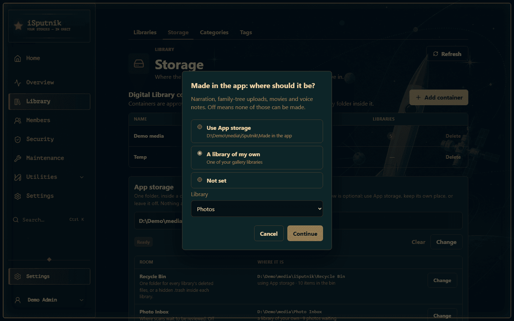
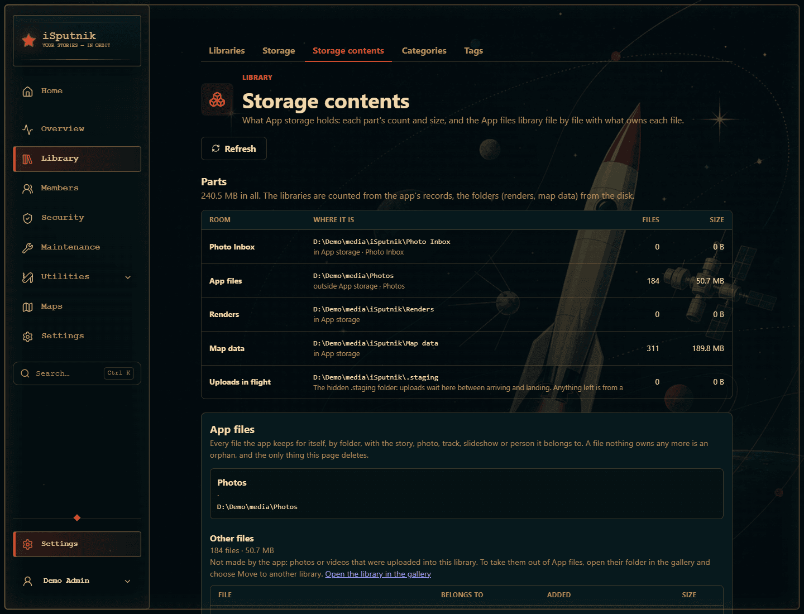
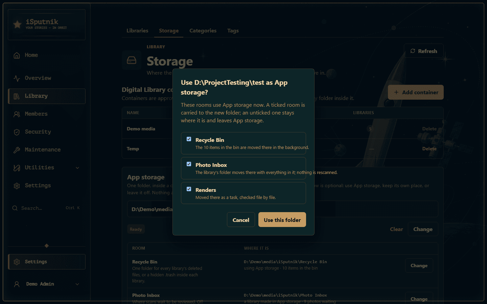

# Storage

Before you can add a library, the server needs to know where things live. It all
sits in **Control panel → Library → Storage**, in three parts:

| | What it is | Why it's needed |
|---|---|---|
| **Digital Library containers** | The folders your libraries are allowed to read | A safety boundary: a library can only ever point somewhere inside an approved container, so a mistyped path can't wander off into the rest of the disk. Everything else on the page lives inside one. |
| **App storage** | One folder the app may keep its own things in: the Recycle Bin, the Photo Inbox, the library for what the family makes in the app, thumbnails, renders and music, backups | So those six answers can be given once, in one place, instead of on six different pages. Every one of them is optional. |
| **Its rooms** | One row per thing the app keeps, saying where it is right now | Each row can use App storage, keep a place of its own, or stay off. Nothing moves until you change a row, and every change is confirmed first. |

Until thumbnails have somewhere to go and at least one container exists, **Add
library** stays disabled and the Libraries page tells you so, with a button
straight back here.

## Digital Library containers

A container is a root folder you're approving. Libraries can then use the whole
container or any folder inside it.

Choose **Add container** and give it a name and a path:


| Field | Example |
|---|---|
| **Container name** | `Family media` — a label for you, shown when picking folders |
| **Container path** | `D:\ProjectTesting\AppDocTest` — must already exist on the server |

The folder has to exist already; the app won't create it. If the path is wrong
or unreadable, you're told immediately rather than at scan time.

Containers come first on the page because everything below them lives inside
one: App storage, and the libraries the app makes for itself.

## App storage

On a new install the App storage block says **Not set** and every room below it
reads **Not set** or **Off**:


Choose **Choose folder** and pick a folder inside one of your containers. It has
to exist already, it can't be the container itself (the app makes its own
folders in it), and it can't be inside a library. A folder beside your media is
the tidy choice:

```
D:\ProjectTesting\AppDocTest\iSputnik
```

A box shows the exact path and asks you to confirm. Choosing the folder records
it and nothing else: no room changes until you change its row. Two rooms do
follow it straight away when they were never given a place of their own, because
they have to live somewhere: **Thumbnails** go to `Thumbnails\` under it, and
**Renders** go to `Renders\` under it, unless you have told the row to stay
inside the thumbnail folder. On a fresh install the
**Recycle Bin** is switched on too, so deleted files have one folder from the
start.

> **Running in Docker?** Use the path *inside the container* — the one you mapped
> your volume to — not the path on the host.

### The rooms

Nothing inside App storage shows up in the gallery on its own. The two rooms
that are gallery libraries, the Photo Inbox and App files, are left out
of the Timeline, Memories, the Home page, People, the map and every picker,
the way an Inbox always was; what they hold is reached from the stories,
photos and family tree that made it, or by choosing the library by name in
the gallery's library filter, where it is labelled. A photo from such a
library that a story, an album or a slideshow already holds keeps showing
there, and opens in the viewer as before. The other rooms are not libraries
and are never scanned.

| Room | Use App storage | Its own place | Off |
|---|---|---|---|
| **Recycle Bin** | `Recycle Bin\` | one folder you name | a hidden `.trash` inside each library |
| **Photo Inbox** | `Photo Inbox\`, made as a library | any gallery library with the Inbox switch on | no Inbox |
| **App files** | `App files\`, made as a library | any gallery library of your own | nothing can be recorded or uploaded from the app |
| **Thumbnails** | `Thumbnails\` | a folder you name | — |
| **Renders** | `Renders\` | — | inside the thumbnail folder |
| **Backups** | `Backups\` | the backup folder (`BACKUP_PATH` in Docker) | — |

Uploaded slideshow music is not really a room any more: once an App files
library exists, every track lives in its `Slideshow music\` folder as an
ordinary audio asset, visible in the gallery and backed up with the rest, and
music uploaded before that moves itself there shortly after the server starts.
The Renders room then holds only finished slideshow movies.

Each row says which column it is in, in words, and **Change** opens a small
chooser with the options for that room. Picking one doesn't apply it: a box
names the room, shows the exact folder it will use from now on, says what moves
and what doesn't, and offers Cancel or a verb. Nothing happens until you press
the verb.


For the two library rooms, **A library of my own** lists your gallery libraries:
pick one to hold what the family makes in the app, or to become the Photo Inbox.



Three rooms are worth a word each:

- **Recycle Bin.** Changing its location moves whatever is in the bin to the new
  place, one item at a time, in the background. The row shows the progress
  ("Moving the bin: 14 of 230") and offers to cancel; the Recycle Bin page shows
  the same line. Restoring and emptying keep working meanwhile, because every
  item remembers where its own files are. The originals that **Replace file**
  set aside, in the `replaced` folder beside the bin, come along too, so the
  old folder is left empty. Keep the bin on the same disk as your
  libraries if you can: deleting into a bin on the same disk is an instant
  rename, onto another disk it copies every byte.
- **Thumbnails.** Changing their folder carries everything already there across
  in the background, one library's folder at a time, and the row shows the
  progress with a way to cancel. New thumbnails go to the new folder at once;
  until an entry has been carried over, its covers are missing. Finished renders
  come along with the thumbnails, since that is where they live unless Renders
  has its own room.
- **Photo Inbox.** Switching to App storage when you already have an Inbox of
  your own moves that library's folder into App storage whole, photos waiting
  and all, and it stays the Inbox; the confirmation says how many come along,
  and nothing is rescanned. With no Inbox yet, a new gallery library is made in
  the room's folder. Switching off leaves the library as an ordinary library
  with its files where they are; it refuses to turn off while photos are still
  waiting in it, so nothing lands on the Timeline unreviewed.
- **App files.** Switching to App storage when a library of your own is
  nominated moves that library's folder into App storage whole, with everything
  in it, and it stays the library for what is made in the app. With none
  nominated, a new gallery library is made in the room's folder and nominated.
  Switching off only clears the nomination.

### What it holds: the Contents page

**Library → Storage contents**, the tab beside Storage, answers the other question about App storage:
what is in it, and why. The top table gives every room a count and a size,
counted from the app's own records where it keeps them (the bin, the two
libraries) and from the disk where it does not (thumbnails, renders, backups),
plus the hidden `.staging` folder where uploads wait between arriving and
landing. Under it, the **App files** library is listed folder by folder and
file by file, each with the thing it belongs to: the story a recording
narrates, the photo a voice note sits on, the track a music file plays as,
the slideshow a movie was rendered from, the person a family-tree photo is
of, each a link where there is a page to go to.



A file nothing owns any more, because the story, photo or slideshow it served
has since gone, is marked an **orphan**, and that is the one thing the page
deletes: it goes to the Recycle Bin like any deleted file. Files the app's
folders do not account for, such as photos uploaded into the library by hand,
are listed as **Other files**, with the way out: open their folder in the
gallery and move it to another library.

### How a move runs

Every move is a **task**: it appears on the Tasks page as a *Storage move*
with its progress and an estimate, it can be stopped there or from the row,
it is timed, and a server restart picks it up again where it was. The row on
this page shows "Moving… 14 of 230" while it runs, and afterwards anything it
could not carry with a **Retry**. The activity log records when a move starts
and how it ended: how much it carried, how long it took, and what failed.

What keeps it safe:

- On the same disk a move is a rename: instant whatever the size, and either
  it happens or it does not.
- Across disks nothing is copied while you wait. The task copies one file at a
  time and checks each one arrived whole, by size, before the original is
  removed. A file that does not check out stays where it was and is listed.
- A library keeps its old folder until the last file is across and verified,
  then switches to the new one in one step and the old folder goes. Stopping
  the move, or a failure, leaves the library exactly where it was.
- One move runs at a time, and never while a library is being scanned; a scan
  waits for a move the same way.

### Changing the folder once rooms use it

The folder is the base of every file its rooms hold, so **Change** on the top
block asks about each room that uses it. The confirmation lists those rooms
with a tick beside each: a ticked room is carried to the new folder, an
unticked one stays where it is and leaves App storage.



What "carried" means depends on the room:

- **Recycle Bin**, **Thumbnails** and **Renders** are carried by
  the same tasks their rows use, one task each, and the rows show the
  progress. Left behind, the bin and the thumbnails keep their old folder as
  their own place; renders and music, which have no place of their own, go
  back inside the thumbnail folder.
- **Photo Inbox** and **App files** move as whole folders, each its own
  task, and the library follows its folder once every file is across: nothing
  is rescanned, and what is waiting for review stays waiting. Left behind, the
  library stays where it is as a library of your own, still the Inbox or still
  nominated.
- **Backups** are the one thing moved at once, a few files. Left behind, they
  go back to the backup folder.

Every check happens before anything changes: if the new folder already holds
a room's folder, a library room is being scanned, or a move is still running,
nothing changes and the box says why. The tasks then run one after another.
**Clear** takes the leave-behind path for every room. Both wait for a move
already running on the page to finish first.

Once thumbnails have a place and a container is listed, you're ready for
**[Setting up libraries](libraries.md)**.

### An install that already had these set

Nothing changes when you update. App storage shows **Not set**, and every room
reads whatever it read before: your thumbnail folder, your bin location, your
App files library. Choosing an App storage folder later changes no room
that already has a place. Each one gains "Use App storage" in its chooser, and
moves in only when you say so.

One name did change: the App files room was called *Made in the app* until
3.86.0, and an install that made the folder under that name keeps it. The room
still reads as using App storage, and nothing moves. If you would like the
folder to match, the App files row offers **Rename folder**: a box shows the
exact before and after, and the rename runs as the same task a library move
uses, the library following its folder in the same step, so nothing is
rescanned. On the same disk it is a single rename.


## How to organise the folder underneath

One container with a folder per library and App storage beside them is the
arrangement most people end up with, and it's what the rest of these guides
assume:

```
D:\ProjectTesting\AppDocTest\      ← the container
├── Audio\                         ← an audiobook library
├── Ebooks\                        ← an ebook library
├── Gallery\                       ← a gallery library
├── FamilyTree\
└── iSputnik\                      ← App storage
    ├── Recycle Bin\
    ├── Photo Inbox\               ← a library the app made
    ├── App files\           ← a library the app made
    ├── Thumbnails\
    └── Renders\
```

You can add several containers if your media lives on different drives. The
**Libraries** column on this page shows how many libraries are using each one,
and a container can't be deleted while a library still depends on it.

## Your original files are never modified

Worth stating plainly, because it governs the whole design: **scanning reads,
it never writes.** The app catalogues what it finds, and everything it derives —
covers, previews, metadata, your reading position — is kept in its own database
and in App storage or the thumbnail folder. Renaming a library, editing a book's
title, or deleting a library never touches the files on disk.

The exceptions are the things you'd expect to touch files, and only those:
uploading adds a file, deleting an *item* (when the library allows it) moves it
to the Recycle Bin, and changing a room on this page moves what that room holds,
after telling you so.

Uploads wait in a hidden `.staging\` folder inside App storage while they
arrive, rather than in the system's temp folder, so a long recording cannot
fill a small root partition.
