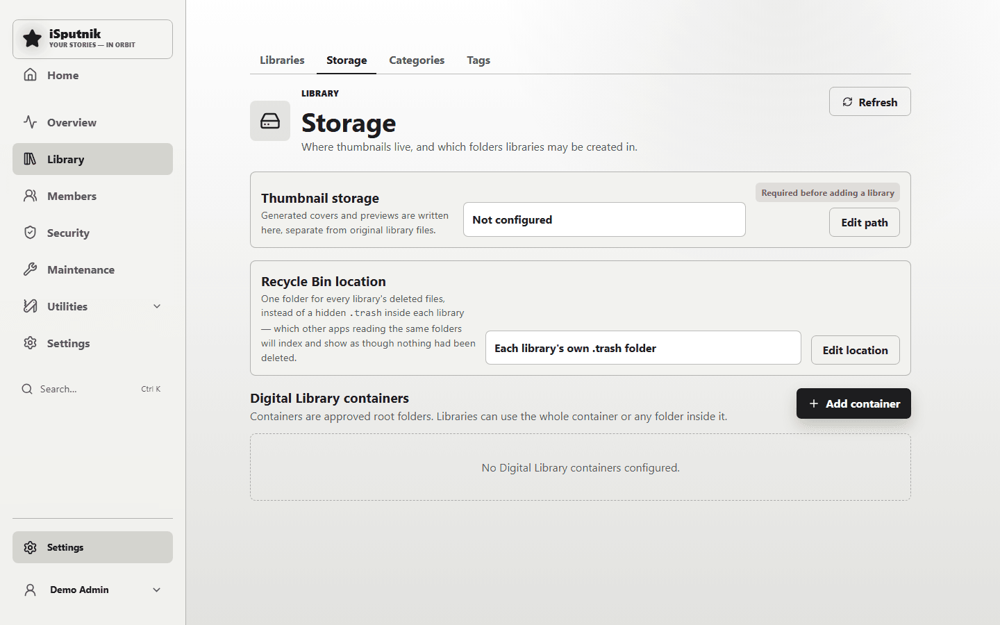
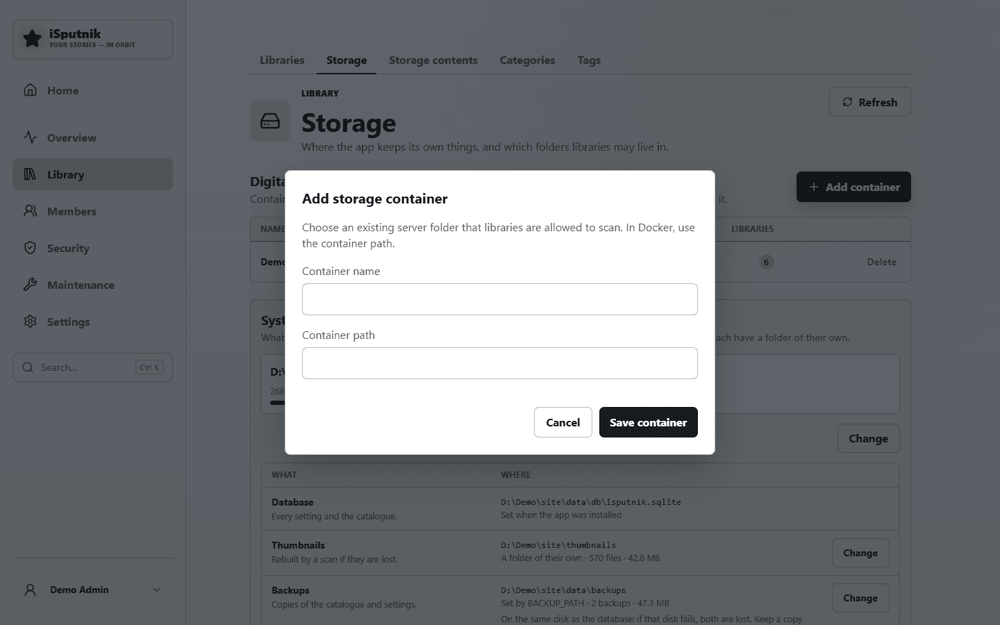
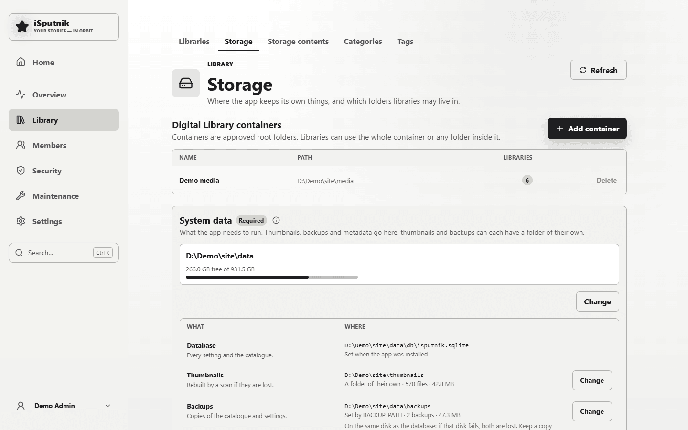

# Storage

Before you can add a library, the server needs to know two things. Both live in
**Control panel → Library → Storage**.



| | What it is | Why it's needed |
|---|---|---|
| **Thumbnail storage** | One writable folder where the app keeps the covers and previews it generates | These are *generated* files. They're kept away from your originals so your media folders stay exactly as you arranged them. |
| **Digital Library containers** | The folders your libraries are allowed to read | A safety boundary: a library can only ever point somewhere inside an approved container, so a mistyped path can't wander off into the rest of the disk. |

Until both are set, **Add library** stays disabled and the Libraries page tells
you so — with a button straight back here.

## Thumbnail storage

Choose **Edit path** and give it a writable folder. Anything works as long as
the server user can write to it and it isn't inside a library you'd rather keep
pristine. A hidden folder alongside your media is a tidy choice:

```
D:\ProjectTesting\AppDocTest\.thumbnails
```

It flips from **Not configured** to **Ready** once saved.

> **Running in Docker?** Use the path *inside the container* — the one you mapped
> your volume to — not the path on the host.

## Digital Library containers

A container is a root folder you're approving. Libraries can then use the whole
container or any folder inside it.

Choose **Add container** and give it a name and a path:



| Field | Example |
|---|---|
| **Container name** | `Family media` — a label for you, shown when picking folders |
| **Container path** | `D:\ProjectTesting\AppDocTest` — must already exist on the server |

The folder has to exist already; the app won't create it. If the path is wrong
or unreadable, you're told immediately rather than at scan time.



Both green? You're ready for **[Setting up libraries](libraries.md)**.

## Recycle Bin location

Deleting from the app doesn't erase anything straight away — it moves the files to the
Recycle Bin, where you can put them back. This is where you say **where that is**.

Left alone, each library keeps its own hidden `.trash` folder inside itself. That is the
fastest possible arrangement: the file never leaves the disk it was already on, so even a
4 GB video is deleted instantly.

The catch is that a `.trash` inside a library is still inside a folder other software
reads. Immich, a backup job, a sync client — anything walking the same share will index it
and go on showing everything you deleted as though it were still there. Most of them have
no reliable way to exclude it, so the fix is to keep the bin somewhere else entirely:
**Edit location**, and give it one folder outside all your libraries.

```
D:\ProjectTesting\AppDocTest\.recyclebin
```

Three things worth knowing before you set it:

- **Set it before you create libraries.** Afterwards it can only be changed while the bin
  is completely empty — moving it would leave whatever is in it behind. Emptying the bin
  destroys those files for good, so that is never offered as part of the change; you do it
  deliberately, on the Recycle Bin page, or wait for the items to expire.
- **Keep it on the same disk as your libraries.** Same disk, deleting is an instant rename.
  A different disk means a real copy of every byte, so a large video takes as long as
  copying it would — and a duplicate cleanup removing thousands of photos, much longer.
- **It can't be inside a library**, and it can't have a library inside it. Anything inside
  a library gets scanned, which would catalogue your deleted files straight back in.

Changing the location never moves what is already in the bin, and never has to: every item
remembers where its own files went, so restoring keeps working either way.

## How to organise the folder underneath

One container with a folder per library is the arrangement most people end up
with, and it's what the rest of these guides assume:

```
D:\ProjectTesting\AppDocTest\      ← the container
├── Audio\                         ← an audiobook library
├── Ebooks\                        ← an ebook library
├── Gallery\                       ← a gallery library
├── FamilyTree\
└── .thumbnails\                   ← generated covers and previews
```

You can add several containers if your media lives on different drives. The
**Libraries** column on this page shows how many libraries are using each one,
and a container can't be deleted while a library still depends on it.

## Your original files are never modified

Worth stating plainly, because it governs the whole design: **scanning reads,
it never writes.** The app catalogues what it finds, and everything it derives —
covers, previews, metadata, your reading position — is kept in its own database
and thumbnail folder. Renaming a library, editing a book's title, or deleting a
library never touches the files on disk.

The exceptions are the things you'd expect to touch files, and only those:
uploading adds a file, and deleting an *item* (when the library allows it) moves
it to the Recycle Bin.
