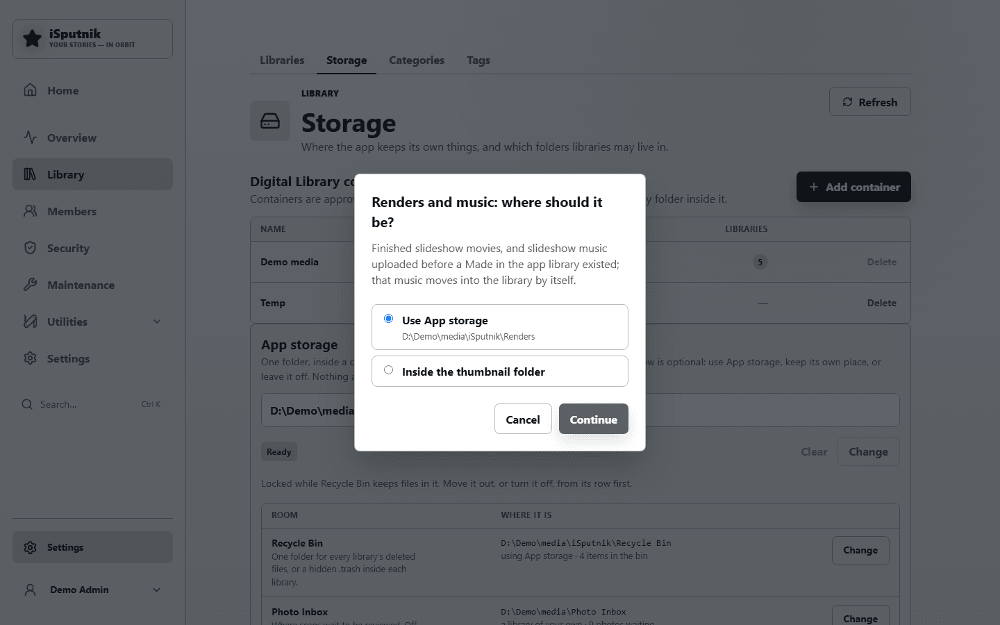
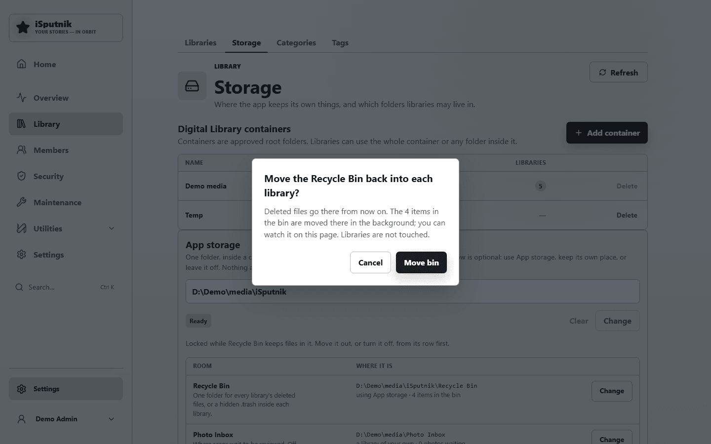

# Storage

Before you can add a library, the server needs to know where things live. It all
sits in **Control panel → Library → Storage**, in three parts:

| | What it is | Why it's needed |
|---|---|---|
| **Digital Library containers** | The folders your libraries are allowed to read | A safety boundary: a library can only ever point somewhere inside an approved container, so a mistyped path can't wander off into the rest of the disk. Everything else on the page lives inside one. |
| **App storage** | One folder the app may keep its own things in: the Recycle Bin, the Photo Inbox, the library for what the family makes in the app, thumbnails, renders and music, backups | So those six answers can be given once, in one place, instead of on six different pages. Every one of them is optional. |
| **Its rooms** | One row per thing the app keeps, saying where it is right now | Each row can use App storage, keep a place of its own, or stay off. Nothing moves until you change a row, and every change is confirmed first. |

Until thumbnails have somewhere to go and at least one container exists, **Add
library** stays disabled and the Libraries page tells you so, with a button
straight back here.

## Digital Library containers

A container is a root folder you're approving. Libraries can then use the whole
container or any folder inside it.

Choose **Add container** and give it a name and a path:


| Field | Example |
|---|---|
| **Container name** | `Family media` — a label for you, shown when picking folders |
| **Container path** | `D:\ProjectTesting\AppDocTest` — must already exist on the server |

The folder has to exist already; the app won't create it. If the path is wrong
or unreadable, you're told immediately rather than at scan time.

Containers come first on the page because everything below them lives inside
one: App storage, and the libraries the app makes for itself.

## App storage

On a new install the App storage block says **Not set** and every room below it
reads **Not set** or **Off**:


Choose **Choose folder** and pick a folder inside one of your containers. It has
to exist already, it can't be the container itself (the app makes its own
folders in it), and it can't be inside a library. A folder beside your media is
the tidy choice:

```
D:\ProjectTesting\AppDocTest\iSputnik
```

A box shows the exact path and asks you to confirm. Choosing the folder records
it and nothing else: no room changes until you change its row. Two rooms do
follow it straight away when they were never given a place of their own, because
they have to live somewhere: **Thumbnails** go to `Thumbnails\` under it, and
**Renders and music** go wherever the thumbnails are. On a fresh install the
**Recycle Bin** is switched on too, so deleted files have one folder from the
start.

> **Running in Docker?** Use the path *inside the container* — the one you mapped
> your volume to — not the path on the host.

### The rooms

| Room | Use App storage | Its own place | Off |
|---|---|---|---|
| **Recycle Bin** | `Recycle Bin\` | one folder you name | a hidden `.trash` inside each library |
| **Photo Inbox** | `Photo Inbox\`, made as a library | any gallery library with the Inbox switch on | no Inbox |
| **Made in the app** | `Made in the app\`, made as a library | any gallery library of your own | nothing can be recorded or uploaded from the app |
| **Thumbnails** | `Thumbnails\` | a folder you name | — |
| **Renders and music** | `Renders\` | — | inside the thumbnail folder |
| **Backups** | `Backups\` | the backup folder (`BACKUP_PATH` in Docker) | — |

Uploaded slideshow music is not really a room any more: once a Made in the app
library exists, every track lives in its `Slideshow music\` folder as an
ordinary audio asset, visible in the gallery and backed up with the rest, and
music uploaded before that moves itself there shortly after the server starts.
The Renders room then holds only finished slideshow movies.

Each row says which column it is in, in words, and **Change** opens a small
chooser with the options for that room. Picking one doesn't apply it: a box
names the room, shows the exact folder it will use from now on, says what moves
and what doesn't, and offers Cancel or a verb. Nothing happens until you press
the verb.





Three rooms are worth a word each:

- **Recycle Bin.** Changing its location moves whatever is in the bin to the new
  place, one item at a time, in the background. The row shows the progress
  ("Moving the bin: 14 of 230") and offers to cancel; the Recycle Bin page shows
  the same line. Restoring and emptying keep working meanwhile, because every
  item remembers where its own files are. Keep the bin on the same disk as your
  libraries if you can: deleting into a bin on the same disk is an instant
  rename, onto another disk it copies every byte.
- **Thumbnails.** Changing their folder carries everything already there across
  in the background, one library's folder at a time, and the row shows the
  progress with a way to cancel. New thumbnails go to the new folder at once;
  until an entry has been carried over, its covers are missing. Finished renders
  come along with the thumbnails, since that is where they live unless Renders
  has its own room.
- **Photo Inbox** and **Made in the app.** Switching either to App storage makes
  a new gallery library in the room's folder. Switching one off leaves the
  library as an ordinary library with its files where they are; the Inbox refuses
  to turn off while photos are still waiting in it, so nothing lands on the
  Timeline unreviewed.

### The folder locks once a room uses it

Once any room keeps files in App storage, **Change** and **Clear** on the top
block are refused, and the block says which rooms those are. Move each of them
out, or turn it off, from its own row first; then the folder is free to change
again. That is deliberate: the folder is the base of every file those rooms
hold, and changing it underneath them would be a "move everything" in disguise.

Once thumbnails have a place and a container is listed, you're ready for
**[Setting up libraries](libraries.md)**.

### An install that already had these set

Nothing changes when you update. App storage shows **Not set**, and every room
reads whatever it read before: your thumbnail folder, your bin location, your
Made in the app library. Choosing an App storage folder later changes no room
that already has a place. Each one gains "Use App storage" in its chooser, and
moves in only when you say so.


## How to organise the folder underneath

One container with a folder per library and App storage beside them is the
arrangement most people end up with, and it's what the rest of these guides
assume:

```
D:\ProjectTesting\AppDocTest\      ← the container
├── Audio\                         ← an audiobook library
├── Ebooks\                        ← an ebook library
├── Gallery\                       ← a gallery library
├── FamilyTree\
└── iSputnik\                      ← App storage
    ├── Recycle Bin\
    ├── Photo Inbox\               ← a library the app made
    ├── Made in the app\           ← a library the app made
    ├── Thumbnails\
    └── Renders\
```

You can add several containers if your media lives on different drives. The
**Libraries** column on this page shows how many libraries are using each one,
and a container can't be deleted while a library still depends on it.

## Your original files are never modified

Worth stating plainly, because it governs the whole design: **scanning reads,
it never writes.** The app catalogues what it finds, and everything it derives —
covers, previews, metadata, your reading position — is kept in its own database
and in App storage or the thumbnail folder. Renaming a library, editing a book's
title, or deleting a library never touches the files on disk.

The exceptions are the things you'd expect to touch files, and only those:
uploading adds a file, deleting an *item* (when the library allows it) moves it
to the Recycle Bin, and changing a room on this page moves what that room holds,
after telling you so.

Uploads wait in a hidden `.staging\` folder inside App storage while they
arrive, rather than in the system's temp folder, so a long recording cannot
fill a small root partition.
